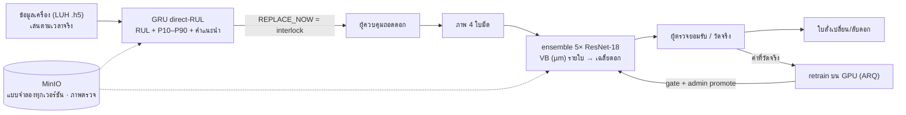

# 🏭 CNC Tool Life AI — Predictive Maintenance ของดอกกัด

> พยากรณ์ **อายุใช้งานที่เหลือ (RUL)** ของดอกกัด CNC จากข้อมูลที่เครื่องบันทึกเองทุกแนวตัด (time series) แล้ว **วัดรอยสึกด้านข้าง VB จากภาพใบมีด** ตอนถอดดอก (non-time-series)
> ทั้งสองแบบจำลองใช้เกณฑ์เดียวกัน: VB ≥ **140 µm** = หมดอายุ (เกณฑ์เฉพาะงาน — ISO 8688-2 ให้ตั้งเกณฑ์ล่วงหน้า) · **103 µm** = เริ่มสึกเร่ง/ใกล้หมดอายุ (จุดเปลี่ยนอัตราสึกที่พบในข้อมูล)



## 🌟 ฟีเจอร์
1. **Tool Life Dashboard / Machine Monitoring** — RUL + ช่วง P10–P90, สถานะการสึก, คำแนะนำ (OK / WATCH / PLAN_REPLACEMENT / REPLACE_NOW), ETA, แผนเปลี่ยนดอก, drift ของอินพุต, สัญญาณสด — ข้อมูลจริงของดอก **T3/T6/T9 ที่ไม่เคยใช้ฝึก**
2. **Interlock** — REPLACE_NOW หยุดป้อนรอผู้ควบคุม (ถอดดอก / ตัดต่อ) · ทุกการตัดสินใจอยู่ใน Audit Trail · แจ้งเตือนจากผลจริง
3. **Tool Inspection** — ถอดดอกแล้วระบบถ่ายภาพ 4 ใบมีด → AI วัด VB + ช่วงความไม่แน่นอน → ระดับดอก = VB เฉลี่ย 4 ใบ (นิยามเดียวกับ label ของ RUL) → ผู้ตรวจยอมรับค่า AI หรือวัดบน optical bench → ใบสั่งงาน + CSV
4. **Retrain + Model Registry** — ค่าที่วัดจริงเท่านั้นเข้า pool → fine-tune บน GPU → gate → admin promote · ทุกเวอร์ชันอยู่ใน MinIO สลับกลับได้ · กราฟการเทรนในหน้าเว็บ + TensorBoard
5. **ไม่สปอยข้อมูล** — ระหว่างใช้งานไม่ส่ง VB / RUL จริง / ชื่อไฟล์ไปหน้าเว็บ · ค่าจริงเปิดเผยหลังถอดดอก (Reports) หรือเมื่อผู้ตรวจสั่งวัด
6. **Observability (ทางเลือก)** — OpenTelemetry → Prometheus / Tempo / Loki → Grafana

เครื่องเดียวกัน ดอกเดียวกัน: M1/M2/M3 = ข้อมูลเครื่อง LUH **T3/T6/T9** คู่กับภาพใบมีด Nonastreda **ดอก 8/9/10** (ไม่เคยใช้ฝึกทั้งคู่)

## 🏗️ โครงสร้าง (ทุกโฟลเดอร์มี README อธิบายไฟล์ข้างใน)
```
ai-ecosystem-Industrial-Predictive/
├── backend/                  FastAPI + แบบจำลองตอนใช้งาน                       → backend/README.md
│   ├── main.py               app, startup, รวม router ใต้ /api/v1
│   ├── app/features/         tool_life · tool_vision · reports · alarms · audit · auth · users · health · workers
│   ├── core/                 config · database · MinIO · Redis/ARQ · observability
│   ├── scripts/              อัปโหลดแบบจำลองขึ้น MinIO
│   └── tests/                pytest
├── frontend/                 React 18 + TypeScript + Vite + Tailwind + Recharts  → frontend/src/README.md
├── timeseries_docs/tool_rul_forecast/   งาน time series: รายงาน, notebook, การทดลอง, แบบจำลอง RUL
├── nontime_docs/tool_vb_vision/         งาน non-time-series: รายงาน, การทดลอง stage A–D, แบบจำลองวัด VB
├── observability/            config ของ OTel Collector / Prometheus / Tempo / Loki / Grafana
├── docs/                     ดัชนีเอกสาร + รายงาน Progress 3
├── dataset/                  LUH milling + Nonastreda (ไม่อยู่ใน git — ดู dataset/README.md)
├── logs/                     log ที่ container เขียน (postgres, redis, tensorboard ของ retrain)
├── compose.yml               db, redis, minio, backend, trainer-worker (GPU), tensorboard, frontend
├── compose.observability.yml ชุดติดตามระบบ (ซ้อนกับ compose.yml)
├── API_SPECIFICATION.md      API ทั้งหมด (43 endpoint + WebSocket — ทุกตัวถูกใช้โดยหน้าเว็บ)
├── .env.example              ตัวอย่างค่าที่ต้องตั้ง (คัดลอกเป็น .env)
└── .gitignore · .gitattributes
```

## 🔌 API (`/api/v1`) — รายละเอียดใน [API_SPECIFICATION.md](API_SPECIFICATION.md)
| Module | Endpoints |
|---|---|
| **Tool Life** | `GET /tool-life/fleet` · `GET /tool-life/machines/{m}` · `POST /tool-life/machines/{m}/{start\|pause\|resume\|reset\|speed\|acknowledge}` · `GET/POST /tool-life/model*` · `GET /tool-life/evaluations` · `WS /tool-life/stream` |
| **Tool Vision** | `GET /tool-vision/stations` · `POST …/stations/{m}/capture` · `GET …/inspections*` · `POST …/inspections/{id}/blades/{b}/measure` · `POST …/inspections/{id}/review` · `…/replacements*` · `GET …/stats` · `…/model*` · `…/training/*` |
| **Reports** · **Alarms** · **Audit** | `GET /reports/tool-life-summary` · `GET /reports/export/csv` · `/alarms*` · `GET /audit-logs` |
| **Auth** · **Users** · **Health** | `POST /auth/signup` · `POST /auth/login` · `GET /auth/me` · `/users*` (admin) · `GET /health` (Docker healthcheck) |

Swagger UI: http://localhost:8000/docs

## 🚀 Quickstart (Docker)
```bash
cp .env.example .env                                   # ตั้ง JWT_SECRET_KEY เพื่อให้ล็อกอินค้างได้หลัง restart
docker compose up -d                                   # db, redis, minio, backend, trainer-worker (GPU), tensorboard, frontend
cd backend
uv run python scripts/publish_tool_rul_model.py                                          # แบบจำลอง RUL → MinIO (ครั้งแรก)
uv run python scripts/publish_tool_vb_model.py --version tool-vision-vb-resnet18-2.0.0   # แบบจำลองวัด VB → MinIO (ครั้งแรก)
docker compose restart backend
```
- เว็บ http://localhost:3000 (บัญชีตั้งต้นของเครื่องพัฒนา: ปุ่มกรอกอัตโนมัติในหน้า login) · MinIO Console http://localhost:9001 · TensorBoard http://localhost:6006
- ชุดข้อมูล: ดู [`dataset/README.md`](dataset/README.md)
- Observability: `docker compose -f compose.yml -f compose.observability.yml up -d` → Grafana http://localhost:3001 ([observability/README.md](observability/README.md))

## 🧠 ฝึกแบบจำลองใหม่
| แบบจำลอง | วิธี |
|---|---|
| RUL (GRU) | [`timeseries_docs/tool_rul_forecast/README.md`](timeseries_docs/tool_rul_forecast/README.md) → `publish_tool_rul_model.py` |
| วัด VB จากภาพ | ครั้งแรก/ค้นหาใหม่: [`nontime_docs/tool_vb_vision/README.md`](nontime_docs/tool_vb_vision/README.md) → `publish_tool_vb_model.py` · ระหว่างใช้งาน: ปุ่ม **เริ่ม retrain** ในหน้า Tool Inspection (admin) |

## ✅ ทดสอบ
```bash
cd backend && uv run --no-sync pytest tests/ -q
cd frontend && npx tsc --noEmit && npm run build
```

## 📚 เอกสาร
- รายงานอนุกรมเวลา: [`timeseries_docs/tool_rul_forecast/Report_TimeSeries_Tool_RUL.md`](timeseries_docs/tool_rul_forecast/Report_TimeSeries_Tool_RUL.md)
- รายงาน non-time-series: [`nontime_docs/tool_vb_vision/Report_NonTimeSeries_VB.md`](nontime_docs/tool_vb_vision/Report_NonTimeSeries_VB.md)
- ดัชนีเอกสารทั้งหมด: [`docs/README.md`](docs/README.md)
