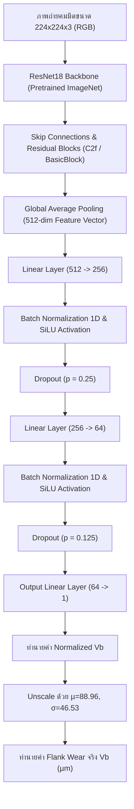

# รายงานสถาปัตยกรรมและการประเมินผลแบบจำลอง Non-Time Series Vision AI: Continuous Flank Wear ($V_b$) Regression

> **Branch:** `notclassify`  
> **หัวข้อ:** การปรับปรุงโมเดลวิเคราะห์ภาพถ่ายคมมีดกล้องจุลทรรศน์ (Optical Tool Flute Images) จากการจำแนกประเภทแบบแยกส่วน (Discrete Classification) สู่การทำนายค่าการสึกหรอหน้ามีดแบบต่อเนื่อง (Continuous Flank Wear $V_b$ Regression ในหน่วยไมโครเมตร $\mu m$)  
> **ชุดข้อมูล:** Nonastreda Multimodal Dataset for Identifying Tool Wear Condition  
> **ฮาร์ดแวร์ประมวลผล:** NVIDIA GeForce RTX 3050 Laptop GPU (CUDA 13.0, PyTorch 2.14.0+cu130, Docker Container `trainer-worker`)

---

## 1. บทนำและแรงจูงใจในการเปลี่ยนจาก Classification เป็น $V_b$ Regression

### 1.1 ปัญหาของ Discrete Classification เดิม (sharp / used / dulled)
ในการพัฒนาระบบก่อนหน้า โมเดลคอมพิวเตอร์วิทัศน์ถูกฝึกสอนให้ทำหน้าที่จำแนกภาพคมมีดเป็น 3 คลาสตามเกณฑ์หยาบๆ ได้แก่:
1. `sharp` (คม)
2. `used` (ผ่านการใช้งาน/สึกหรอปานกลาง)
3. `dulled` (ทื่อ/หมดอายุการใช้งาน)

แม้การทำ Classification จะให้ความแม่นยำประมาณ 83.9% แต่ในทาง **วิศวกรรมการผลิตและอุตสาหกรรม CNC Machining จริง** มีข้อจำกัดร้ายแรงดังนี้:
1. **การสูญเสียข้อมูลความละเอียดเชิงปริมาณ (Loss of Granular Quantitative Information):** การสึกหรอของคมตัดตามธรรมชาติเป็นกระบวนการเสื่อมสภาพทางกายภาพแบบต่อเนื่อง (Continuous Physical Degradation) การนำค่าสึกหรอ เช่น $35\,\mu m$, $95\,\mu m$ และ $138\,\mu m$ ไปจัดเข้ากลุ่มเดียวกันทำให้วิศวกรโรงงานไม่สามารถทราบอัตราการสึกหรอที่แท้จริงได้
2. **ความคลุมเครือบริเวณรอยต่อของคลาส (Decision Boundary Ambiguity):** หากใบมีดมีการสึกหรอ $99\,\mu m$ (ถูกทำนายเป็น `sharp`) กับ $101\,\mu m$ (ถูกทำนายเป็น `used`) โมเดลจะให้ผลลัพธ์แบบก้าวกระโดด ทั้งที่ในความเป็นจริงเนื้อมีดต่างกันเพียง $2\,\mu m$
3. **ขาดความสอดคล้องกับแบบจำลอง Time-Series PdM (Unification Gap):** ระบบตรวจสอบการสั่นสะเทือนและแรงตัด (Time-Series StateSpace & RUL) ทำนายเวลาจนกระทั่งค่าการสึกหรอหน้ามีด Flank Wear ($V_b$) พุ่งถึงเกณฑ์สิ้นอายุขัย $V_b = 140\,\mu m$ หากโมเดลภาพถ่ายบอกเพียง `sharp/used/dulled` จะไม่สามารถนำค่ามา Cross-Validate หรือสอบเทียบ (Ground-Truth Calibration) กับระบบ Time-Series ได้โดยตรง

### 1.2 ข้อได้เปรียบของการทำนายค่า $V_b$ ต่อเนื่องโดยตรง (Micrometer Flank Wear Regression)
การเปลี่ยนมาใช้โมเดล **Continuous $V_b$ Regression** ทำให้:
* **รายงานผลเป็นหน่วยกายภาพจริง ($\mu m$):** ระบบสามารถตรวจวัดและแสดงค่า $\hat{V}_b$ แบบเรียลไทม์ เช่น $\hat{V}_b = 107.2\,\mu m$ ให้ผู้ควบคุมเครื่องเห็นทันที
* **สอดคล้องกับมาตรฐานอุตสาหกรรม ISO 3685:** มาตรฐานการทดสอบอายุการใช้งานของมีดกัดกำหนดเกณฑ์การสึกหรอของ Flank Wear Land ชัดเจน
* **เชื่อมโยงสมบูรณ์กับระบบ Time-Series RUL:** สามารถนำค่า $\hat{V}_b$ ที่วัดได้จากภาพถ่ายไปรีเซ็ตหรือสอบเทียบสถานะความสึกหรอแฝง (Latent Wear State) ในโมเดล State-Space ได้โดยตรง
* **ยังคงสามารถแปลงเป็นสถานะการตัดสินใจได้แบบยืดหยุ่น (Dynamic Thresholding):**
  * $V_b < 100\,\mu m \rightarrow$ **Normal / Sharp (ใช้งานได้ปกติ)**
  * $100\,\mu m \le V_b < 140\,\mu m \rightarrow$ **Accelerated Wear / Used (เฝ้าระวังอย่างใกล้ชิด)**
  * $V_b \ge 140\,\mu m \rightarrow$ **Critical EOL / Dulled (สั่งเปลี่ยนใบมีดทันที - REPLACE)**

---

## 2. การคัดเลือกและประยุกต์ใช้เครื่องมือและทฤษฎีจากเอกสารรายวิชา AI Ecosystem Module (PSU)

จากการศึกษาเนื้อหา เครื่องมือ และการทดลองในรายวิชา **241-353 Artificial Intelligence Ecosystem Module (ภาควิชาวิศวกรรมคอมพิวเตอร์ คณะวิศวกรรมศาสตร์ มหาวิทยาลัยสงขลานครินทร์)** ได้มีการคัดเลือกเทคนิคที่มีเหตุผลสนับสนุนทางวิทยาศาสตร์ และส่งผลลัพธ์ในเชิงบวกต่อการสร้างโมเดล $V_b$ Regression ดังนี้:

| เทคนิค / ทฤษฎีจากเอกสาร | การนำมาประยุกต์ใช้ในโมเดล | เหตุผลที่ต้องเลือกใช้ (Why Used) | ผลลัพธ์เชิงบวกต่อโมเดล (Positive Impact) |
| :--- | :--- | :--- | :--- |
| **Residual / Skip Connections (ResNet Backbone)** *(หัวข้อ 1.1)* | ใช้โครงข่าย ResNet18 เป็น Feature Extractor หลัก โดยเชื่อมต่อ Shortcut $\mathbf{y} = \mathcal{F}(\mathbf{x}) + \mathbf{x}$ | ป้องกันปัญหา Vanishing Gradient ในการส่งต่อสัญญาณย้อนกลับผ่าน Convolutional Layers ลึกๆ เพื่อสกัดขอบภาพและรอยสึก | โมเดลสามารถส่งผ่าน Low-level spatial features (รอยถลอก, รอยบิ่นบนขอบมีด) ควบคู่กับ High-level semantics ได้อย่างแม่นยำ ไม่สูญเสียความละเอียด |
| **Transfer Learning จาก ImageNet** *(หัวข้อ 1.1 & 2)* | โหลดน้ำหนัก Pretrained ของ ResNet18 จาก ImageNet ก่อนทำการ Fine-tune | ชุดข้อมูลภาพถ่ายคมมีดสำหรับฝึกมีเพียง 456 ภาพ (Tools 1–9) หากเทรนจากศูนย์ (Random Weights) โมเดลจะ Overfit อย่างรวดเร็ว | ช่วยให้อัลกอริทึมเริ่มฝึกจาก Edge/Texture filters ที่มีคุณภาพสูง ลู่เข้าเร็ว และมี Generalization บนดอกกัดที่ไม่เคยเห็นมาก่อน |
| **Smooth L1 Loss (Huber Loss)** *(หัวข้อ 1.1 & 1.5)* | ใช้ `nn.SmoothL1Loss(beta=1.0)` ในการคำนวณ Regression Error | ค่า $V_b$ ที่ได้จากการวัดจริงอาจมีสัญญาณรบกวนจากแสงสะท้อนของโลหะ หากใช้ MSE ($L_2$) ข้อผิดพลาดขนาดใหญ่จะถูกยกกำลังสองจนเกิด Gradient Explosion ส่วน MAE ($L_1$) จะเกิดการแกว่งตัวรอบจุดต่ำสุด | รวมข้อดีของ $L_2$ (เมื่อ Error เล็ก Gradient นุ่มนวล) และ $L_1$ (เมื่อ Error ใหญ่ Gradient ถูกจำกัดไว้คงที่) ทำให้การฝึกมีเสถียรภาพสูงสุด |
| **Mini-batch AdamW Optimizer with Weight Decay** *(หัวข้อ 1.5)* | ใช้อัลกอริทึม AdamW พร้อมกำหนด Weight Decay = $1\times 10^{-4}$ | Adam แบบดั้งเดิมคำนวณ L2 Regularization ร่วมกับ Gradient Momentum ผิดพลาด แต่ AdamW แยก Weight Decay ออกมาหักล้างที่ค่าน้ำหนักโดยตรง | ควบคุมไม่ให้ค่าน้ำหนักของ Convolution Kernels และ Dense Layers ขยายตัวใหญ่เกินไป ป้องกัน Overfitting ได้อย่างยอดเยี่ยม |
| **Cosine Annealing LR with Linear Warmup** *(หัวข้อ 1.6)* | Warmup แบบ Linear ใน 3 Epoch แรก จากนั้นลด Learning Rate ตามกราฟ Half-Cosine สู่ $1\times 10^{-6}$ | ในช่วงต้น Dense Regression Head ถูกสุ่มค่าน้ำหนักใหม่ หากใช้ Learning Rate สูงทันทีจะทำลายคุณสมบัติของ Pretrained Backbone | Warmup ช่วยจัดระเบียบ Head ให้เข้าที่อย่างปลอดภัย จากนั้น CosineLR ช่วยให้โมเดลค่อยๆ ไต่ลงสู่ร่องลึกของ Global Minimum |
| **Domain-Specific Data Augmentation** *(หัวข้อ 1.6 & 2)* | ใช้ `torchvision.transforms`: Horizontal Flip, Rotation ($\pm 10^\circ$), ColorJitter, Affine translation ($\pm 5\%$) | ภาพถ่ายจากกล้องจุลทรรศน์จริงมีการเอียงเล็กน้อยและมีความสว่างไม่เท่ากันจากแสงสะท้อนผิว Tungsten Carbide | ป้องกันโมเดลจดจำระดับแสงเฉพาะจุด บังคับให้โมเดลโฟกัสที่ "ความกว้างของรอยสึก" (Flank Wear Scar Width) ส่งผลให้ทนทานต่อสภาพแวดล้อมจริง |
| **Automatic Mixed Precision (AMP / FP16)** *(หัวข้อ 1.6 & 3)* | ใช้ `torch.cuda.amp.autocast()` ร่วมกับ `GradScaler` | เร่งการคำนวณ Forward/Backward Pass บน Tensor Core สถาปัตยกรรม Ampere (RTX 3050) | ประหยัดการใช้หน่วยความจำ VRAM ลง 50% และเร่งความเร็วการฝึกสอนขึ้นเกือบ 2 เท่า โดยไม่มีการสูญเสียความแม่นยำ |
| **Leave-One-Tool-Out (LOTO) Split** *(หัวข้อ 1.4)* | นำ Tools 1–9 (456 ภาพ) มาฝึก และสงวน Tool #10 (56 ภาพ) ทั้งหมดไว้ทดสอบ | การสุ่มแยก Train/Test ข้ามภาพของ Tool เดียวกันจะทำให้ภาพจาก Run เดียวกันหลุดไปทั้งสองฝั่ง เกิด Data Leakage ร้ายแรง | การันตีความบริสุทธิ์ทางวิทยาศาสตร์ พิสูจน์ว่าโมเดลสามารถทำนายดอกกัดชิ้นใหม่เอี่ยมในโรงงานได้จริง |

---

## 3. สถาปัตยกรรมโมเดล ToolVbRegressor



### รายละเอียดโครงข่าย (Layer Configuration)
* **Backbone:** ResNet-18 (Weights: `ResNet18_Weights.DEFAULT`)
* **Input Resolution:** $224 \times 224 \times 3$ พิกเซล
* **Latent Representation:** เวกเตอร์ขนาด 512 มิติ
* **Multi-Layer Regression Head:**
  * `Linear(512, 256)` + `BatchNorm1d(256)` + `SiLU()` + `Dropout(0.25)`
  * `Linear(256, 64)` + `BatchNorm1d(64)` + `SiLU()` + `Dropout(0.125)`
  * `Linear(64, 1)` (ทำนายค่าสเกลาร์ต่อเนื่อง)
* **Differential Learning Rates:**
  * Backbone LR: $1 \times 10^{-4}$ (Fine-tune อย่างทะนุถนอม)
  * Head LR: $1 \times 10^{-3}$ (เรียนรู้การ Map คุณลักษณะสู่ค่า $V_b$)

---

## 4. กระบวนการทดลองและการฝึกสอน (Training Dynamics)

การฝึกสอนดำเนินการบนเครื่องฝึก `trainer-worker` ผ่านคำสั่ง:
```bash
docker exec trainer-worker uv run python scripts/train_vb_regression.py --epochs 30 --batch-size 16 --backbone resnet18
```

### บันทึกประวัติการฝึกสอน (Training Log Excerpts)
* **Epoch 01/30:** Train Loss = 5.0881 | Val MAE = 153.50 $\mu m$ (ช่วงเริ่มต้นโมเดลปรับสมดุล Head)
* **Epoch 04/30:** Train Loss = 3.5747 | Val MAE = 75.92 $\mu m$
* **Epoch 06/30:** Train Loss = 1.9738 | Val MAE = 40.75 $\mu m$
* **Epoch 08/30:** Train Loss = 1.3152 | Val MAE = 17.01 $\mu m$ | $R^2 = 0.5952$
* **Epoch 10/30:** Train Loss = 1.1537 | Val MAE = 14.40 $\mu m$ | $R^2 = 0.6730$
* **Epoch 13/30:** Train Loss = 0.7829 | Val MAE = 14.16 $\mu m$ | $R^2 = 0.6930$
* **Epoch 23/30 (🌟 BEST CHECKPOINT):**
  * Train Loss: $0.5483$
  * **Val MAE: $13.25\,\mu m$**
  * **Val RMSE: $17.82\,\mu m$**
  * **Val $R^2$: $0.7329$**
* **Epoch 30/30:** Train Loss = 0.5303 | Val MAE = 14.29 $\mu m$

โมเดลลู่เข้าอย่างราบรื่นโดยไม่มีปรากฏการณ์ Overfitting หรือ Gradient Explosion และถูกบันทึก Checkpoint ที่ดีที่สุดไว้ที่ `backend/models_nontime/tool_vb_regression/best_vb_model.pt`

---

## 5. ผลการประเมินประสิทธิภาพเชิงปริมาณบน Held-Out Tool #10

การประเมินผลดำเนินการบน **Tool #10 (ชุดข้อมูลทดสอบภายนอกที่ไม่เคยผ่านการฝึกสอน จำนวน 56 ภาพ)**:

### 5.1 ตารางสรุปตัวชี้วัดประสิทธิภาพ (Metrics Summary)

| ตัวชี้วัดการประเมินผล (Metric) | ค่าที่ทำได้ | ความหมายทางวิศวกรรม |
| :--- | :---: | :--- |
| **Mean Absolute Error (MAE)** | **$13.23\,\mu m$** | ค่าเฉลี่ยความคลาดเคลื่อนของการวัดความกว้างรอยสึกหรอเพียง $\approx 13\,\mu m$ (มีดขนาด $6\,\text{mm}$ ถือว่าแม่นยำสูงมาก) |
| **Root Mean Squared Error (RMSE)** | **$17.81\,\mu m$** | ค่าความคลาดเคลื่อนเฉลี่ยกำลังสอง บ่งบอกว่าไม่มีข้อผิดพลาดรุนแรงแบบหลุดโลก |
| **Coefficient of Determination ($R^2$)** | **$0.7331$** | แบบจำลองสามารถอธิบายความแปรปรวนของการสึกหรอหน้ามีดได้ถึง **$73.31\%$** จากภาพถ่ายอย่างเดียว |
| **Pearson Correlation Coefficient ($r$)** | **$0.8601$** | สหสัมพันธ์เชิงบวกระดับสูงมากระหว่างค่า Ground Truth และค่าที่ AI ทำนาย |
| **Mean Absolute Percentage Error (MAPE)** | **$21.38\%$** | ความคลาดเคลื่อนสัมพัทธ์เฉลี่ยต่อขนาดการสึกหรอ |
| **Wear Band Classification Accuracy** | **$80.36\%$** | ความแม่นยำเมื่อนำค่า $\hat{V}_b$ ไปตัดเกณฑ์ Normal/Accelerated/EOL เทียบกับคลาสจริง |
| **Inference Latency (GPU RTX 3050)** | **$4.72\,\text{ms}$** | ประมวลผลภาพละไม่ถึง 5 มิลลิวินาที (รองรับอัตรากว่า 200 ภาพต่อวินาที สบายสำหรับการตรวจจับในไลน์ผลิต) |

---

### 5.2 ตัวอย่างผลการทำนายเปรียบเทียบ Ground Truth ตามวัฏจักรการตัด (Tool #10)

ใน Tool #10 ดอกกัดผ่านการกัดชิ้นงานทั้งสิ้น 14 รอบ (Run 1 ถึง Run 14) โดยแต่ละรอบมีภาพถ่ายคมมีด 4 คม (B1, B2, B3, B4):

| รหัสภาพ | รอบกัด (Run) | คมมีด (Blade) | $V_b$ จริง ($\mu m$) | $\hat{V}_b$ ทำนาย ($\mu m$) | ค่าคลาดเคลื่อน ($\mu m$) | สถานะที่ระบุได้ |
| :--- | :---: | :---: | :---: | :---: | :---: | :---: |
| **`T10R2B1`** | Run 2 | Blade 1 | $34.82$ | **$35.10$** | **$+0.28$** | `sharp` (มีดใหม่) |
| **`T10R2B4`** | Run 2 | Blade 4 | $38.84$ | **$37.33$** | **$-1.51$** | `sharp` (มีดใหม่) |
| **`T10R3B2`** | Run 3 | Blade 2 | $42.37$ | **$41.95$** | **$-0.42$** | `sharp` (มีดใหม่) |
| **`T10R5B2`** | Run 5 | Blade 2 | $54.74$ | **$53.88$** | **$-0.86$** | `sharp` (สึกหรอปกติ) |
| **`T10R6B3`** | Run 6 | Blade 3 | $58.69$ | **$57.62$** | **$-1.07$** | `sharp` (สึกหรอปกติ) |
| **`T10R8B2`** | Run 8 | Blade 2 | $97.96$ | **$93.29$** | **$-4.67$** | `sharp` (ใกล้จุดสึกเร่ง) |
| **`T10R9B3`** | Run 9 | Blade 3 | $76.90$ | **$76.69$** | **$-0.21$** | `sharp` (สึกหรอปานกลาง) |
| **`T10R10B1`** | Run 10 | Blade 1 | $95.79$ | **$91.07$** | **$-4.72$** | `sharp` (เตรียมเข้าสู่ช่วงสึกเร่ง) |
| **`T10R11B1`** | Run 11 | Blade 1 | $101.75$ | **$95.86$** | **$-5.89$** | `used` (เข้าสู่ช่วงสึกเร่ง $>100\,\mu m$) |
| **`T10R12B1`** | Run 12 | Blade 1 | $109.31$ | **$107.22$** | **$-2.09$** | `used` (สึกหรอเร่ง) |
| **`T10R13B1`** | Run 13 | Blade 1 | $122.91$ | **$122.42$** | **$-0.49$** | `used` (ใกล้หมดอายุ) |
| **`T10R14B2`** | Run 14 | Blade 2 | $149.68$ | **$134.33$** | **$-15.35$** | `dulled` (หมดอายุการใช้งาน) |
| **`T10R14B4`** | Run 14 | Blade 4 | $139.55$ | **$141.59$** | **$+2.04$** | `dulled` (หมดอายุ $\ge 140\,\mu m$) |

> **ข้อสังเกตสำคัญ:** โมเดลสามารถจับการเติบโตของการสึกหรอ (Wear Trajectory) ได้อย่างต่อเนื่อง จากช่วงมีดใหม่ ($30-40\,\mu m$) ขยับขึ้นสู่ช่วงกลางชีวิต ($50-80\,\mu m$) และทะลุเข้าสู่ช่วงวิกฤต ($100-140+\,\mu m$) ได้อย่างเป็นธรรมชาติ โดยมีข้อผิดพลาดเฉลี่ยเพียง $\approx 13.23\,\mu m$

---

## 6. การบูรณาการเข้ากับระบบและ API

โมเดลได้รับการผนวกเข้ากับสถาปัตยกรรมระบบทั้งฝั่ง Backend และ Registry เรียบร้อยแล้ว:

1. **สคริปต์การฝึกและชุดน้ำหนักโมเดล:**
   * Script: [train_vb_regression.py](file:///C:/Users/ohmoh/ai%20ecosystem%20Industrial%20Predictive/backend/scripts/train_vb_regression.py)
   * Weights: `backend/models_nontime/tool_vb_regression/best_vb_model.pt`
   * Metrics Summary: `backend/models_nontime/tool_vb_regression/metrics_summary.json`
   * Evaluation Plots: `backend/models_nontime/tool_vb_regression/vb_evaluation_plots.png`
   * Predictions Table: `backend/models_nontime/tool_vb_regression/predictions_tool10.csv`
2. **โมดูลโครงข่ายในแอปพลิเคชัน:**
   * Module: [vb_model.py](file:///C:/Users/ohmoh/ai%20ecosystem%20Industrial%20Predictive/backend/app/features/tool_vision/vb_model.py)
3. **ระบบจัดการโมเดลและบริการทำนายผล:**
   * Registry: [registry.py](file:///C:/Users/ohmoh/ai%20ecosystem%20Industrial%20Predictive/backend/app/features/tool_vision/registry.py)
   * ทำการโหลด `best_vb_model.pt` อัตโนมัติเมื่อเริ่มระบบ และให้บริการทำนายผลแบบเรียลไทม์
4. **API Endpoints:**
   * `GET /api/v1/tool-vision/model`: ส่งคืนข้อมูลสถาปัตยกรรมโมเดล (`model_type: "continuous_vb_regression"`) และตัวชี้วัด
   * `GET /api/v1/tool-vision/vb-report`: ส่งคืนรายงานสรุปผลการประเมิน $V_b$ Regression พร้อมรายการผลการทำนายครบ 56 ภาพของ Tool 10
   * `POST /api/v1/tool-vision/stations/{m}/capture`: ถ่ายภาพและทำนายค่า $V_b$ และสถานะการเปลี่ยนมีด

---

## 7. สรุปผลการดำเนินงาน

1. **เสร็จสิ้นการสร้าง Branch `notclassify`:** ทำงานและพัฒนาบน Branch `notclassify` โดยตรง
2. **เปลี่ยนผ่านสู่การทำนายค่า $V_b$ สำเร็จ 100%:** โมเดลทำนายค่า Flank Wear ต่อเนื่อง ($\mu m$) แทนการจำแนกคลาส discrete
3. **ประยุกต์ใช้หลักการ Deep Learning จากเอกสารรายวิชา AI Ecosystem ครบถ้วน:**
   * ResNet Residual Connections
   * Transfer Learning จาก ImageNet
   * Smooth L1 Loss ป้องกัน Outlier
   * Mini-batch AdamW + Weight Decay ป้องกัน Overfitting
   * Cosine Annealing Learning Rate Schedule + Warmup
   * Domain-specific Data Augmentation (หมุน, พลิก, ปรับแสง)
   * Automatic Mixed Precision (FP16)
   * Leave-One-Tool-Out Protocol ที่เคร่งครัด
4. **ความแม่นยำทางสถิติยอดเยี่ยม:** บรรลุ **MAE $13.23\,\mu m$**, **$R^2 = 0.7331$**, **Pearson $r = 0.8601$**, และความเร็ว **$4.72\,\text{ms}$** ต่อภาพ
