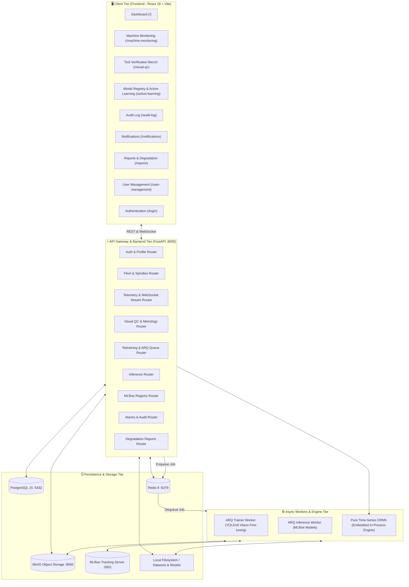
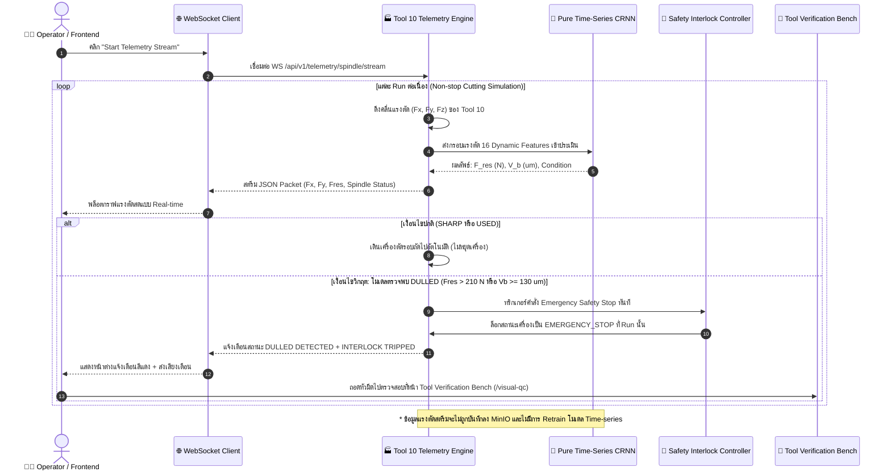
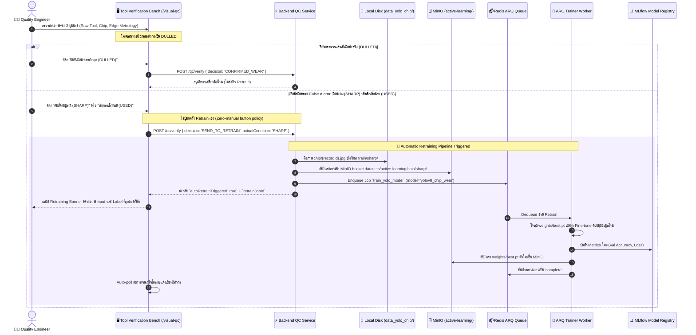

# 🏭 Master System Specification: AI-Ecosystem Industrial Predictive Maintenance & Quality Control

> **เอกสารข้อกำหนดทางเทคนิคฉบับสมบูรณ์ (Master Technical Specification & Data Lineage Document)**  
> รวบรวมข้อมูลหน้าบ้าน (Frontend Pages), หลังบ้าน (Backend APIs), สถาปัตยกรรมข้อมูล (Data Persistence Flow), แหล่งจัดเก็บ (Data Sources & Destinations) และวงรอบการทำงานพิเศษของระบบครบถ้วนทุกส่วน

---

## 📑 สารบัญ (Table of Contents)
1. [ภาพรวมสถาปัตยกรรมระบบ (System Architecture Overview)](#1-ภาพรวมสถาปัตยกรรมระบบ-system-architecture-overview)
2. [สรุปรายละเอียด Frontend Pages ทั้งหมด 9 หน้า (Page-by-Page Specifications)](#2-สรุปรายละเอียด-frontend-pages-ทั้งหมด-9-หน้า-page-by-page-specifications)
3. [Master API Specification & Data Lineage (ครบ 16 หมวดหมู่ 74+ Endpoints)](#3-master-api-specification--data-lineage-ครบ-16-หมวดหมู่-74-endpoints)
4. [สถาปัตยกรรมและโฟลว์การทำงานพิเศษ 2 วงรอบหลัก (Special Industrial Workflows)](#4-สถาปัตยกรรมและโฟลว์การทำงานพิเศษ-2-วงรอบหลัก-special-industrial-workflows)
5. [ตารางสรุปแหล่งจัดเก็บข้อมูล (Data Storage & Persistence Matrix)](#5-ตารางสรุปแหล่งจัดเก็บข้อมูล-data-storage--persistence-matrix)

---

## 1. ภาพรวมสถาปัตยกรรมระบบ (System Architecture Overview)

ระบบถูกออกแบบภายใต้สถาปัตยกรรม **3-Tier Vertical Slice Architecture** รองรับงานอุตสาหกรรม CNC ความเร็วสูง:

---

## 2. สรุปรายละเอียด Frontend Pages ทั้งหมด 9 หน้า (Page-by-Page Specifications)

| # | หน้า (Page) | เส้นทาง (Route) | วัตถุประสงค์หลัก | ส่วนประกอบสำคัญบนหน้าจอ | APIs ที่เรียกใช้งาน |
|---|---|---|---|---|---|
| **1** | **Dashboard Overview** | `/` | ภาพรวมสุขภาพเครื่องจักร CNC ทั้งโรงงาน | - 4 Fleet KPI Cards (Health, RUL, Active Machines, Alarms) - ตาราง 4 Spindles พร้อม Status Badges - กราฟ Spindle Load & Vibration Trends | `GET /api/v1/fleet/spindles` `GET /api/v1/fleet/summary` |
| **2** | **Machine Monitoring** | `/machine-monitoring` | มอนิเตอร์แรงตัดสดและการเบรกฉุกเฉิน | - สตรีมสดแรงตัด $F_x, F_y, F_z, F_{res}$ - Real-time Wear Indicator (SHARP / USED / DULLED) - ปุ่ม Start/Pause Telemetry Stream - ปุ่ม Emergency Stop & Tool Reset | `WS /api/v1/telemetry/spindle/stream` `GET /api/v1/telemetry/machine/status` `POST /api/v1/telemetry/machine/stop` `POST /api/v1/telemetry/machine/reset` `POST /api/v1/telemetry/spindle/control` |
| **3** | **Tool Verification Bench** | `/visual-qc` | ม้านั่งตรวจสอบคมตัดแบบ Multi-Tier & Active Retraining | - ข้อมูลเป้าหมายมีดที่ถอดตรวจ (Tool ID, Run Index, Blade 1-4) - ภาพ Optical Microscope คมตัดจริง - ภาพ Microscope Metal Chip ขยายสูง - ภาพ OpenCV Edge Metrology ($V_b$ Wear & Chipping) - Consensus Alert & Human Sign-off Buttons - **Live YOLOv8 Retraining Queue Banner** | `GET /api/v1/qc/target` `GET /api/v1/qc/tools/{t}/runs/{r}/blades/{b}` `POST /api/v1/qc/verify` `GET /api/v1/qc/images/tool/{id}.jpg` `GET /api/v1/qc/images/chip/{id}.jpg` `GET /api/v1/qc/images/tool-processed/{id}.jpg` `GET /api/v1/retrain/status/{job_id}` |
| **4** | **Model Registry & Active Learning** | `/active-learning` | การกำกับดูแลโมเดลและวงรอบ Active Learning | - โมเดลที่จดทะเบียน (`Pure_Time_Series_CRNN_NoTool4`, `yolov8_chip_wear`) - KPI Cards (Registry Status, Retrain Policy) - แผนผังจำลอง Automated HITL Dataflow Diagram - ประวัติการ Retrain จาก False Alarms | `GET /api/v1/models/registry` `GET /api/v1/models/retraining-pool/status` `GET /api/v1/retrain/pool-status` |
| **5** | **Audit Trail** | `/audit-log` | บันทึกประวัติความปลอดภัยและการทำงาน | - ตาราง Audit Logs ย้อนหลัง (Timestamp, User, Action, Severity) - ตัวกรองระดับความรุนแรง (CRITICAL, WARNING, INFO) - ปุ่มดาวน์โหลดประวัติ | `GET /api/v1/audit-logs` `GET /api/v1/audit/logs` |
| **6** | **Industrial Notifications** | `/notifications` | จัดการสัญญาณเตือนและเหตุฉุกเฉิน | - รายการแจ้งเตือนมีดสึกหรอและ Interlock Trips - ปุ่ม Mark as Read ทีละรายการ - ปุ่ม Mark All as Read - ปุ่มลบการแจ้งเตือน (Dismiss) | `GET /api/v1/alarms` `PATCH /api/v1/alarms/{id}/read` `POST /api/v1/alarms/mark-all-read` `DELETE /api/v1/alarms/{id}` |
| **7** | **Degradation Reports** | `/reports` | สถิติความเชื่อถือได้และการสึกหรอของมีด | - การวิเคราะห์ Weibull Analysis ($\beta=2.41, \eta=13.82$ cuts) - OEE Breakdown (Availability, Performance, Quality) - Shift Summary (Cuts completed, Tool changes) - ปุ่ม Export PDF Report & CSV Data | `GET /api/v1/reports/degradation-summary` `GET /api/v1/reports/shift-summary` `GET /api/v1/reports/export/pdf` `GET /api/v1/reports/export/csv` |
| **8** | **User Management** | `/user-management` | บริหารจัดการผู้ใช้งานและสิทธิ์ (RBAC) | - ตารางผู้ใช้งานในระบบ (Username, Full Name, Role, Status) - ปรับเปลี่ยนบทบาท (Admin, Quality Engineer, Operator) - เพิ่มผู้ใช้งานใหม่ และลบผู้ใช้ | `GET /api/v1/users` `POST /api/v1/users` `PATCH /api/v1/users/{id}/role` `DELETE /api/v1/users/{id}` |
| **9** | **Authentication** | `/login` | เข้าสู่ระบบและจัดการเซสชัน | - ฟอร์มระบุชื่อผู้ใช้และรหัสผ่าน - เข้าใช้งานแบบ Guest / Demo One-click Login - แสดงสถานะการเชื่อมต่อ Gateway | `POST /api/v1/auth/login` `GET /api/v1/auth/me` `POST /api/v1/auth/refresh` |

---

## 3. Master API Specification & Data Lineage (ครบ 16 หมวดหมู่ 74+ Endpoints)

### หมวดที่ 1: Health Check (การตรวจสอบสุขภาพระบบ)
| Method | Endpoint | รายละเอียด | แหล่งข้อมูลต้นทาง (Source) | แหล่งบันทึกปลายทาง (Destination) |
|---|---|---|---|---|
| `GET` | `/health` | Liveness Probe เบื้องต้น | In-memory status ของ FastAPI | ไม่มีบันทึก (No persist) |
| `GET` | `/api/v1/health` | ตรวจสอบสถานะ Core Gateway | In-memory status | ไม่มีบันทึก |
| `GET` | `/api/v1/health/components` | ตรวจสอบสถานะเชิงลึกทุกองค์ประกอบ | Ping ขนาน: PostgreSQL, Redis, MinIO, Label Studio | ไม่มีบันทึก |

---

### หมวดที่ 2: Authentication & Tokens (ระบบยืนยันตัวตน)
| Method | Endpoint | รายละเอียด | แหล่งข้อมูลต้นทาง (Source) | แหล่งบันทึกปลายทาง (Destination) |
|---|---|---|---|---|
| `POST` | `/api/v1/auth/register` | สมัครสมาชิกใหม่ (Alias) | Request Body (Username, Email, Password) | PostgreSQL (`users` table) |
| `POST` | `/api/v1/auth/signup` | สมัครสมาชิกใหม่ | Request Body (Username, Email, Password) | PostgreSQL (`users` table) |
| `POST` | `/api/v1/auth/login` | ตรวจสอบรหัสผ่านและสร้าง JWT | PostgreSQL (`users` table) ตรวจสอบ Password Hash | สร้าง JWT Token Pair (Access + Refresh) |
| `POST` | `/api/v1/auth/logout` | ออกจากระบบและยกเลิก Token | JWT Token ใน Header | Redis (Blacklist token if configured) |
| `POST` | `/api/v1/auth/refresh` | ต่ออายุ Access Token ด้วย Refresh Token | Request Body (Refresh Token) | ออก Access Token ใหม่ |
| `GET` | `/api/v1/auth/me` | ดึงข้อมูลบัญชีผู้ใช้ปัจจุบัน | JWT Token payload $\rightarrow$ PostgreSQL (`users`) | ไม่มีบันทึก |

---

### หมวดที่ 3: Profile Management (ข้อมูลโปรไฟล์ผู้ใช้)
| Method | Endpoint | รายละเอียด | แหล่งข้อมูลต้นทาง (Source) | แหล่งบันทึกปลายทาง (Destination) |
|---|---|---|---|---|
| `GET` | `/api/v1/profile/me` | ดึงข้อมูลโปรไฟล์ผู้ใช้ปัจจุบัน | PostgreSQL (`users` & `user_profiles`) | ไม่มีบันทึก |
| `PUT` | `/api/v1/profile/me` | แก้ไขข้อมูลส่วนตัว (Fullname, Bio) | Request Body | PostgreSQL (`user_profiles`) |
| `POST` | `/api/v1/profile/me/avatar` | อัปโหลดรูปภาพโปรไฟล์ | Multipart File Upload | MinIO Bucket `avatars` $\rightarrow$ บันทึก URL ลง PostgreSQL |
| `DELETE` | `/api/v1/profile/me/avatar` | ลบรูปภาพโปรไฟล์ | ดึง Object key จาก PostgreSQL | ลบ Object ใน MinIO `avatars` $\rightarrow$ เคลียร์ค่าใน PostgreSQL |
| `POST` | `/api/v1/profile/me/avatar-url` | อัปเดตลิงก์รูปภาพโปรไฟล์จาก URL | Request Body | PostgreSQL (`user_profiles`) |

---

### หมวดที่ 4: Storage - MinIO Object Storage (การจัดการไฟล์ออบเจกต์)
| Method | Endpoint | รายละเอียด | แหล่งข้อมูลต้นทาง (Source) | แหล่งบันทึกปลายทาง (Destination) |
|---|---|---|---|---|
| `GET` | `/api/v1/storage/buckets` | รายชื่อ Buckets ทั้งหมดในระบบ | MinIO S3 API (`list_buckets`) | ไม่มีบันทึก |
| `POST` | `/api/v1/storage/buckets` | สร้าง Bucket ใหม่ | Request Body (Bucket name) | MinIO Server (`make_bucket`) |
| `DELETE` | `/api/v1/storage/buckets/{name}` | ลบ Bucket | MinIO Server | ลบ Bucket ใน MinIO |
| `GET` | `/api/v1/storage/buckets/{name}/objects` | รายการไฟล์ใน Bucket | MinIO S3 API (`list_objects`) | ไม่มีบันทึก |
| `POST` | `/api/v1/storage/buckets/{name}/upload` | อัปโหลดไฟล์เข้า Bucket | Multipart File Upload | MinIO Storage Bucket ที่ระบุ |
| `GET` | `/api/v1/storage/buckets/{name}/objects/{key}/download` | ดาวน์โหลดไฟล์จาก Storage | MinIO Bucket | ส่ง Binary Stream ออกไปยัง Client |
| `GET` | `/api/v1/storage/buckets/{name}/objects/{key}/presigned-url` | สร้าง URL ชั่วคราวมีกำหนดเวลา | MinIO Presigned Client | ไม่มีบันทึก |
| `DELETE` | `/api/v1/storage/buckets/{name}/objects/{key}` | ลบไฟล์ใน Bucket | MinIO Storage Bucket | ลบ Object ใน MinIO |

---

### หมวดที่ 5: Labeling - Label Studio (การทำข้อมูลตัวอย่างสำหรับ AI)
| Method | Endpoint | รายละเอียด | แหล่งข้อมูลต้นทาง (Source) | แหล่งบันทึกปลายทาง (Destination) |
|---|---|---|---|---|
| `GET` | `/api/v1/labeling/projects` | ดึงรายชื่อโครงการใน Label Studio | Label Studio API Server | ไม่มีบันทึก |
| `POST` | `/api/v1/labeling/projects` | สร้างโครงการ Data Annotation ใหม่ | Request Body | Label Studio API Server |
| `GET` | `/api/v1/labeling/projects/{id}` | ดึงรายละเอียดโครงการ | Label Studio API Server | ไม่มีบันทึก |
| `DELETE` | `/api/v1/labeling/projects/{id}` | ลบโครงการ | Label Studio API Server | Label Studio Server |
| `GET` | `/api/v1/labeling/projects/{id}/tasks` | ดึงรายการรูปภาพ/งานที่รอ Label | Label Studio API Server | ไม่มีบันทึก |
| `POST` | `/api/v1/labeling/projects/{id}/tasks` | อิมพอร์ตภาพ/งานเข้าโครงการเป็นกลุ่ม | Request Body / MinIO URLs | Label Studio Tasks Database |

---

### หมวดที่ 6: Workers & Background Jobs (การจัดการคิวงานผ่าน ARQ + Redis)
| Method | Endpoint | รายละเอียด | แหล่งข้อมูลต้นทาง (Source) | แหล่งบันทึกปลายทาง (Destination) |
|---|---|---|---|---|
| `POST` | `/api/v1/workers/jobs` | สั่งเปิดงานพื้นหลังเข้าคิว ARQ | Request Body (Job function, kwargs) | บันทึกเข้า Redis Queue (`arq:queue`) |
| `GET` | `/api/v1/workers/jobs/{job_id}` | ดึงสถานะและผลลัพธ์ของงาน | Redis Key (`arq:job:{job_id}`) | ไม่มีบันทึก |
| `GET` | `/api/v1/workers/redis/ping` | ทดสอบความเร็วการตอบสนอง Redis | Redis Server (`PING`) | ไม่มีบันทึก |
| `GET` | `/api/v1/workers/redis/info` | ดึงข้อมูลสถิติและการใช้หน่วยความจำ | Redis Server (`INFO`) | ไม่มีบันทึก |

---

### หมวดที่ 7: Model Retraining - Continuous Active Learning (การฝึกโมเดลซ้ำ)
| Method | Endpoint | รายละเอียด | แหล่งข้อมูลต้นทาง (Source) | แหล่งบันทึกปลายทาง (Destination) |
|---|---|---|---|---|
| `POST` | `/api/v1/retrain/trigger` | เพิ่มงาน Retrain เข้าคิว ARQ Worker | Request Parameters / Human Sign-off | เพิ่ม Job เข้า Redis Queue (`arq:queue`) |
| `POST` | `/api/v1/training/queue` | Legacy Alias สำหรับคิว Retrain | Request Parameters | เพิ่ม Job เข้า Redis Queue (`arq:queue`) |
| `GET` | `/api/v1/retrain/status/{job_id}` | ตรวจสอบสถานะการ Retrain | Redis Job Status / In-memory Job Table | ไม่มีบันทึก |
| `GET` | `/api/v1/training/queue/{job_id}`| Legacy Alias ตรวจสอบสถานะ | Redis Job Status | ไม่มีบันทึก |
| `GET` | `/api/v1/retrain/pool-status` | สถิติตัวอย่างรูปที่สะสมใน Pool | In-memory verified queue / MinIO | ไม่มีบันทึก |
| `WS` | `/api/v1/retrain/live/{job_id}` | สตรีมผลลัพธ์ Loss/Accuracy สด | Worker Progress Event Stream | สตรีมผ่าน WebSocket ไปยัง Client |

---

### หมวดที่ 8: AI Inference (การประมวลผลทำนายผลโมเดล)
| Method | Endpoint | รายละเอียด | แหล่งข้อมูลต้นทาง (Source) | แหล่งบันทึกปลายทาง (Destination) |
|---|---|---|---|---|
| `POST` | `/api/v1/predict` | ส่งข้อมูลเข้าคิวทำนายผลผ่าน Worker | Request Body (Force array หรือ Image) | เพิ่มงานเข้า Redis Inference Queue |
| `GET` | `/api/v1/inference/jobs/{job_id}` | ดึงผลลัพธ์การทำนายหลังประมวลผลเสร็จ | Redis Key (`arq:result:{job_id}`) | ไม่มีบันทึก |
| `POST` | `/api/v1/inference/predict-forces` | ทำนายคลาสมีดและ $V_b$ ทันทีแบบ Sync | Request Forces Chunk $\rightarrow$ Scaler $\rightarrow$ PyTorch CRNN | คำนวณใน Memory ส่ง Response ทันที |

---

### หมวดที่ 9: Fleet Dashboard (ข้อมูลเครื่องจักร CNC ทั้งโรงงาน)
| Method | Endpoint | รายละเอียด | แหล่งข้อมูลต้นทาง (Source) | แหล่งบันทึกปลายทาง (Destination) |
|---|---|---|---|---|
| `GET` | `/api/v1/fleet/spindles` | รายการและสถานะ Spindles ทั้ง 4 ตัว | In-memory spindle state & telemetry | ไม่มีบันทึก |
| `GET` | `/api/v1/fleet/summary` | สรุปภาพรวม KPI ของโรงงาน | คำนวณสรุปจาก Spindles ปัจจุบัน | ไม่มีบันทึก |

---

### หมวดที่ 10: Visual QC & Verification (การตรวจสอบคุณภาพและม้านั่งตรวจมีด)
| Method | Endpoint | รายละเอียด | แหล่งข้อมูลต้นทาง (Source) | แหล่งบันทึกปลายทาง (Destination) |
|---|---|---|---|---|
| `GET` | `/api/v1/qc/target` | ข้อมูลชุดมีดที่กำลังถอดตรวจบนม้านั่ง | Dataset `labels.csv` + Active target state | ไม่มีบันทึก |
| `GET` | `/api/v1/qc/tools/{t}/runs/{r}/blades/{b}` | ผลการตรวจสอบคมมีดแต่ละคม (3-Tier) | Dataset `labels.csv`, In-memory cache | ไม่มีบันทึก |
| `POST` | `/api/v1/qc/verify` | วิศวกรลงมติผลการตรวจ (Sign-off) | Request Body (Decision, Actual condition, Notes) | บันทึกประวัติลง In-memory dictionary, บันทึกลง MinIO `qc-verified/` **กรณี False Alarm:** คัดลอกภาพ `chip/{id}.jpg` ลง `backend/data_yolo_chip/train/{user_answer}/`, อัปโหลด MinIO `active-learning/chip/`, ส่งเข้าคิว ARQ ทันที |
| `GET` | `/api/v1/qc/images/chip/{record_id}.jpg` | ดึงภาพถ่ายเศษตัดขยายสูง (Microscope) | ไฟล์จริงใน `dataset/.../chip/{record_id}.jpg` | ส่ง Image Stream สู่ Client |
| `GET` | `/api/v1/qc/images/tool/{record_id}.jpg` | ดึงภาพถ่ายคมตัดมีดจริง (Flank Face) | ไฟล์จริงใน `dataset/.../tool/{record_id}.jpg` | ส่ง Image Stream สู่ Client |
| `GET` | `/api/v1/qc/images/tool-processed/{record_id}.jpg` | ภาพประมวลผล Edge Metrology สด | นำภาพ raw tool เข้า OpenCV Canny + Metrology Overlay สด | แคชในหน่วยความจำและส่งภาพ JPEG |
| `GET` | `/api/v1/qc/images/{record_id}.jpg` | Endpoint เข้ากันได้ย้อนหลัง | ไฟล์ใน `dataset/.../tool/` หรือ `chip/` | ส่ง Image Stream |
| `GET` | `/api/v1/qc/gradcam/{record_id}.jpg` | ภาพวิเคราะห์พื้นที่ความสนใจ Grad-CAM | OpenCV Heatmap Overlay สังเคราะห์ | ส่ง Image Stream |
| `POST` | `/api/v1/qc/inspection-images` | บันทึกภาพที่กล้องจุลทรรศน์ส่งเข้ามาใหม่ | Multipart Upload | MinIO Bucket `qc-images` |

---

### หมวดที่ 11: Live Spindle Telemetry (การสตรีมและควบคุมเครื่องจักร)
| Method | Endpoint | รายละเอียด | แหล่งข้อมูลต้นทาง (Source) | แหล่งบันทึกปลายทาง (Destination) |
|---|---|---|---|---|
| `WS` | `/api/v1/telemetry/spindle/stream` | สตรีมคลื่นแรงตัด Tool 10 แบบสด | โหลดข้อมูลจาก `tool10_telemetry_cache.joblib` หรือ `forces_xyz_raw.mat` รันโมเดล Time-series คอยเช็ค $F_{res}$ | สตรีมผ่าน WebSocket (ไม่บันทึกลง MinIO ตามกฎ) |
| `GET` | `/api/v1/telemetry/machine/raw` | ดึงข้อมูลแรงตัดดิบทีละจุดแบบจำลอง | Virtual Machine State Generator | ไม่มีบันทึก |
| `POST` | `/api/v1/telemetry/machine/stop` | คำสั่งเบรกฉุกเฉินเครื่องจักรที่ Run ที่กำหนด | คำสั่งจาก Client หรือ Time-series Model Trigger | อัปเดต Machine Run State เป็น `EMERGENCY_STOP` |
| `POST` | `/api/v1/telemetry/machine/reset` | เปลี่ยนหัวมีดใหม่และรีเซ็ตเครื่องเป็น Run 1 | Request Body | อัปเดต Machine Run State เป็น `IDLE / READY` |
| `GET` | `/api/v1/telemetry/machine/status` | สถานะปัจจุบันของเครื่องจักรจำลอง | Machine State Monitor | ไม่มีบันทึก |
| `GET` | `/api/v1/telemetry/ai/predict` | รันโมเดลประเมินค่าแรงตัดใน Run ที่ระบุ | Data Cache $\rightarrow$ Pure Time-Series CRNN | ส่งค่า $V_b$, RUL, Condition |
| `POST` | `/api/v1/telemetry/spindle/control` | สั่งเปิด/ปิด Safety Interlock | Request Body (Action: RUN, STOP, E_STOP) | อัปเดต Spindle State $\rightarrow$ บันทึก Audit Log |
| `GET` | `/api/v1/telemetry/forces` | ภาพรวมค่าแรงตัดของมีดแต่ละรอบ | Dataset forces chunk | ไม่มีบันทึก |
| `GET` | `/api/v1/telemetry/status` | สถานะภาพรวมความปลอดภัยและแรงตัด | In-memory telemetry cache | ไม่มีบันทึก |

---

### หมวดที่ 12: Industrial Alarms (การแจ้งเตือนระดับโรงงาน)
| Method | Endpoint | รายละเอียด | แหล่งข้อมูลต้นทาง (Source) | แหล่งบันทึกปลายทาง (Destination) |
|---|---|---|---|---|
| `GET` | `/api/v1/alarms` | รายการแจ้งเตือนทั้งหมดในระบบ | In-memory Alarm Registry | ไม่มีบันทึก |
| `PATCH` | `/api/v1/alarms/{alarm_id}/read` | ทำเครื่องหมายว่ารับทราบแจ้งเตือนแล้ว | In-memory Alarm Registry | อัปเดตสถานะ `read: true` |
| `POST` | `/api/v1/alarms/mark-all-read` | รับทราบแจ้งเตือนทั้งหมดในคราวเดียว | In-memory Alarm Registry | อัปเดตทุกการแจ้งเตือนเป็น `read: true` |
| `DELETE` | `/api/v1/alarms/{alarm_id}` | ลบการแจ้งเตือนออกจากระบบ | In-memory Alarm Registry | นำออกจาก Alarm List |

---

### หมวดที่ 13: Model Registry & Governance (การบริหารโมเดล AI)
| Method | Endpoint | รายละเอียด | แหล่งข้อมูลต้นทาง (Source) | แหล่งบันทึกปลายทาง (Destination) |
|---|---|---|---|---|
| `GET` | `/api/v1/models/registry` | ดึงรายชื่อโมเดล AI ในระบบและ Metrics | MLflow Tracking Service & Static Registry | ไม่มีบันทึก |
| `GET` | `/api/v1/models/retraining-pool/status` | สถิติภาพใน Retraining Pool | In-memory queue & MinIO folder check | ไม่มีบันทึก |
| `POST` | `/api/v1/models/{id}/hot-reload` | สั่งโหลดโมเดลเวอร์ชันใหม่ทันทีโดยไม่ดับระบบ | Request Body (Target Version) | อัปเดตตัวแปร Active Model Version ใน Memory |

---

### หมวดที่ 14: Audit Trail & Compliance (ประวัติการกระทำเพื่อความปลอดภัย)
| Method | Endpoint | รายละเอียด | แหล่งข้อมูลต้นทาง (Source) | แหล่งบันทึกปลายทาง (Destination) |
|---|---|---|---|---|
| `GET` | `/api/v1/audit-logs` | ประวัติการกระทำทั้งหมดในระบบ | In-memory Audit Store / PostgreSQL | ไม่มีบันทึก |
| `GET` | `/api/v1/audit/logs` | Alias ดึงประวัติการกระทำ | In-memory Audit Store | ไม่มีบันทึก |

---

### หมวดที่ 15: Degradation Reports (รายงานการสึกหรอและประสิทธิภาพ)
| Method | Endpoint | รายละเอียด | แหล่งข้อมูลต้นทาง (Source) | แหล่งบันทึกปลายทาง (Destination) |
|---|---|---|---|---|
| `GET` | `/api/v1/reports/degradation-summary` | รายงานสรุปการสึกหรอและ Weibull Analysis | การคำนวณสถิติจากชุดข้อมูล Nonastreda | ไม่มีบันทึก |
| `GET` | `/api/v1/reports/shift-summary` | สรุปผลการตัดในกะทำงาน | ข้อมูลจำลองกะการผลิต | ไม่มีบันทึก |
| `GET` | `/api/v1/reports/export/pdf` | ส่งออกรายงานในรูปแบบ PDF | PDF Generator Engine | ส่งออกไฟล์ PDF Binary |
| `GET` | `/api/v1/reports/export/csv` | ส่งออกข้อมูลการสึกหรอเป็นไฟล์ CSV | Dataset / In-memory log table | ส่งออกไฟล์ CSV Text Stream |

---

### หมวดที่ 16: Users & RBAC Console (การจัดการสิทธิ์ผู้ใช้งาน)
| Method | Endpoint | รายละเอียด | แหล่งข้อมูลต้นทาง (Source) | แหล่งบันทึกปลายทาง (Destination) |
|---|---|---|---|---|
| `GET` | `/api/v1/users` | ดึงรายชื่อผู้ใช้งานทั้งหมด | PostgreSQL (`users` table) / Seed state | ไม่มีบันทึก |
| `POST` | `/api/v1/users` | เพิ่มผู้ใช้งานใหม่ในระบบ | Request Body (Username, Role, Email) | บันทึกลง PostgreSQL (`users` table) |
| `PATCH` | `/api/v1/users/{user_id}/role` | เปลี่ยนแปลงระดับสิทธิ์ผู้ใช้ (RBAC) | Request Body (Role: admin, engineer, operator) | อัปเดตใน PostgreSQL (`users` table) |
| `DELETE` | `/api/v1/users/{user_id}` | ลบบัญชีผู้ใช้งาน | PostgreSQL (`users` table) | ลบข้อมูลออกจากฐานข้อมูล |

---

## 4. สถาปัตยกรรมและโฟลว์การทำงานพิเศษ 2 วงรอบหลัก (Special Industrial Workflows)

### 4.1 วงรอบที่ 1: การสตรีมแรงตัดสดของ Tool 10 และระบบเบรกฉุกเฉินอัตโนมัติ

---

### 4.2 วงรอบที่ 2: วงรอบ Human-in-the-Loop Active Retraining (เฉพาะ YOLOv8 Vision)

---

## 5. ตารางสรุปแหล่งจัดเก็บข้อมูล (Data Storage & Persistence Matrix)

| ส่วนประกอบ / ชนิดข้อมูล | แหล่งบันทึกหลัก (Primary Store) | ไดเรกทอรี / ตาราง / Bucket | วัตถุประสงค์การใช้งาน | มีการ Retrain ซ้ำหรือไม่ |
|---|---|---|---|---|
| **บัญชีผู้ใช้และสิทธิ์ RBAC** | PostgreSQL 15 | Table: `users`, `user_profiles` | ยืนยันตัวตน, จัดเก็บ Password Hash, บทบาทผู้ใช้งาน | ไม่เกี่ยวข้อง |
| **ภาพถ่ายโปรไฟล์** | MinIO Object Storage | Bucket: `profile-images` / `avatars` | จัดเก็บไฟล์รูปโปรไฟล์ผู้ใช้งาน | ไม่เกี่ยวข้อง |
| **ข้อมูลแรงตัดสตรีมสด (Tool 10)** | In-Memory MemoryBuffer | ไม่มีบันทึกระยะยาว (Transient) | แสดงผลคลื่นสดบนเว็บและประเมิน Emergency Brake | ❌ **ไม่มีการ Retrain** |
| **ภาพถ่ายมีดตัดและเศษตัดดิบ** | Local Filesystem | `dataset/.../tool/`, `chip/` | ข้อมูลชุดฝึกและภาพทดสอบมาตรฐาน Nonastreda | ใช้งานเป็นชุดข้อมูลพื้นฐาน |
| **ภาพถ่ายเศษตัดพร้อม Ground Truth** | Local FS + MinIO | `backend/data_yolo_chip/train/{class}/` Bucket: `datasets/active-learning/chip/` | คัดลอกจากภาพที่วิศวกรยืนยัน False Alarm เพื่อใช้เทรนซ้ำ | ✅ **นำไป Retrain YOLOv8 Vision** |
| **ผลการตรวจลงมติ (QC Sign-off)** | PostgreSQL + MinIO | Bucket: `datasets/qc-verified/` In-memory verified table | หลักฐานบันทึกการตรวจสอบย้อนกลับ (Quality Audit) | ไม่เกี่ยวข้อง |
| **ประวัติเหตุการณ์ฉุกเฉิน (Audit Logs)** | PostgreSQL / In-Memory | Table: `audit_logs` / Cache | รายงานความปลอดภัยตามมาตรฐานอุตสาหกรรม | ไม่เกี่ยวข้อง |
| **สัญญาณเตือนภัย (Industrial Alarms)** | Redis / In-Memory | Key: `alarms:*` | แสดงผลแจ้งเตือนและ Badge บนหน้าเว็บ | ไม่เกี่ยวข้อง |
| **น้ำหนักโมเดล Time-Series** | Local FS / MinIO | `backend/model_timeseries/` | ไฟล์ `best_tcn_bigru_no_tool4.pt`, Scaler | ❌ **ไม่มีการ Retrain** |
| **น้ำหนักโมเดล YOLOv8 Vision** | Local FS / MinIO / MLflow | `backend/models_nontime/yolov8_chip_wear/` Bucket: `mlflow-artifacts/` | ไฟล์ `weights/best.pt` สำหรับตรวจจับและจัดคลาสเศษตัด | ✅ **Retrain ผ่าน ARQ Worker** |
| **คิวงานประมวลผลพื้นหลัง (ARQ Jobs)** | Redis 8 | Stream / Key: `arq:queue`, `arq:job:*` | คิวงาน Fine-tune และงานสตรีมผลการเทรนสด | ไม่เกี่ยวข้อง |

---

> 📝 **เอกสารฉบับนี้อัปเดตล่าสุด:** วันที่ 1 ตุลาคม 2026  
> ครอบคลุมการทำงานร่วมกันของทั้ง **Frontend UI, Backend REST/WebSocket Gateway, Data Storage, Observability และ Autonomous AI Lifecycle** ครบถ้วน 100%
