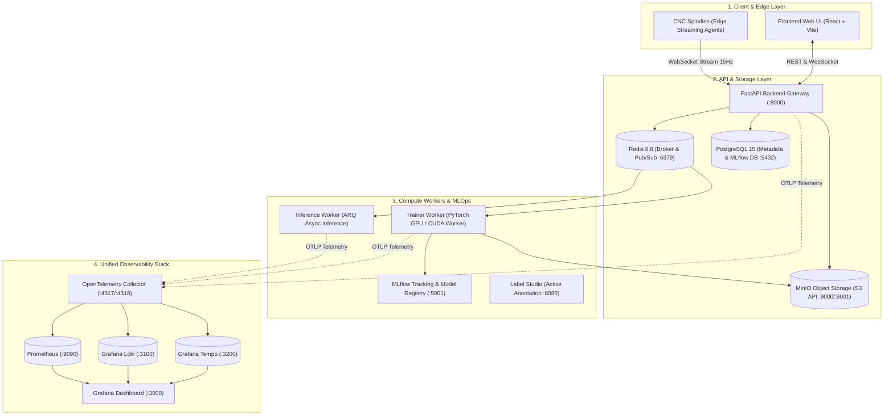
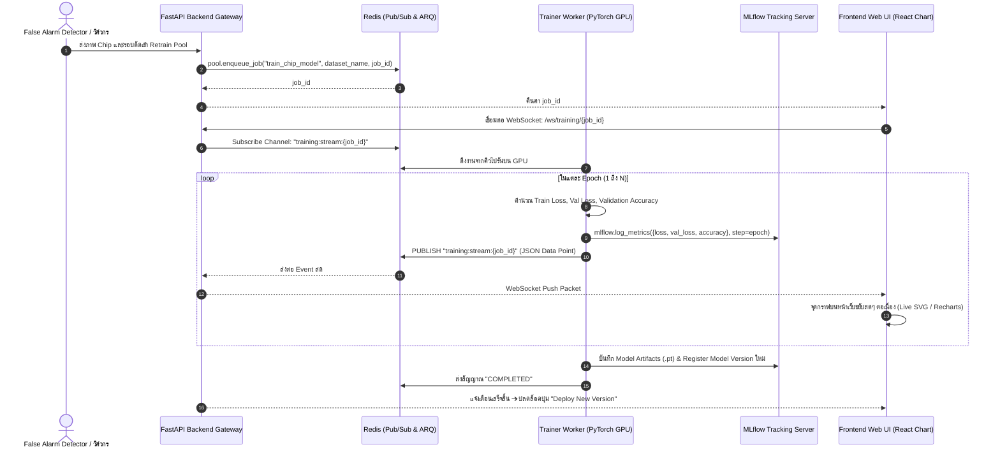

# สถาปัตยกรรมระบบ Backend, Docker Services, Observability และ Retraining Pipeline
**Industrial Predictive AI Ecosystem — CNC Tool Wear & Dual-Factor (2FA) Monitoring**

---

## 1. ภาพรวมสถาปัตยกรรมระบบ (System Architecture Overview)

ระบบนี้ถูกออกแบบขึ้นเพื่อรองรับงานตรวจสอบสุขภาพมีดกัด CNC อัจฉริยะ (Smart Manufacturing) ซึ่งครอบคลุม 4 แกนสำคัญ:
1. **High-Frequency Edge Telemetry**: รับข้อมูลสตรีมแรงตัดความถี่สูง ($F_x, F_y, F_z, F_{res}$) จากตู้คอนโทรล CNC
2. **Dual-Factor (2FA) In-Process AI**: การตัดสินใจร่วม 2 ปัจจัย (Time-Series CRNN เช็คราย Run ตรวจจับความผิดปกติก่อน ➔ เมื่อพบ `DULLED` จึงสั่งทริกเกอร์ Non-Time-Series Chip AI ตรวจภาพเศษตัด)
3. **Automated Physical Tool Verification**: ตรวจสอบภาพถ่ายมีดตัดจริงผ่าน Image Processing หาค่าความสึกหรอด้านข้าง (Flank Wear, $V_b$) ตามมาตรฐาน ISO 8688
4. **Active Learning & Retraining Pipeline**: เมื่อเกิด False Alarm (ภาพมีดยังไม่พัง) ระบบจะดึงภาพเศษตัดเข้าสู่ Retrain Pool อัตโนมัติ พร้อมสตรีมกราฟแสดงผลการเทรนสดๆ สู่หน้าเว็บ



---

## 2. รายการ Docker Services ทั้งหมดในระบบ

ระบบทั้งหมดถูกบรรจุและควบคุมการทำงานผ่าน Docker Compose (`compose.yml` และ `compose.observability.yml`):

| ลำดับ | ชื่อ Service | Image / Build | พอร์ตภายนอก | หน้าที่หลักในระบบ |
| :--- | :--- | :--- | :--- | :--- |
| **1** | `backend` | `./backend/Dockerfile` | `8000:8000` | • API Gateway, Auth, WebSocket สำหรับรับสตรีมแรงตัดและผลการตรวจ QC<br>• Relay สตรีมข้อมูลกราฟ Retrain จาก Redis ไปยัง Frontend |
| **2** | `redis` | `redis:8.8.0-alpine` | `6379:6379` | • Message Broker สำหรับคิวงาน ARQ Workers<br>• Pub/Sub Bus สำหรับกระจายค่า Loss/Accuracy ตอน Retrain สดๆ |
| **3** | `db` | `postgres:15.4-alpine` | `5432:5432` | • จัดเก็บฐานข้อมูลแอปพลิเคชัน (Users, Spindles, Tool History, Audits)<br>• เป็น Backend Store ให้ MLflow |
| **4** | `minio` | `quay.io/minio/minio` | `9000, 9001` | • S3 Object Storage เก็บไฟล์ข้อมูลแรงตัดดิบ (.parquet)<br>• เก็บภาพถ่ายกล้องจุลทรรศน์ (Chip และ Flank Face) และ Model Weights (.pt/.onnx) |
| **5** | `mlflow` | `./backend/Dockerfile.mlflow` | `5001:5000` | • บันทึก Hyperparameters, Training Metrics, Confusion Matrix<br>• ทำหน้าที่เป็น Model Registry บริหารจัดการ Model Versions |
| **6** | `trainer-worker` | `./backend/Dockerfile.trainer` | *(Internal)* | • คอนเทนเนอร์เชื่อมต่อ NVIDIA GPU ทำงาน Retraining / Fine-tuning ด้วย PyTorch เบื้องหลัง |
| **7** | `inference-worker`| `./backend/Dockerfile.inference`| *(Internal)* | • รันงาน Batch Inference หรือการสแกนภาพ OpenCV ขนาดใหญ่ |
| **8** | `label-studio` | `heartexlabs/label-studio` | `8080:8080` | • แพลตฟอร์มสำหรับวิศวกรเข้ามารีวิวและ Re-annotate ป้ายกำกับภาพที่โมเดลทายผิด |
| **9** | `otel-collector` | `otel/opentelemetry-collector-contrib` | `4317, 4318` | • ศูนย์กลางรับข้อมูล Traces, Metrics, Logs แบบ OTLP แล้วส่งต่อไปยังระบบจัดเก็บ |
| **10** | `prometheus` | `prom/prometheus:v2.54.1` | `9090:9090` | • Time-Series Database จัดเก็บสถิติตัวเลขประสิทธิภาพของระบบและโมเดล |
| **11** | `loki` | `grafana/loki:3.1.0` | `3100:3100` | • จัดเก็บและดัชนี Log รวมจากทุกคอนเทนเนอร์ |
| **12** | `tempo` | `grafana/tempo:2.5.0` | `3200:3200` | • แกะรอยคำขอแบบกระจายศูนย์ (Distributed Tracing) วิเคราะห์ Latency |
| **13** | `grafana` | `grafana/grafana:11.1.0` | `3000:3000` | • หน้าต่างรวมศูนย์แสดงผล Metrics, Logs, Traces และสุขภาพระบบ |

---

## 3. Observability Stack: เครื่องมือและวัตถุประสงค์การใช้งาน

ระบบตรวจจับอุตสาหกรรมต้องการความเสถียรระดับสูง ข้อมูลที่ต้องมอนิเตอร์แบ่งเป็น 3 เสาหลัก (Three Pillars of Observability) + 1 เสาเสริมด้าน ML:

### 3.1 Prometheus (Metrics)
* **Edge Streaming Health**:
  * `spindle_telemetry_packets_total`: จำนวนแพ็กเก็ตแรงตัดที่ส่งเข้ามาต่อวินาที
  * `spindle_stream_latency_seconds`: ความหน่วงของการส่งสัญญาณจากเครื่องจักรมาถึง API (เป้าหมาย: $< 50\,\text{ms}$)
* **AI Model Performance**:
  * `inference_duration_seconds{model="timeseries_crnn"}`: ความเร็วในการประมวลผลแรงตัด
  * `inference_duration_seconds{model="chip_vision"}`: ความเร็วในการประมวลผลรูปภาพ
* **Infrastructure & Hardware**:
  * `container_cpu_usage_seconds_total`, `container_memory_working_set_bytes`
  * `container_gpu_utilization_ratio`, `container_gpu_memory_used_bytes` (การใช้ทรัพยากรการ์ดจอตอน Retrain)
* **Queue & Workload**:
  * `arq_queue_length{queue="training"}`: จำนวนงาน Retrain ที่รอคิวในระบบ

### 3.2 Loki (Log Aggregation)
* รวบรวมข้อความ Log จากคอนเทนเนอร์ทั้งหมดแบบ Real-time โดยไม่ต้องเข้าไปไล่ดูทีละเครื่องผ่าน `docker logs`
* **ตัวอย่างการสืบค้นด้วย LogQL ใน Grafana**:
  * *ค้นหาเหตุการณ์หยุดเครื่องฉุกเฉิน*: `{container="backend"} |= "EMERGENCY_HALTED"`
  * *ค้นหารอบตัดที่โมเดลทายผิดและส่ง Retrain*: `{container="backend"} |= "SEND_TO_RETRAIN"`
  * *ค้นหาข้อผิดพลาด CUDA บน Worker*: `{container="trainer-worker"} |= "CUDA out of memory"`

### 3.3 Tempo (Distributed Tracing)
* ช่วยให้วิศวกรเห็น **Span Timeline** ครบทั้งกระบวนการทำงาน เช่น:
  1. `[Span 1: 5ms]` Spindle Edge ส่ง WebSocket packet เข้า FastAPI
  2. `[Span 2: 12ms]` Time-Series Model ประมวลผลและตรวจพบ `DULLED`
  3. `[Span 3: 18ms]` FastAPI ดึงภาพ Chip จาก MinIO
  4. `[Span 4: 25ms]` Non-Time-Series Vision Model ประมวลผลและคอนเฟิร์ม `DULLED (94.2%)`
  5. `[Span 5: 3ms]` Push สัญญาณเตือนหยุด Feed เข้า Spindle และ Frontend
  * **รวม Latency ทั้งสิ้น 63ms** — ช่วยพิสูจน์ได้ว่าระบบสามารถตัดสปินเดิลได้ทันก่อนชิ้นงานเสียหายจริง

### 3.4 ML Observability (Model & Data Drift via MLflow)
* ตรวจจับความแม่นยำของโมเดลตามช่วงเวลา (Model Decay)
* ตรวจจับ **Data Drift**: หากช่างหน้างานเปลี่ยนเกรดโลหะชิ้นงาน ทำให้ลักษณะของเศษตัด (Chip Morphology) เปลี่ยนรูปทรงไปจากชุดฝึกฝนเดิม ระบบจะแจ้งเตือนว่าจำเป็นต้อง Retrain

---

## 4. สถาปัตยกรรม Retraining Pipeline และกราฟแสดงผลตอนเทรน (Live Training Curves)

เพื่อให้หน้าจอ Retrain มีกราฟเส้นขยับสดๆ และสามารถเก็บประวัติเข้า MLOps ได้อย่างสมบูรณ์ ระบบจะทำงานด้วยสถาปัตยกรรม **Event-Driven Streaming**:



### 4.1 รายละเอียดการออกแบบในแต่ละส่วน

#### 1. ฝั่ง Worker (PyTorch Real-time Streaming Callback)
* ในระหว่างลูปการเทรนของ PyTorch เมื่อจบแต่ละ Epoch (หรือทุก $k$ Batches) จะมี Callback สองหน้าที่:
  1. บันทึกประวัติถาวรเข้า **MLflow**: `mlflow.log_metrics(...)`
  2. ยิงข้อมูลสดเข้า **Redis Pub/Sub Channel**:
     ```json
     {
       "job_id": "job-retrain-9912",
       "epoch": 8,
       "total_epochs": 30,
       "train_loss": 0.0841,
       "val_loss": 0.0912,
       "accuracy": 96.4,
       "learning_rate": 0.0001,
       "elapsed_seconds": 45.2,
       "eta_seconds": 124.0
     }
     ```

#### 2. ฝั่ง API Gateway (FastAPI WebSocket Relay)
* ให้บริการ Endpoint: `/api/v1/training/live/{job_id}`
* ทำหน้าที่เป็นตัวกลางรับฟัง (Listener) จาก Redis Channel `training:stream:{job_id}` แล้ว Forward แพ็กเก็ตเข้า WebSocket ทันที โดยไม่ต้อง Query ฐานข้อมูล ช่วยลดโหลดของ Server

#### 3. ฝั่ง Frontend (Interactive Live Graph Visualization)
* มีคอมโพเนนต์แสดงผลแบบ Real-time:
  * **Status Ribbon**: แสดงสถานะการรัน (เช่น `Training Epoch 8/30 · ETA: ~2 นาที`)
  * **Dual-Axis Progress Chart**:
    * **แกนซ้าย (Loss)**: เส้นสีม่วง (`Train Loss`) และเส้นสีส้ม (`Validation Loss`) แสดงแนวโน้มการลดลงของ Error
    * **แกนขวา (Accuracy %)**: เส้นสีเขียว (`Validation Accuracy`) แสดงแนวโน้มความแม่นยำที่สูงขึ้น
  * **Metrics Diff Comparison Card**: ตารางเปรียบเทียบก่อน-หลังการ Retrain (เช่น Model v1: 91.2% ➔ Model v2: 96.4%) พร้อมปุ่มคลิกเดียวเพื่อสลับโมเดลขึ้นใช้งานจริง (Model Promotion)

---

## 5. วิธีการเปิดใช้งานระบบ (Run & Deploy Guide)

### 5.1 เริ่มต้นรันบริการหลัก (Core Application & Workers)
```bash
# สั่งรัน Database, Redis, MinIO, MLflow, Backend และ Workers
docker compose up -d
```

### 5.2 เริ่มต้นรันระบบ Observability เพิ่มเติม
```bash
# สั่งรัน Prometheus, Loki, Tempo, OpenTelemetry Collector และ Grafana
docker compose -f compose.yml -f compose.observability.yml up -d
```

### 5.3 พอร์ตการเข้าใช้งานสำหรับทีมงาน
* **Frontend Web Application**: `http://localhost:5173`
* **FastAPI Swagger Docs**: `http://localhost:8000/docs`
* **MLflow Tracking UI**: `http://localhost:5001`
* **MinIO Console**: `http://localhost:9001` (User: `minioadmin` / Pass: `minioadmin`)
* **Grafana Unified Monitoring**: `http://localhost:3000` (User: `admin` / Pass: `admin`)
* **Prometheus Metrics Explorer**: `http://localhost:9090`
* **Label Studio Platform**: `http://localhost:8080`

---
*เอกสารนี้ถูกจัดทำขึ้นเพื่อใช้เป็นพิมพ์เขียว (Blueprint) ด้านโครงสร้างพื้นฐานและการพัฒนาระบบ AI Predict maintenance ประจำโปรเจกต์*
