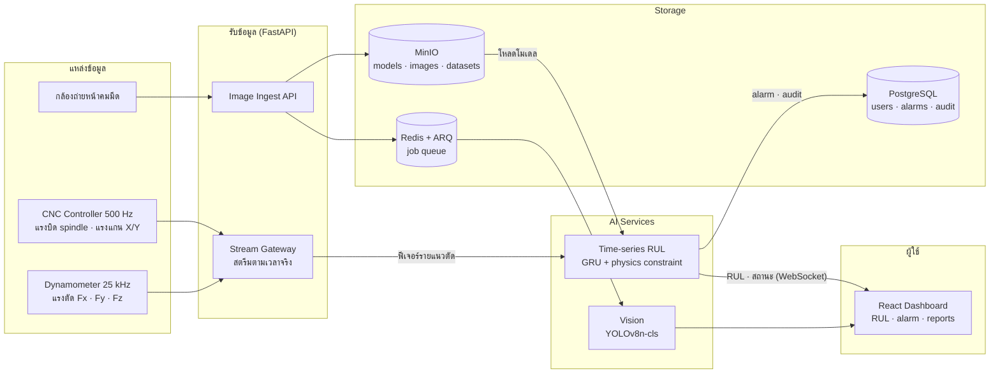
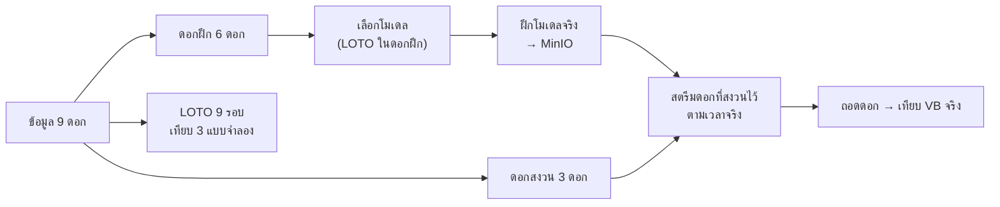

# CNC Tool Life AI Ecosystem — Mini Project Progress 3

WTN-A12 · กลุ่ม: ________ · สมาชิก: ________

ระบบพยากรณ์อายุใช้งานที่เหลือ (RUL) ของดอกกัด CNC จากสัญญาณเครื่องจักร (Time-series) ร่วมกับการประเมินสภาพคมตัดจากภาพ (Vision) โดยไม่ต้องหยุดเครื่องวัดรอยสึก

---

## 1. Dataflow and Ecosystem Design

**Dataflow**
1. **รับสัญญาณ:** แรงตัดจาก dynamometer (25 kHz) และแรงบิด spindle/แรงแกนจาก controller (500 Hz) ไหลเข้า Stream Gateway ทีละแนวตัด (~4.4 วินาที)
2. **สกัดฟีเจอร์:** เมื่อจบแต่ละแนวตัด คำนวณค่าเฉลี่ย 7 สัญญาณ + เวลาตัดสะสม + เครื่อง แล้วกรอง outlier แบบใช้ข้อมูลอดีตเท่านั้น
3. **พยากรณ์:** GRU อ่าน 29 แนวตัดล่าสุด → RUL (นาที) + ช่วง P10–P90 + สถานะ → คำแนะนำ OK / PLAN / REPLACE
4. **แสดงผลและแจ้งเตือน:** ส่งผลขึ้น dashboard ผ่าน WebSocket ถ้าถึง REPLACE_NOW จะสร้าง alarm และหยุดป้อนรอผู้ควบคุมยืนยัน (บันทึก audit)
5. **Vision:** ภาพหน้าคมมีดถูกอัปโหลดเข้า MinIO แล้วส่งเข้าคิวให้โมเดล YOLOv8 จำแนก SHARP / USED / DULLED
6. **โมเดล:** ฝึกออฟไลน์แล้วเก็บใน MinIO แยกเวอร์ชัน backend ดึงไปใช้ (ในอนาคตจะมีระบบ retrain จากข้อมูลดอกที่ถอดแล้ว)

---

## 2. Experiment Design

**สมมติฐาน**
- **H1:** พยากรณ์ RUL โดยตรงจากอนุกรมเวลาแม่นกว่าการพยากรณ์รอยสึก (VB) ก่อนแล้วหาจุดตัดเกณฑ์
- **H2:** ข้อจำกัดฟิสิกส์ “เวลาหมดอายุของดอกคงที่” ลดความคลาดเคลื่อน
- **H3:** Vision จำแนกสภาพคมตัดของดอกที่ไม่เคยเห็นได้ ≥ 80%

**ข้อมูลและการแบ่ง**

| งาน | ข้อมูล | การแบ่ง |
|---|---|---|
| Time-series | LUH milling: 9 ดอก, 3 เครื่อง, 6,418 แนวตัด · label = เวลาที่ VB ถึง 140 µm | ฝึก 6 ดอก / สงวน 3 ดอก (T3, T6, T9) ไว้ทดสอบผ่านระบบสตรีม · Leave-one-tool-out · 80:20 ตามเวลา |
| Vision | Nonastreda `tool/`: ภาพหน้าคมมีด 3 คลาส | ฝึก 456 ภาพ (ดอก 1–9) / ทดสอบ 56 ภาพ (ดอก 10) |

**แบบจำลองที่เปรียบเทียบ**
- **Time-series:** Fleet baseline (อายุเฉลี่ยของเครื่อง) · StateSpace (พยากรณ์ VB แล้วหาจุดตัด) · **GRU direct-RUL** (+ ablation: ไม่มีเซนเซอร์ / ไม่มีข้อจำกัดฟิสิกส์)
- **Vision:** YOLOv8n-cls (transfer learning)

**ตัวชี้วัด**
- **Time-series:** MAE ของ RUL (ทั้งอายุ และ 20% ท้าย) · %late (พยากรณ์อายุเกินจริง) · เวลาที่สั่งเปลี่ยนดอกเทียบเวลาหมดอายุจริง
- **Vision:** Top-1 accuracy, macro-F1, latency

