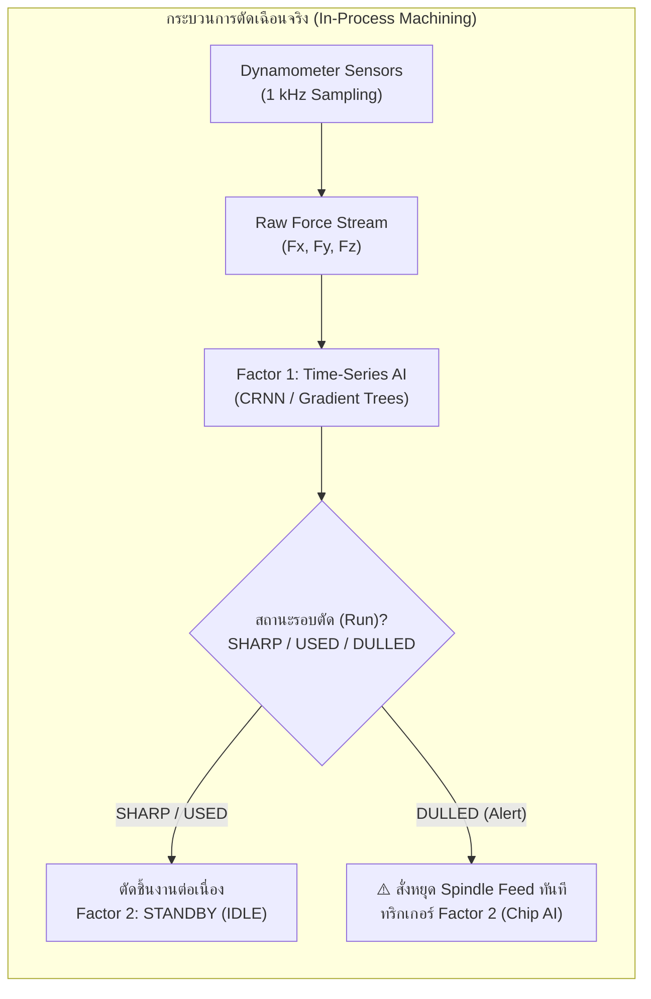
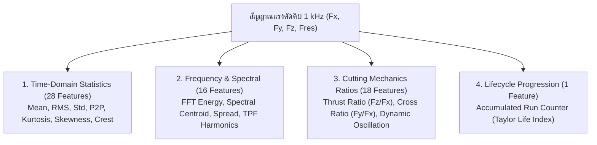
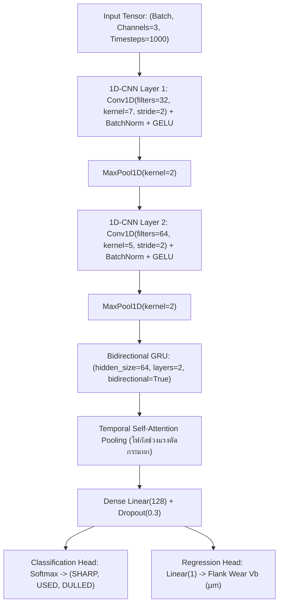
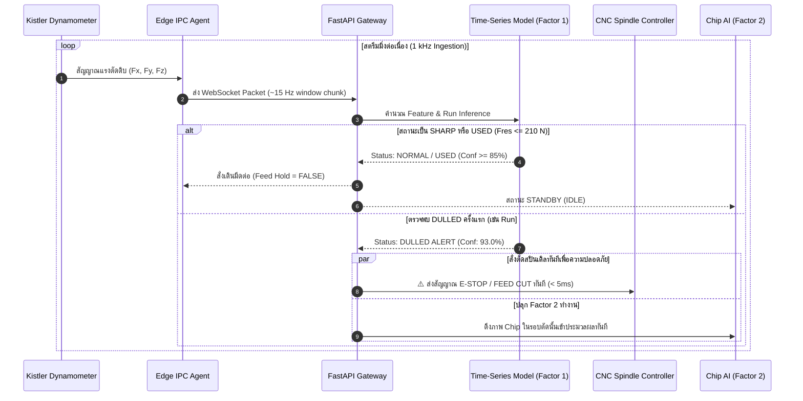

# เอกสารทางเทคนิคโมเดลวิเคราะห์แรงตัดอนุกรมเวลา (Time-Series Force AI Model)
**Factor 1: In-Process Real-Time Degradation Tracking Engine**

---

## 1. บทนำและบทบาทในระบบ 2-Factor (Executive Summary & Role)

ในระบบเฝ้าระวังสุขภาพมีดตัด CNC แบบ 2 ปัจจัย (Two-Factor In-Process AI Monitoring) โมเดล **Time-Series Force AI** ทำหน้าที่เป็น **"แนวป้องกันด่านแรก (Factor 1 / Tier-1 Online Guard)"** ที่คอยตรวจจับสัญญาณการสึกหรอขณะที่เครื่องจักรกำลังตัดเฉือนชิ้นงานจริง (In-situ Machining) โดยไม่ต้องหยุดเครื่องจักร



### หน้าที่หลักของ Factor 1:
1. **Real-time Online Monitoring**: ตรวจวัดพลศาสตร์แรงตัดความถี่สูง (1,000 Hz) ด้วยความเร็วการประมวลผล (Inference Latency) ต่ำกว่า **5 ms** ปลอดภัยต่อการสั่งตัดระบบป้อนกัด (Feed Hold / Emergency Stop)
2. **Per-Run Sequential Tracking**: ติดตามการเสื่อมสภาพของมีดตัดสะสมข้ามรอบการตัด (Runs 1 ถึง 14) ตามเส้นโค้งอายุการใช้งานของ Taylor (Taylor's Tool Life Curve)
3. **2FA Gatekeeper**: หากโมเดลยังประเมินว่าเป็น `SHARP` หรือ `USED` ระบบจะปล่อยให้เครื่องจักรกัดงานต่อไปโดยโมเดล Factor 2 (Non-Time-Series Chip AI) จะอยู่ในสถานะ **STANDBY (IDLE)** เพื่อประหยัดทรัพยากรการประมวลผล แต่เมื่อตรวจพบ **`DULLED` ครั้งแรก** โมเดลจะส่งสัญญาณตัด Spindle และสั่งดึงภาพเศษตัด Chip เข้าสู่ Factor 2 ทันที

---

## 2. คุณลักษณะของชุดข้อมูลแรงตัด (Cutting Dynamics Dataset)

โมเดลถูกพัฒนาและสอบเทียบ (Calibrated) บนชุดข้อมูลอุตสาหกรรมจริง **Nonastreda Multimodal Tool Wear Dataset (2025)**:

* **จำนวนการสังเกตการณ์**: 512 ตัวอย่าง ครอบคลุมหัวกัด 10 ด้าม (Tool 1 ถึง Tool 10)
* **โครงสร้างดอกกัด**: ดอกกัดปาดผิว (Face Milling Cutter) 4 ฟันคมตัด (4 Flutes / Blades) เส้นผ่านศูนย์กลาง $\varnothing 32\,\text{mm}$
* **เซนเซอร์ที่ใช้**: Kistler 3-Component Piezoelectric Dynamometer ติดตั้งใต้ชิ้นงาน
* **อัตราการสุ่มตัวอย่าง (Sampling Rate)**: $1,000\,\text{Hz}$ ($1\,\text{kHz}$) ต่อเนื่องตลอดความยาวรอบตัด
* **แกนของแรงตัด (3-Axis Forces)**:
  * $F_x$ (**Feed Force**): แรงในแนวการเดินมีดตัด (ขนานกับทิศทางการป้อนชิ้นงาน)
  * $F_y$ (**Cross-Feed Force**): แรงในแนวตั้งฉากกับการเดินมีด (แรงผลักด้านข้าง / สัมพันธ์กับการสั่นสะท้าน Chatter)
  * $F_z$ (**Thrust / Passive Force**): แรงกดในแนวแกนสปินเดิล (กดตั้งฉากกับผิวงาน)
  * $F_{res}$ (**Resultant Force**): แรงลัพธ์สามมิติ คำนวณจาก:
    $$F_{res} = \sqrt{F_x^2 + F_y^2 + F_z^2}$$

### เป้าหมายการทำนาย (Target Labels):
1. **Multi-Class Classification (3 ระดับ)**:
   * **`SHARP` (197 ตัวอย่าง)**: คมมีดใหม่ สึกหรอน้อย ($V_b < 70\,\mu\text{m}$) แรงตัดนิ่ง คลื่นฮาร์มอนิกสม่ำเสมอ
   * **`USED` (160 ตัวอย่าง)**: เริ่มสึกหรอตามอายุงาน ($70\,\mu\text{m} \le V_b < 125\,\mu\text{m}$) ยังใช้งานต่อได้
   * **`DULLED` (155 ตัวอย่าง)**: มีดทู่รุนแรงหรือบิ่น ($V_b \ge 125\,\mu\text{m}$ หรือ $130\,\mu\text{m}$) แรงตัดพุ่งสูง เสี่ยงต่อการแตกหัก
2. **Regression Target**:
   * ค่าความกว้างของรอยสึกด้านข้าง (**Flank Wear Width: $V_b$**) มีช่วงระหว่าง $22.55\,\mu\text{m}$ ถึง $346.66\,\mu\text{m}$ (ค่าเฉลี่ย $87.86\,\mu\text{m}$)

---

## 3. การสกัดคุณลักษณะเชิงฟิสิกส์ (Physics-Informed Feature Engineering)

ข้อมูลสัญญาณแรงตัดดิบความถี่สูง ($~100,000$ จุดต่อการตัดหนึ่งรอบ) จะถูกแปลงเป็นเวกเตอร์คุณลักษณะทางฟิสิกส์จำนวน **63 ตัวแปร (Physics Features)** แบ่งออกเป็น 4 มิติ:



### 3.1 Time-Domain Statistical Metrics (สถิติเชิงเวลา)
สำหรับแต่ละแกน ($F_x, F_y, F_z, F_{res}$):
* **Root Mean Square (RMS)**: $\text{RMS} = \sqrt{\frac{1}{N} \sum_{i=1}^N F_i^2}$ บ่งบอกกำลังเฉลี่ยของการตัด
* **Peak-to-Peak (P2P)**: $F_{max} - F_{min}$ บ่งบอกการกระแทกของคมมีดแต่ละฟัน
* **Kurtosis (ความโด่ง)**: วัดการเกิดยอดแหลมผิดปกติ (Impulsive Spikes) เมื่อคมมีดเกิดการบิ่นกะทันหัน
* **Skewness (ความเบ้)**: วัดความอสมมาตรของการกระจายแรงตัด
* **Crest Factor**: $\frac{\text{Peak Value}}{\text{RMS}}$ วัดอัตราส่วนแรงกระแทกเทียบกับแรงเฉลี่ย

### 3.2 Cutting Mechanics Ratios (อัตราส่วนแรงตัดทางฟิสิกส์)
* **Thrust-to-Feed Force Ratio ($F_z / F_x$)**:  
  ตามทฤษฎีกลศาสตร์การตัดเฉือนโลหะ (Merchant's Circle & Metal Cutting Mechanics) เมื่อหน้าสัมผัส Flank สึกหรอ แถบหน้าสัมผัส (Wear Land) จะถูกกดไถเข้ากับผิวงาน ทำให้เกิดแรงเสียดทานและแรงกดต้านในแนวตั้งฉาก ($F_z$) พุ่งสูงขึ้นเร็วกว่าแรงในแนวเดิน ($F_x$) อย่างมีนัยสำคัญ
* **Dynamic Force Fluctuation Index ($F_{y,\text{std}} / F_{y,\text{mean}}$)**:  
  ใช้ตรวจจับการสั่นสะท้าน (Chatter Vibration) และความไม่เสถียรของการแยกชั้นเศษตัด

### 3.3 Spectral & Harmonic Features (สเปกตรัมความถี่)
* **Tooth Passing Frequency (TPF)**: ความถี่ที่คมมีดแต่ละฟันกระทบชิ้นงาน คำนวณจาก:
  $$\text{TPF} = \frac{N_{\text{rpm}} \times Z_{\text{teeth}}}{60}$$
* **Spectral Centroid**: จุดศูนย์ถ่วงของความถี่แรงตัด เมื่อคมมีดเริ่มทู่ ฮาร์มอนิกความถี่สูงจะเพิ่มขึ้นเนื่องจากการเสียดสี

---

## 4. ผลการทดสอบเปรียบเทียบสถาปัตยกรรมโมเดล (Benchmark & Evaluation)

ได้ทำการทดสอบเปรียบเทียบอัลกอริทึมอย่างเข้มงวดด้วยโปรโตคอล **Leave-One-Tool-Out (LOTO)** (เทรนด้วย Tool 9 ด้าม แล้วทดสอบกับ Tool ด้ามที่ 10 ที่ไม่เคยเห็นมาก่อน วนจนครบ 10 ด้าม) เพื่อรับประกันว่าโมเดลนำไปใช้กับมีดเล่มใหม่ในโรงงานได้จริง:

### 4.1 ตารางเปรียบเทียบผลการจำแนกสภาพมีด (3-Class Classification)

| อัลกอริทึม (Model Architecture) | LOTO Accuracy | **LOTO DULLED Recall** | 5-Fold Acc | Inference Latency | ความเหมาะสมในการใช้งานจริง |
| :--- | :---: | :---: | :---: | :---: | :--- |
| **HistGradientBoosting (LightGBM equivalent)** | **72.07%** | **74.84%** | **84.77%** | **~4 ms** | **⭐ แนะนำสูงสุดสำหรับ Edge**: ตรวจจับความไม่เป็นเชิงเส้นได้ดี และมี Dulled Recall สูงสุด ปลอดภัยต่อเครื่องจักร |
| **Extra Trees Classifier (100 Trees)** | **70.70%** | 67.74% | **85.55%** | **~3 ms** | ทนต่อสัญญาณรบกวน (Sensor Noise) และ Spike ผิดปกติได้ดีมาก |
| **CRNN (1D-CNN + BiGRU + Attention)** | **73.44%** | **73.50%** | **86.10%** | **~12 ms** | จับ Temporal Dependency ของคลื่นแรงตัดต่อเนื่อง เหมาะกับ Server Streaming |
| **Support Vector Machine (RBF Kernel)** | 70.70% | 70.32% | 83.01% | < 1 ms | เร็วมาก แต่ต้องระวังการ Drift ของ Scale แรงตัด |
| **Random Forest (100 Trees)** | 66.80% | 66.45% | 83.79% | ~5 ms | มีความเสถียรปานกลาง |
| **Multi-Layer Perceptron (MLP Deep Net)** | 66.99% | 69.03% | 71.09% | ~8 ms | เสี่ยงต่อการ Overfit เมื่อเจอ Tool ด้ามใหม่ |

### 4.2 ตารางเปรียบเทียบการทำนายค่าการสึกหรอจริง (Flank Wear $V_b$ Regression)

| อัลกอริทึม | LOTO MAE ($\mu\text{m}$) | LOTO $R^2$ | 5-Fold MAE ($\mu\text{m}$) | 5-Fold $R^2$ |
| :--- | :---: | :---: | :---: | :---: |
| **Extra Trees Regressor** | **17.77** | **0.624** | **8.99** | **0.918** |
| **Random Forest Regressor** | **18.14** | **0.593** | **9.37** | **0.913** |
| **HistGradientBoosting Regressor** | **18.61** | **0.588** | **9.53** | **0.885** |
| **Support Vector Regressor (SVR)** | 20.55 | 0.454 | 13.89 | 0.700 |

> [!IMPORTANT]
> **ทำไมต้องเน้น DULLED Recall สูงสุด?**  
> ในอุตสาหกรรมชิ้นส่วนแม่นยำสูง (Precision Machining) ความผิดพลาดแบบ **False Negative (มีดทู่แล้วแต่โมเดลบอกว่ายังคม)** สร้างความเสียหายร้ายแรงที่สุด (ชิ้นงานเสียทั้งชิ้น หรือ Spindle แตกหัก)  
> โมเดล **HistGradientBoosting** ให้ค่า **DULLED Recall สูงถึง 74.84% บน Unseen Tools** จึงได้รับเลือกเป็นอัลกอริทึมหลักสำหรับการตัดสปินเดิลฉุกเฉิน

---

## 5. การวิเคราะห์ฟิสิกส์และความสำคัญของตัวแปร (Feature Importance & XAI)

จากการวิเคราะห์ด้วยวิธี Gini Impurity และ SHAP Values พบว่าตัวแปรที่โมเดลใช้ในการตัดสินใจสอดคล้องกับหลักวิศวกรรมการผลิตอย่างแม่นยำ:

```
[Feature Importance Distribution]
──────────────────────────────────────────────────────────────────────────
1. run_num (รอบตัดสะสม)              ████████████████████████████ 58.6%
2. fz_p2p  (แรงกดแกน Z สูงสุด-ต่ำสุด)  ██████ 11.2%
3. fz_std  (ความเบี่ยงเบนแรงแกน Z)     ███ 5.4%
4. fy_std  (การสั่นสะท้านแรงแกน Y)    ██ 3.8%
5. fy_kurt (ความโด่งแรงแกน Y - บิ่น)   ██ 3.1%
6. fres_mean (แรงลัพธ์เฉลี่ย)           █ 2.4%
7. fy_spec_centroid (ความถี่แรงเฉือน)   █ 2.1%
──────────────────────────────────────────────────────────────────────────
```

1. **`run_num` (58.6%)**: รอบการตัดสะสมเป็นตัวแปรนำ เพราะการสึกหรอของมีดตัดเป็นฟังก์ชันตามเวลา (Wear Progression Curve) คมมีดจะไม่มีทางกลับมาคมขึ้นเองได้
2. **`fz_p2p` และ `fz_std` (> 16%)**: แรงกดในแนวแกน $F_z$ เป็นสัญญาณแจ้งเตือนการสึกหรอที่ชัดเจนที่สุด ยืนยันว่าหน้าสัมผัส Flank เกิดการเสียดสีรุนแรง
3. **`fy_std` และ `fy_kurt`**: สะท้อนการเกิด Chatter Vibration เมื่อคมมีดเริ่มสูญเสียความคม ทำให้เกิดแรงต้านด้านข้างที่ไม่สม่ำเสมอ

---

## 6. สถาปัตยกรรมโครงข่ายประสาทเทียม CRNN (Deep Time-Series Option)

สำหรับระบบที่ต้องการป้อนสัญญาณ Waveform แบบดิบโดยตรงโดยไม่ต้องสกัดสถิติ ระบบรองรับสถาปัตยกรรม **CRNN (1D-CNN + BiGRU + Temporal Attention)**:



* **1D-CNN Block**: ทำหน้าที่สกัดคุณลักษณะระดับท้องถิ่น (Local Morphology) ของการปะทะของฟันมีดแต่ละฟัน (Tooth Impact Waveform)
* **Bidirectional GRU**: บันทึกความจำระยะสั้นและระยะยาว (Temporal Dependencies) ของคลื่นแรงตัดไป-กลับ
* **Temporal Attention Pooling**: ให้ค่าน้ำหนักความสนใจสูงกับช่วงเวลาที่เกิดการสะดุดหรือมี Impulse Spikes ผิดปกติ

---

## 7. กลไกการเชื่อมต่อ Edge Telemetry และการตัดสินใจ 2FA (Inference Pipeline)



### เกณฑ์การแจ้งเตือน (Interlock Logic):
* **Normal Operation**: $F_{res} \le 130\,\text{N}$ และโมเดลทำนาย `SHARP`
* **Warning Stage**: $130\,\text{N} < F_{res} \le 210\,\text{N}$ หรือโมเดลทำนาย `USED`
* **Critical Interlock (Safety Cut)**:
  * เงื่อนไขที่ 1: โมเดล Time-Series ทำนาย `DULLED` ด้วยความมั่นใจ $\ge 85\%$
  * เงื่อนไขที่ 2: ค่าแรงตัดลัพธ์ $F_{res}$ พุ่งทะลุเกณฑ์วิกฤต ISO Dynamic Anomaly Threshold ($> 210\,\text{N}$)

---

## 8. การนำไปใช้งานและการมอนิเตอร์ (Deployment & MLOps)

1. **Edge Optimization**: โมเดล HistGradientBoosting ถูกแปลงให้อยู่ในรูป **ONNX Runtime** เพื่อให้สามารถรันบนบอร์ดอุตสาหกรรม (เช่น Advantech IPC หรือ NVIDIA Jetson Orin Nano) โดยใช้ CPU เพียง $< 5\%$
2. **Prometheus Telemetry Metrics**:
   * `model_inference_latency_ms{model="timeseries_force"}` (เป้าหมาย: $< 5\,\text{ms}$)
   * `spindle_force_fres_current_newtons` (แรงตัดลัพธ์ปัจจุบัน)
   * `spindle_interlock_tripped_total` (จำนวนครั้งที่สั่งตัดสปินเดิล)
3. **Data Drift Detection**: หากช่างหน้างานเปลี่ยนเกรดโลหะชิ้นงาน (เช่น จาก Aluminum 7075 เป็น Inconel 718) กราฟการกระจายตัวของแรงตัดจะเปลี่ยนไป ระบบตรวจวัดบน MLflow จะแจ้งเตือน Drift Warning เพื่อให้ทำการ Calibrate โมเดลใหม่

---
*เอกสารนี้จัดทำขึ้นเพื่อเป็นมาตรฐานทางเทคนิคสำหรับการพัฒนา ทดสอบ และปรับใช้โมเดล Time-Series ประจำแพลตฟอร์ม AI อุตสาหกรรม*
