# แบบจำลอง Non-Time-Series: วัดรอยสึกด้านข้าง VB จากภาพใบมีด

**โปรเจกต์:** CNC Tool Life AI · **รายวิชา:** 241-353 Artificial Intelligence Ecosystem Module (ส่วน non-time-series)
**ชุดข้อมูล:** Nonastreda Multimodal Dataset — ภาพหน้าคมมีด (`tool/`) 512 ภาพ + ค่าที่ optical bench วัด (`labels_reg.csv`)
**โค้ด:** [`experiments_vb.py`](experiments_vb.py) (stage A–C) · [`search_vb.py`](search_vb.py) (stage D + ตัวใช้งาน) · [`vb_model.py`](../../backend/app/features/tool_vision/vb_model.py) · [`vb_rules.py`](../../backend/app/features/tool_vision/vb_rules.py)

---

## สรุป

| | |
|---|---|
| โจทย์ | ภาพหน้าคมมีด 1 ใบ → **ค่ารอยสึกด้านข้าง VB (µm)** + ช่วง P10–P90 → โซนตามเกณฑ์ของงาน (หัวข้อ 1.1): ปกติ < 103 µm ≤ ใกล้หมดอายุ < 140 µm ≤ หมดอายุ |
| แบบจำลองที่ใช้งาน (v2.0.0) | **ensemble 5 ตัวของ ResNet-18 (ฝึกมาแล้วบน ImageNet) + หัว regression** (Dropout + Linear → 1 ค่า) เฉลี่ยค่า VB · อินพุต 224×672 (คงสัดส่วนภาพ), fine-tune ทั้งตัว, **augmentation สี/แสงแรง**, AdamW + L2, LR warm-up + cosine decay, Huber loss, EMA ของน้ำหนัก, **60 epoch** |
| เลือกจาก | stage A–C: 10 ชุด (CNN ฝึกจากศูนย์, ResNet-18, backbone YOLOv8n-cls, ablation, หัว/ความละเอียด) → v1.0.0 · **stage D: 19 ชุด × 2 seed** (การเตรียมภาพ, augmentation, loss, backbone 5 แบบ, จำนวน epoch, regularization, เทียบภาพตอนดอกใหม่, TTA) → v2.0.0 — ทั้งหมดด้วย leave-one-tool-out บนดอก 1–7 · ทดลองเพิ่มหลังเลือก: best checkpoint ตามดอก 7 (v3.0.0) และสุ่มภาพช่วง VB สูงบ่อยขึ้น (S5) — ไม่ดีกว่าในช่วงที่ระบบตัดสิน (หัวข้อ 4, 5.4, 5.5) |
| ผล | CV (ดอก 1–7): **MAE 19.6 µm** (v1: 22.0), ช่วง VB ≥ 103 µm 25.6 (v1: 30.2), ระดับดอก 17.2 (v1: 20.2) · **Test ดอก 8–10 (ดอกบนเครื่อง ไม่เคยใช้ฝึก/เลือก): 24.5 µm** (v1: 25.9), ระดับดอก 24.0 (v1: 25.1) · CPU 0.2 s/ภาพ |
| ในระบบ | Machine Monitoring (RUL) แจ้งหมดอายุ → ถอดดอก → แบบจำลองนี้วัด VB ของ 4 ใบ → ผู้ตรวจยอมรับค่า AI หรือวัดจริงเมื่อช่วงความไม่แน่นอนคร่อมเกณฑ์ → ใบเบิกดอกทดแทน (PDF) → ติดตั้งดอกใหม่ → ค่าที่วัดจริงใช้ retrain อัตโนมัติ · **ใช้งานจริงตอนนี้ = v2.0.0 ที่ retrain ด้วยค่าวัดจริงจากหน้างาน** (`tool-vision-vb-resnet18-20261007-135808`, หัวข้อ 6) · v2.0.0 = previous · v1.0.0 / v3.0.0 เก็บใน `models/archive-*` |

---

## 1. ทำไมเปลี่ยนจากการจำแนก sharp / used / dulled เป็นการวัด VB

แบบจำลองอนุกรมเวลา (RUL) ของระบบพยากรณ์ "อีกกี่นาทีของเวลาตัด VB จะถึง 140 µm" แต่แบบจำลองภาพเดิมตอบได้แค่ 3 คลาส ซึ่งไม่สอดคล้องกันด้วย 3 เหตุผล

1. **คลาสเดิมคือ VB ที่ถูกแบ่งช่วงด้วยเกณฑ์อื่น** — ผู้จัดทำชุดข้อมูลกำหนด sharp < 71 µm ≤ used < 110 µm ≤ dulled (Data in Brief, 2025) ซึ่งไม่ตรงกับเกณฑ์ 103/140 µm ของระบบ และ ~5% ของภาพมี label ไม่ตรงกับเกณฑ์ของตัวเอง (ใกล้รอยต่อ, รูป d02) — ถ้าทาย VB ตรง ๆ จะแปลงเป็นคลาสตามเกณฑ์ใดก็ได้ แต่ถ้าทายคลาสจะย้อนกลับเป็นค่า VB ไม่ได้
2. **คลาสไม่บอกว่า "ใกล้หมดอายุแค่ไหน"** — ใบที่ VB 105 µm กับ 135 µm อาจอยู่คลาสเดียวกัน แต่ใบแรกยังเหลืออายุ ใบหลังต้องเปลี่ยน
3. **ใช้เกณฑ์เดียวกันทั้งระบบได้** — เมื่อวัดเป็น VB จะเทียบกับเกณฑ์ 103/140 µm ชุดเดียวกับที่แบบจำลอง RUL ใช้ (ISO 8688-2 กำหนดอายุดอกด้วยรอยสึกด้านข้าง VB) ทำให้ระบบตอบคำถามเดียวกันจาก 2 แหล่ง: RUL บอก *เมื่อไร* ส่วนภาพบอก *ตอนนี้สึกเท่าไร ใบไหน*

ค่า VB ของทุกภาพมีอยู่แล้วใน `labels_reg.csv` (ผู้เชี่ยวชาญวัดด้วยกล้อง Keyence VHX-S15F ความไม่แน่นอน ±2 µm หลังทุกรอบการใช้งาน) จึงเปลี่ยนเป็น regression ได้โดยไม่ต้องทำ annotation เพิ่ม

### 1.1 เกณฑ์ที่ใช้และที่มา

| ค่า | ที่มา |
|---|---|
| วิธีวัด VB | ISO 8688-2 (end milling) ข้อ 7: ความกว้างแถบรอยสึกด้านข้าง วัดตั้งฉากจากแนวคมตัดเดิม ณ จุดที่สึกกว้างที่สุดใต้กล้องจุลทรรศน์ |
| เกณฑ์อายุดอกตาม ISO 8688-2 | มาตรฐานให้ "กำหนดค่าล่วงหน้า" ของตัววัดการสึก ตัวอย่างในข้อ 7.2.3 คือ VB1 = 0.3 mm (รอยสึกสม่ำเสมอ) · ISO 3685 (งานกลึง) ใช้ VB = 0.3 mm / VBmax = 0.6 mm |
| **140 µm = หมดอายุ** | เกณฑ์เฉพาะงาน: ชุดข้อมูล LUH (เซนเซอร์ของระบบ) หยุดใช้ดอกที่ VB ≈ 150 µm จึงใช้ 140 µm ที่ทุกดอกผ่านจริง — เข้มกว่า 0.3 mm เพราะเป็นดอกเล็กงานเก็บผิว |
| **103 µm = ใกล้หมดอายุ** | จากข้อมูล: อัตราสึกต่อชั้นงานกระโดด 1.7–3.9 เท่าเมื่อ VB เกิน ~103 µm ทุกดอก (SETAR ในรายงานอนุกรมเวลา) = เริ่มช่วงสึกเร่งของเส้นโค้งการสึก 3 ช่วง |
| **ระดับดอก = VB เฉลี่ย 4 คม** | ชุดข้อมูล LUH (label ของแบบจำลอง RUL) วัด VB ทุกคมแล้วรายงานค่าเฉลี่ย และ ISO 8688-2 ใช้ค่าเฉลี่ยทุกฟันสำหรับรอยสึกสม่ำเสมอ — ระบบจึงตัดสิน "เปลี่ยน/ลับดอก" ด้วยค่าเฉลี่ย 4 ใบ ส่วน VB รายใบใช้บอกคมที่สึกมากสุดและคมที่เกิน 140 µm เฉพาะใบ (รอยสึกเฉพาะจุดซึ่ง ISO ให้เกณฑ์สูงกว่าค่าเฉลี่ย) |
| 71 / 110 µm | เกณฑ์คลาส sharp/used/dulled ของผู้จัดทำชุดข้อมูล Nonastreda (ไม่ใช้ในระบบ) |

ชุดข้อมูลทั้งสองไม่มีดอกที่ใช้จนถึง 0.3 mm (ยกเว้นดอก 5 ของ Nonastreda) จึงฝึกแบบจำลองให้ตัดสินที่ 0.3 mm ไม่ได้ — ถ้าโรงงานใช้เกณฑ์อื่น แบบจำลองวัด VB ใช้ต่อได้ทันที (เปลี่ยนแค่ค่าใน `vb_rules.py`) ส่วนแบบจำลอง RUL ต้องสร้าง label ใหม่

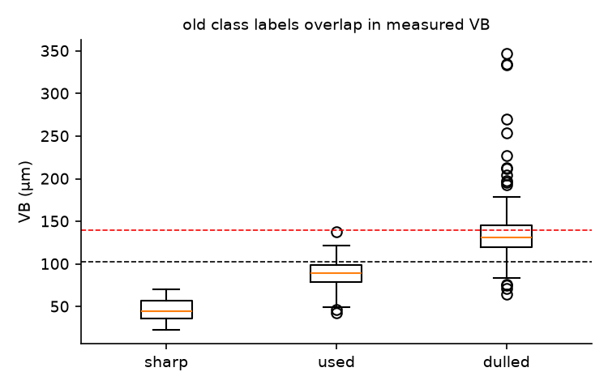

---

## 2. ข้อมูล (Dataset card)

| รายการ | รายละเอียด |
|---|---|
| ภาพ | 512 ภาพ = 10 ดอก × 10–15 รอบการใช้งาน (run) × 4 ใบมีด (B1–B4) · ภาพหน้าคมมีดจาก optical bench ขนาด 1550×500 (ดอก 1–2 บางส่วน 3100×1000 มุมกล้องเดียวกัน) |
| label | `flank_wear` (µm) จาก optical bench = VB · ไม่ใช้ `image_label` (คลาสเดิม) ในการฝึก |
| ช่วงค่า | 22.6–346.7 µm, เฉลี่ย 87.9 µm · ภาพที่ VB ≥ 103 µm = 141 ภาพ, ≥ 140 µm = 55 ภาพ |
| รหัสภาพ | `T{tool}R{run}B{blade}` → ตาราง manifest (id, tool, run, blade, vb_um, path) สร้างใน `nonastreda.vb_samples()` |

**การแบ่งข้อมูล — แบ่งตามดอก ไม่ใช่ตามภาพ** (ภาพของดอกเดียวกันหน้าตาคล้ายกันมาก ถ้าแบ่งตามภาพจะได้ผลดีเกินจริง)

| ชุด | ดอก | ภาพ | VB เฉลี่ย ± SD (µm) | % ≥ 103 µm | % ≥ 140 µm | ใช้ทำอะไร |
|---|---|---|---|---|---|---|
| train | 1–6 | 296 | 96.3 ± 50.5 | 43.2 | 15.2 | ฝึกตัวใช้งานจริง |
| val | 7 | 56 | 72.7 ± 33.0 | 23.2 | 3.6 | gate ของ retrain |
| test | 8–10 | 160 | 77.5 ± 35.0 | 24.4 | 5.0 | ทดสอบครั้งเดียวตอนท้าย = ดอกบนเครื่อง M1–M3 ในระบบ |
| CV | 1–7 | 352 | | | | leave-one-tool-out 7 fold เพื่อเลือกแบบจำลอง |

ดอก 8/9/10 คือดอกที่ระบบจับคู่กับข้อมูลเซนเซอร์ LUH T3/T6/T9 ของเครื่อง M1/M2/M3 — ไม่ถูกใช้ทั้งการฝึกและการเลือกแบบจำลอง

**การจับคู่ภาพกับเครื่อง:** ดอกแต่ละเครื่องใช้ภาพของดอก Nonastreda ดอกเดิมตลอด (M1–N8, M2–N9, M3–N10) และเลือก *รอบช่วงท้ายอายุ* (VB เฉลี่ย 4 ใบ ≥ 103 µm)
ที่ความสึกใกล้กับดอกจริงในข้อมูลเซนเซอร์ตอนถูกถอดที่สุด เช่น ถอดตามคำแนะนำ RUL: T3 = 116 µm → ภาพ N8 รอบ 12 (119 µm), T6 = 124 µm → N9 รอบ 12 (122 µm),
T9 = 125 µm → N10 รอบ 13 (124 µm) · ถ้าผู้ควบคุมตัดต่อจนดอกสึกมากขึ้น ระบบจะได้ภาพที่สึกมากขึ้นตาม · ค่า VB จริงใช้เลือกภาพภายในเท่านั้น (เป็นค่าหลังถอดดอกแบบเดียวกับหน้า Reports) ไม่ถูกส่งไปหน้าเว็บหรือให้แบบจำลองเห็น

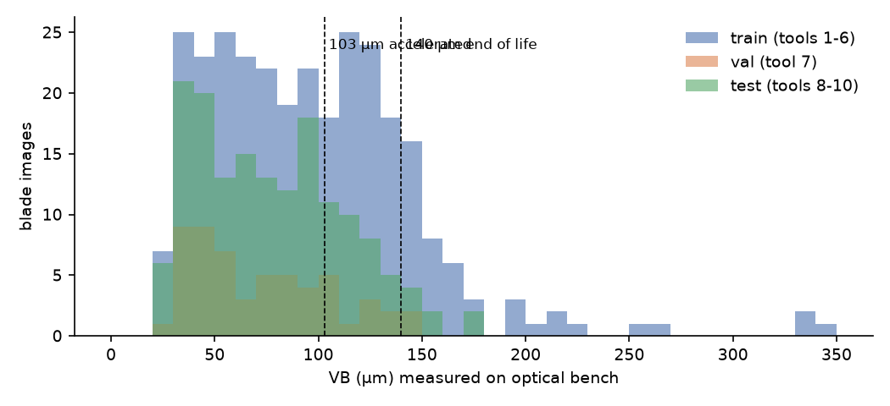
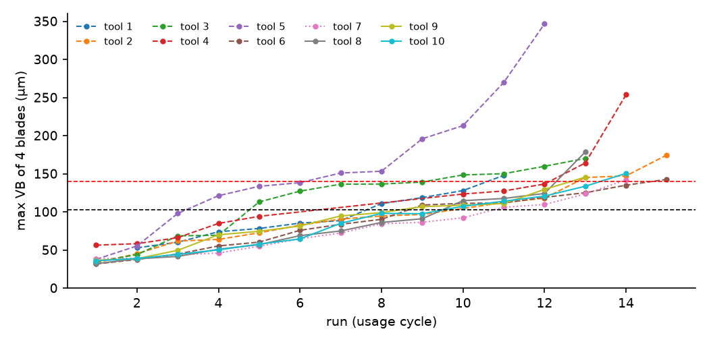

รูป d03: VB สูงสุดของ 4 ใบเพิ่มแบบ "คงที่แล้วเร่ง" เหมือนข้อมูลเซนเซอร์ LUH จึงใช้เกณฑ์ 103/140 µm ชุดเดียวกันได้ · ดอก 4 และ 5 สึกเกินไปมาก (254 และ 347 µm) จึงเป็น fold ที่ยากที่สุดของ CV

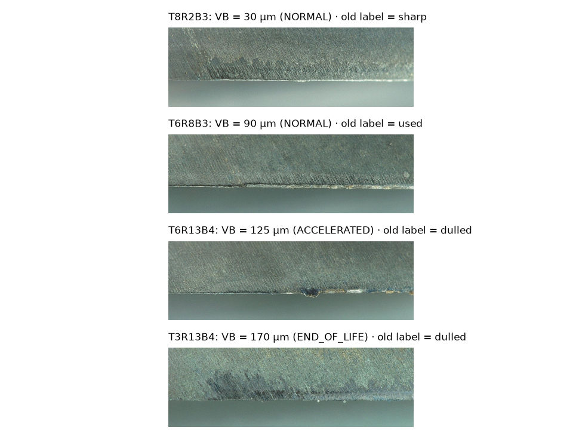

---

## 3. การออกแบบแบบจำลอง

### 3.1 โจทย์เป็น regression: ภาพ → ตัวเลข 1 ค่า
แนวคิดจากรายวิชา: นำ **backbone ที่ฝึกมาแล้ว + ข้อมูลของเรา → ปัญหาของเรา** และ **ตัดชั้นบนสุด (หัว 1000 คลาสของ ImageNet) แล้วใส่หัวใหม่ให้ตรงงาน** — ที่นี่หัวใหม่คือ `Dropout(0.3) → Linear(512 → 1)` ให้ค่า VB/100 ตรง ๆ (เหมือนที่ YOLO ทำ box regression เป็นการทายตัวเลข)

### 3.2 ผู้สมัคร 3 สถาปัตยกรรม (stage A)
| แบบจำลอง | พารามิเตอร์ | เหตุผลที่ทดลอง |
|---|---|---|
| CNN เล็กฝึกจากศูนย์ | 0.25 M | baseline: Conv-BN-ReLU-MaxPool × 5 → Global Average Pooling → Linear (แบบ Lab ในชั้นเรียน) |
| **ResNet-18** (ImageNet) | 11.2 M | residual block (skip connection) ฝึกลึกได้เสถียร, feature ภาพทั่วไปที่ดีสำหรับข้อมูลน้อย |
| backbone ของ YOLOv8n-cls (ImageNet) | 1.4 M | CSP-Darknet ที่ใช้ใน YOLO + เดิมทีมใช้ YOLOv8-cls จำแนกคลาส |

### 3.3 การออกแบบอินพุต
ขอบคมตัดเป็นเส้นแนวนอน รอยสึกคือแถบเหนือขอบ **ความสูงของแถบ = VB** จึง
- **คงสัดส่วนภาพ ~3:1** (224×672) — การบีบเป็น 224×224 ทำให้แนวตั้งกับแนวนอนถูกย่อไม่เท่ากัน (ทดสอบใน ablation)
- **ไม่ใช้ augmentation ที่เปลี่ยนสเกล** (random scale / crop / zoom) เพราะเปลี่ยนความสูงของแถบเป็นพิกเซล = เปลี่ยนคำตอบ

### 3.4 ทำไมไม่ใช้ object detection หรือ segmentation
| ทางเลือก | ทำไมไม่ใช้ตอนนี้ |
|---|---|
| YOLO detection (กล่อง) | 1 ภาพมีใบมีด 1 ใบเสมอ ไม่มีอะไรให้หาตำแหน่ง และคำตอบที่ต้องการคือตัวเลข ไม่ใช่กล่อง |
| U-Net (semantic segmentation) → วัดความสูงของแถบ | ต้องมี mask ระดับพิกเซลของแถบรอยสึกทั้ง 512 ภาพ (ชุดข้อมูลไม่มี ต้องวาดเองด้วย CVAT/SAM2) และต้องรู้สเกล µm/พิกเซล — เป็นงานต่อยอดที่ดี (อธิบายผลได้ชัดกว่า) แต่ regression ใช้ label ที่วัดไว้แล้วได้ทันที |
| YOLACT / YOLOv8-seg (instance) | ไม่มีหลายวัตถุซ้อนกัน จึงไม่ได้ประโยชน์จากการแยก instance |

---

## 4. การฝึก

| ส่วน | ค่าที่ใช้ | เหตุผล |
|---|---|---|
| loss | Huber (SmoothL1), δ = 20 µm | ใกล้ MSE เมื่อคลาดน้อย, ทนต่อค่าสุดโต่ง (ดอก 5 ถึง 347 µm) |
| optimizer | AdamW, weight decay 1e-4 | weight decay = **L2 regularization** ลดความซับซ้อนของน้ำหนัก กัน overfit |
| learning rate | backbone 3e-4 · หัวใหม่ ×5 | หัวสุ่มใหม่ต้องเรียนเร็ว ส่วน backbone ปรับช้า ๆ เพื่อไม่ลบความรู้เดิม |
| scheduler | **warm-up เชิงเส้น 3 epoch + cosine decay** (`torch.optim.lr_scheduler.LinearLR` + `CosineAnnealingLR`) ปรับทุก iteration | warm-up กัน diverge ช่วงแรก, decay ให้ลู่เข้านิ่ง |
| batch / epoch | mini-batch 16, **60 epoch** (v1: 30), AMP บน GPU (RTX 4050) | augmentation ที่แรงขึ้นทำให้ฝึกนานได้โดยไม่ overfit (stage D: 30 → 45 → 60 epoch ดีขึ้นต่อเนื่อง) |
| regularization | Dropout 0.3 ที่หัว + augmentation + EMA ของน้ำหนัก (decay 0.98/iteration) | EMA ลดการแกว่งของผลระหว่าง epoch |
| augmentation (online, สุ่มใหม่ทุก batch, ไม่เขียนลงดิสก์) | กลับซ้าย-ขวา · หมุน ±3° + เลื่อน ≤ 3–4% · **ความสว่าง/คอนทราสต์ ±40% · ความอิ่มตัวสี ±30% · gamma 0.7–1.4 · สีเพี้ยนรายช่องสี ±12%** (v1: ±25% / ±15% ไม่มี gamma/สีเพี้ยน) · Gaussian blur (p = 0.25) | ภาพของแต่ละดอกสีต่างกันชัด (ฟ้า/เขียว/มืด/สว่าง — ความสว่างเฉลี่ยรายดอก 92–147) แบบจำลองจึงต้องไม่พึ่งสีรวมของภาพ · นโยบายเขียนเป็น `torchvision.transforms.v2` และคำนวณทั้ง batch พร้อมกันบน GPU |
| ensemble | 5 ตัว ฝึกด้วยสูตรเดียวกัน ต่างกันที่ seed → เฉลี่ยค่า VB | ลดความแปรปรวนจากการสุ่ม (MAE รายตัวต่างกัน ±0.4–0.8 µm ระหว่าง seed) |
| ไม่ทำ | random scale / crop / zoom, flip แนวตั้ง | เปลี่ยนความสูงแถบ/ตำแหน่งขอบคม (ระวัง augmentation ที่มากเกินไป) |

**TensorBoard** (`SummaryWriter`): loss/train, loss/val, MAE/val, learning rate ทุก iteration, histogram ของน้ำหนัก (หัว, conv แรก, block สุดท้าย) ทุก 5 epoch, กราฟโครงข่าย (add_graph) และรูป pred-vs-true ของตัวสุดท้าย · เปิดดูด้วย `tensorboard --logdir nontime_docs/tool_vb_vision/runs`

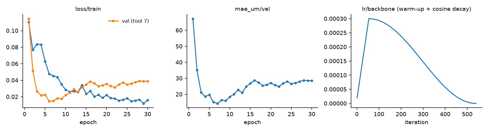

**ทำไมฝึกจำนวน epoch คงที่ ไม่เก็บ best checkpoint จากดอก 7 (แบบ `best.pt` ของ YOLO):** กราฟ val ของดอก 7 ต่ำสุดช่วงต้นแล้วสูงขึ้น (v2: ทุกสมาชิกต่ำสุดที่ epoch 4–8 ได้ 9–17 µm แล้วจบที่ 29–34 µm) ซึ่งดูเหมือน overfit แต่เกิดกับดอก 7 ดอกเดียว — ใน cross-validation ของสูตรเดียวกัน (60 epoch, 2 seed × 7 fold, `results_vb/search/hist_s3_sa_e60_s*.csv`):

| | MAE (µm) |
|---|---|
| ค่าเฉลี่ย 7 fold ที่ epoch 6 / 30 / 60 | 29.1 / 20.8 / **20.1** — ลดลงจนจบ ไม่มีช่วงที่ error กลับขึ้น |
| ดอก 1–6: epoch ที่ดีที่สุด | epoch 26–60 · epoch สุดท้ายห่างจากค่าดีที่สุดไม่เกิน 1.5 µm |
| ดอก 7: ดีที่สุด / epoch สุดท้าย | 13.0 (epoch 5) / 30.9 |
| เลือก epoch จาก fold อื่น (ไม่ดูดอกที่ทดสอบ) | 20.7 — แย่กว่าใช้ epoch สุดท้าย |
| เลือก epoch ที่ดีที่สุดของแต่ละดอกเอง | 16.5 — ใช้ค่าจริงของดอกที่ทดสอบมาเลือก (แอบดูคำตอบ) จึงใช้จริงไม่ได้ |

ถ้าเก็บ best ตามดอก 7 จะได้น้ำหนักช่วง epoch ~5 ซึ่งบนดอกอื่นยังคลาดราว 29 µm และดอก 7 จะใช้เป็น gate ที่ไม่ลำเอียงไม่ได้ · จำนวน epoch (60) จึงเลือกด้วย cross-validation ดอก 1–7 (stage D) แล้วใช้น้ำหนักของ epoch สุดท้าย · `vb_model.fit` เก็บ best checkpoint ได้ (`patience` > 0) แต่ไม่เปิดใช้ด้วยเหตุผลนี้ — การเปลี่ยนไปใช้ YOLO จึงไม่ได้อะไรเพิ่ม (YOLO ไม่มีหัว regression ให้วัด VB และแบบจำแนกคลาสด้อยกว่าในหัวข้อ 5.6)

**ทดลองจริงแล้ว — v3.0.0 = สูตรเดียวกันแต่เก็บ best checkpoint ตามดอก 7** (`patience = 10`; ทดลองหลังเห็นผลดอกทดสอบว่าดอก 8–10 ถูกทายเกินแบบเดียวกับดอก 7 จึงไม่ใช่การเลือกที่เป็นกลาง): ทุกโมเดลย่อยได้ checkpoint ที่ epoch 4–8 — **เส้นการฝึกตรงกับ 14–18 epoch แรกของ v2 ทุกจุด** (seed และตารางเดียวกัน) คือ v2 ที่หยุดกลางทาง ตอน LR ยังอยู่ 98–100% ของค่าสูงสุด (cosine decay ยังไม่เริ่ม)
- MAE รวมบนดอกทดสอบดีขึ้นมาก (24.5 → 13.6 µm) เพราะใบที่ยังคมไม่ถูกทายเกินแล้ว — แต่ **underfit**: MAE ชุดฝึก 26.6 µm (v2 4.7) ขณะที่ val ดอก 7 = 8.7 µm (ดีกว่าชุดฝึก = เข้ากับดอก 7 โดยบังเอิญ)
- ค่าทายมีเพดาน (สูงสุด 129 µm บนดอกทดสอบ) ภาพ VB ≥ 140 µm คลาด 64.8 µm (v2 32.0) และภาพตอนถอดของดอก 8 / 10 ที่หมดอายุแล้ว (161.7 / 144.9 µm) ถูกทายว่า **ปกติ** (86 / 89 µm) — ค่าทายลดลงทั้งที่ดอกสึกมากขึ้น
- ยืนยันเหตุผลข้างบน: จุดต่ำสุดของดอก 7 ไม่ใช่จุดที่แบบจำลองดีที่สุดสำหรับงานนี้ → ใช้ v2 ต่อ · v3 ไม่ได้อยู่ในระบบแล้ว ไฟล์เก็บไว้เทียบที่ `models/archive-3.0.0/`, `results_vb/summary_v3.json`

---

## 5. การทดลองและผล

### 5.1 วิธีประเมิน
- **Leave-one-tool-out บนดอก 1–7**: ฝึก 6 ดอก ทายดอกที่เหลือ หมุนครบ 7 รอบ → ได้ค่าทายนอกชุดฝึกของทุกภาพ
- ตัวชี้วัด: MAE/RMSE (µm), **MAE ในช่วง VB ≥ 103 µm** (ช่วงที่ใช้ตัดสินจริง — ระบบตรวจเฉพาะดอกที่ถอดตอนหมดอายุ), ความถูกต้องของโซน 3 ระดับ, recall/precision ของการตัดสิน "หมดอายุ" (VB ≥ 140 µm)
- **เกณฑ์เลือก (กำหนดก่อนดูผลทดสอบ)** = MAE ในช่วง VB ≥ 103 µm ต่ำสุด · ดอก 8–10 ใช้ครั้งเดียวหลังเลือกเสร็จ

### 5.2 ผลการเลือกแบบจำลอง

| ชุด | การตั้งค่า | MAE | MAE (VB ≥ 103) | โซนถูก | recall หมดอายุ | SD ระหว่าง fold |
|---|---|---|---|---|---|---|
| A | CNN ฝึกจากศูนย์ | 30.5 | 39.0 | 62.5% | 34% | 6.8 |
| A | **ResNet-18** | 22.4 | 30.5 | 69.6% | 51% | 5.9 |
| A | backbone YOLOv8n-cls | 27.7 | 35.8 | 66.8% | 49% | 6.5 |
| B | ResNet-18 ไม่มี augmentation | 22.2 | 29.3 | 69.9% | 45% | 6.6 |
| B | ResNet-18 ฝึกจากศูนย์ (ไม่ pretrain) | 29.3 | 37.5 | 64.2% | 28% | 6.4 |
| B | ResNet-18 แช่แข็ง backbone (ฝึกเฉพาะหัว) | 24.0 | 29.6 | 69.6% | 23% | 9.9 |
| B | ResNet-18 อินพุตสี่เหลี่ยม 224×224 | 25.0 | 33.4 | 68.2% | 51% | 7.2 |
| C | ResNet-18 + avg & max pooling | 25.6 | 34.5 | 69.6% | 36% | 8.9 |
| C | ResNet-18 + avg & max pooling, 288×864 | 27.5 | 37.9 | 65.3% | 21% | 8.0 |
| C | **ResNet-18 + EMA (v1.0.0)** | **22.0** | **30.2** | **69.9%** | 49% | 6.0 |

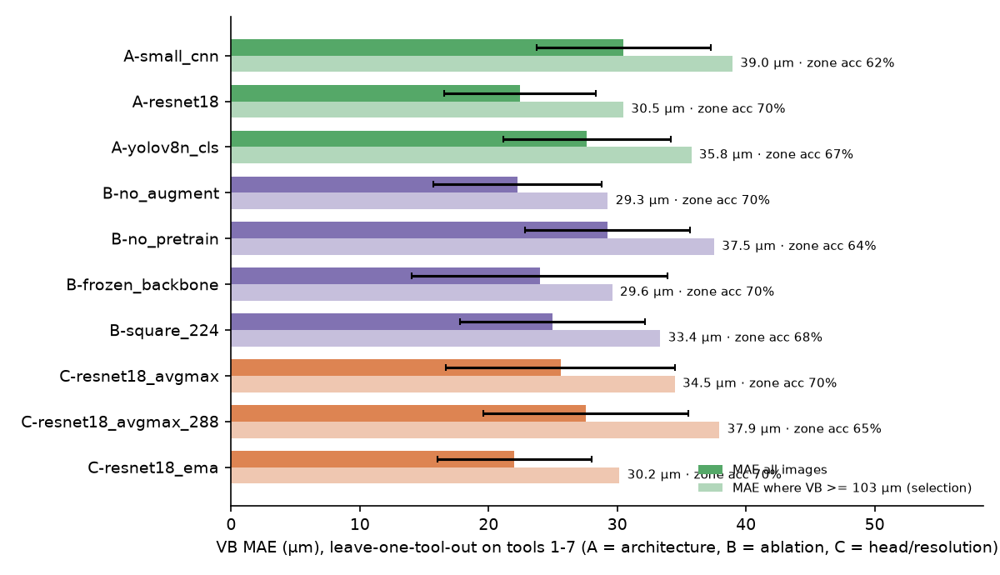

สิ่งที่ได้จากตาราง
- **การ pretrain สำคัญที่สุด** — ResNet-18 สถาปัตยกรรมเดียวกันแต่ฝึกจากศูนย์แย่ลง 7 µm (ข้อมูลฝึกมีแค่ ~300 ภาพ) และ CNN เล็กฝึกจากศูนย์แย่ที่สุด
- **ResNet-18 ดีกว่า backbone ของ YOLOv8n** 5 µm — YOLOv8n ถูกออกแบบให้เล็ก/เร็วสำหรับ detection ส่วนงานนี้รันวันละไม่กี่ภาพ ความเร็วไม่ใช่ข้อจำกัด (ResNet-18 ใช้ 36 ms/ภาพบน CPU)
- **fine-tune ทั้งตัวดีกว่าแช่แข็ง backbone** — MAE รวมใกล้กัน แต่ recall หมดอายุตกจาก 51% เหลือ 23% และผลแกว่งระหว่างดอกมากขึ้น (feature ของ ImageNet ยังไม่ไวต่อรอยสึกพอ ต้องปรับ)
- **คงสัดส่วนภาพดีกว่าบีบเป็นสี่เหลี่ยม** 2.6 µm (8 µm ในช่วงตัดสิน)
- **สมมติฐานที่ไม่ผ่าน**: VB คือความกว้าง *สูงสุด* จึงลองเพิ่ม max pooling ให้หัว และเพิ่มความละเอียดภาพ — ทั้งคู่แย่ลง (max pooling ไวต่อจุดสะท้อนแสงจ้า/สิ่งสกปรกที่ขอบ) จึงไม่ใช้
- **EMA** ดีขึ้นเล็กน้อยและทำให้กราฟ val นิ่ง จึงเป็น v1.0.0

### 5.3 augmentation ช่วยไหม? (v1.0.0)
บน CV ภาพสะอาด มี/ไม่มี augmentation ระดับพื้นฐานใกล้กัน (22.0 vs 22.2 µm) เพราะภาพ optical bench ถ่ายในสภาพควบคุม ประโยชน์คือ **ความทนทานเมื่อภาพตอนใช้งานต่างจากตอนฝึก** — ฝึกตัวใช้งานจริงทั้ง 2 แบบแล้วรบกวนภาพทดสอบ (ดอก 8–10) · ใน stage D (หัวข้อ 5.4) augmentation ที่ *แรงขึ้น* ช่วยบน CV ด้วย:

| สภาพภาพทดสอบ | MAE มี aug | MAE ไม่มี aug | MAE (VB ≥ 103) มี aug | MAE (VB ≥ 103) ไม่มี aug |
|---|---|---|---|---|
| ปกติ | **25.9** | 27.3 | 22.0 | 19.1 |
| มืดลง ×0.7 | **21.1** | 28.1 | **19.8** | 22.1 |
| สว่างขึ้น ×1.3 | 24.9 | 24.5 | **19.9** | 23.0 |
| คอนทราสต์ ×0.7 | 23.3 | **19.0** | **18.4** | 19.6 |
| เบลอ σ 1.5 | 22.8 | 22.2 | **16.2** | 31.1 |
| เอียง 3° | **24.0** | 27.3 | 18.6 | 17.8 |
| **แย่ที่สุด** | **25.9** | 28.1 | **22.0** | 31.1 |

กรณีแย่ที่สุดในช่วงที่ใช้ตัดสินดีกว่าชัดเจน (22.0 vs 31.1 µm) จึงใช้ augmentation

### 5.4 Stage D: หาตัวที่แม่นที่สุด (v2.0.0)

**วิเคราะห์ก่อนว่าคลาดเพราะอะไร** (ค่าทายนอกชุดฝึกของ v1)
- **คลาดแบบคงที่รายดอก** — ทุกภาพของดอก 7 ถูกทายเกิน (+27 µm) ทุกภาพของดอก 4 ถูกทายขาด (−30 µm) · ถ้าลบ bias รายดอกออก MAE เหลือ 17 µm จาก 22 µm → ส่วนใหญ่ของความคลาดคือ "ดอกนี้ทั้งดอกดูต่างจากดอกที่ฝึก" ไม่ใช่การวัดภาพทีละภาพผิด
- **บีบช่วงค่า** — VB < 60 µm ทายเกิน +13, VB > 140 µm ทายขาด −34 µm
- ภาพแต่ละดอกสีและความสว่างต่างกันชัด (ความสว่างเฉลี่ยรายดอก 92–147, บางดอกออกฟ้า บางดอกออกเขียว) · ขอบคมอยู่ที่ ~64% ของความสูงทุกภาพ
- label ของแต่ละใบเพิ่มขึ้นตามรอบเสมอ (ไม่มีรอบใดลดลง) จึงไม่มีสัญญาณรบกวนของ label ให้แก้

**วิธีทดลอง** — leave-one-tool-out บนดอก 1–7 เหมือนเดิม แต่ละชุด **2 seed** (MAE ต่างกันระหว่าง seed ±0.2–0.8 µm จึงนับเฉพาะผลที่ต่างเกินนั้น) · ดอก 8–10 ไม่ถูกแตะจนเลือกเสร็จ · เปลี่ยนทีละปัจจัยจากสูตร v1 แล้วต่อยอดตัวที่ดีขึ้น (โค้ด [`search_vb.py`](search_vb.py), ผลดิบ `results_vb/search/`, สรุป `results_vb/search_summary.csv`)

| รอบ | การเปลี่ยนแปลง | MAE | MAE (VB ≥ 103) | ระดับดอก | สรุป |
|---|---|---|---|---|---|
| — | สูตร v1 (ทำซ้ำ 2 seed) | 22.2 | 30.4 | 20.3 | จุดเทียบ |
| S1 | ตัดฉากหลังใต้ขอบคม (224×992 / 288×1276) | 24.5 / 24.7 | 32.4 / 33.7 | 22.3 / 22.7 | แย่ลง — ส่วนใต้ขอบคม (คมบิ่น/ขอบสะท้อนแสง) มีข้อมูล |
| S1 | ปรับมาตรฐานรายภาพ (instance normalization) | 22.2 | 29.3 | 19.4 | ไม่ต่าง |
| S1 | ภาพเทา + ปรับมาตรฐานรายภาพ | 21.5 | 29.4 | 19.3 | ดีขึ้นเล็กน้อย |
| S1 | **augmentation สี/แสงแรงขึ้น** | **21.2** | 29.1 | 18.8 | ดีขึ้น |
| S1 | L1 loss แทน Huber | 22.0 | 30.1 | 20.1 | ไม่ต่าง |
| S1 | Siamese เทียบภาพใบเดียวกันตอนติดตั้งดอก (1 seed) | 23.5 | 32.4 | 22.4 | แย่ลง — bias รายดอกไม่หาย (ดอก 4 −36, ดอก 7 +23) |
| S2 | aug แรง + ภาพเทา | 21.3 | 28.6 | 18.7 | ไม่เสริมกัน |
| S2 | aug แรง + ResNet-34 / ResNet-50 / RegNetY-3.2GF | 20.9 / 22.0 / 21.2 | 28.7 / 29.5 / 27.9 | 18.7 / 19.7 / 19.1 | backbone ใหญ่ขึ้นไม่ช่วย (ข้อมูล 6 ดอก) |
| S2 | aug แรง + weight decay 1e-2 + dropout 0.5 | 21.6 | 29.5 | 19.4 | ไม่ช่วย |
| S2 | **aug แรง + 45 epoch** | **20.1** | 26.6 | 17.6 | ดีขึ้นชัด |
| S3 | **aug แรง + 60 epoch** | **19.9** | **25.9** | **17.4** | **ดีที่สุด → เลือก** |
| S3 | aug แรง + ResNet-34 45 epoch / ResNet-34 288×864 / ConvNeXt-T | 20.9 / 21.5 / 21.6 | 27.6 / 29.3 / 28.9 | 18.7 / 19.1 / 19.6 | ไม่ดีกว่า ResNet-18 |
| S4 | ตัวที่เลือก + TTA กลับซ้าย-ขวา (seed เดียวกัน) | 20.3 vs 20.3 | | | ไม่ต่าง — ไม่ใช้ (เวลา CPU ×2) |
| S5 | ตัวที่เลือก + สุ่มภาพแต่ละช่วง VB (< 103 / 103–140 / ≥ 140) เท่ากัน — ถ่วงผกผันกับจำนวนภาพ (ทดลองหลังเลือก) | 19.9 | 26.2 | 17.7 | ไม่ดีขึ้น — ภาพ VB ≥ 140 ยังทายต่ำ (ensemble 41.4 vs 39.4 µm) · ชุดฝึกเรียนช่วงค่าสูงได้อยู่แล้ว (MAE ชุดฝึกช่วง ≥ 103 = 6.7 µm) ความคลาดมาจากความต่างระหว่างดอก ไม่ใช่จำนวนภาพ |

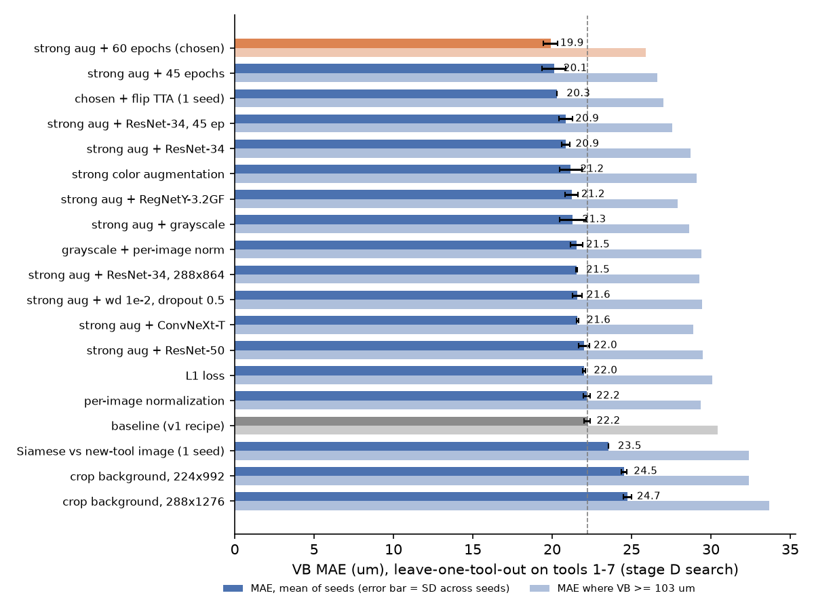

**ensemble** — เฉลี่ยค่าทายของ 2 seed: 19.9 → 19.6 µm · ผสมสถาปัตยกรรมต่างกัน (ResNet-18 + RegNetY / ConvNeXt) ไม่ดีกว่า ensemble ของ ResNet-18 ล้วน · calibration เชิงเส้นที่ประเมินแบบ leave-one-tool-out แย่ลง (20.5 → 23.0 µm) เหมือน v1 จึงไม่ใช้

**เลือก** = ResNet-18 + augmentation แรง + 60 epoch (MAE ต่ำสุดทั้งรวมและช่วง VB ≥ 103 µm = เกณฑ์เดิมของหัวข้อ 5.1) → ตัวใช้งานจริง = **ensemble 5 seed** ฝึกบนดอก 1–6 (val ดอก 7) · ช่วง P10–P90 = residual ของ ensemble นอกชุดฝึก (รายใบ −34 / +26 µm, ค่าเฉลี่ยดอก −28 / +20 µm)

| CV (ดอก 1–7, ensemble) | v1 | v2 |
|---|---|---|
| MAE รายใบ | 21.9 | **19.6** |
| bias ดอก 1 / 2 / 3 / 4 / 5 / 6 / 7 | −15 / +12 / −9 / −30 / −18 / −7 / +27 | **+4 / +5 / 0** / −24 / −15 / −6 / +31 |
| bias ช่วง VB 103–140 / > 140 µm | −13.5 / −34.1 | **−4.0** / −33.9 |
| MAE ระดับดอก · โซนถูก | 20.1 · 69% | **17.2 · 73%** |

augmentation แรงตัดความคลาดคงที่ของดอก 1–3 ได้เกือบหมด และลดการบีบช่วงค่าในช่วง 103–140 µm (ช่วงที่ระบบตัดสิน "ใกล้หมดอายุ") แต่ดอก 4/5/7 ยังคลาดแบบคงที่ และภาพที่ VB > 140 µm ยังถูกทายต่ำ — การทดลองแบบเทียบภาพตอนดอกใหม่ (Siamese) แสดงว่าความต่างนี้ไม่ได้มาจากหน้าตาของดอกตอนใหม่ จึงน่าจะมาจากลักษณะการสึกเฉพาะดอก/การวัดของแต่ละดอก ซึ่งต้องการดอกฝึกมากกว่า 6–7 ดอกถึงจะเรียนได้

### 5.5 ผลบนดอกทดสอบ (ดอก 8–10 = ดอกบนเครื่อง M1–M3) — ใช้ครั้งเดียวหลังเลือกเสร็จ

| ชุด | n | MAE v1 → **v2** (µm) | bias v1 → v2 | โซนถูก v1 → v2 |
|---|---|---|---|---|
| train (ดอก 1–6) | 296 | 6.5 → 4.7 | −2.8 → +1.6 | 92% → 96% |
| validation (ดอก 7) | 56 | 28.6 → 30.7 | +28.6 → +30.7 | 57% → 52% |
| **test (ดอก 8–10)** | 160 | 25.9 → **24.5** | +21.6 → +20.6 | 61% → 62% |
| test ช่วง VB ≥ 103 µm | 39 | 22.0 → 22.0 | | |
| test เฉพาะภาพตอนถอดดอก (รอบสุดท้าย) | 12 | 29.9 → 29.6 | −21.6 → −19.1 | 25% → 25% |
| test รายดอก 8 / 9 / 10 | | 24.5 / 31.7 / 21.9 → 26.4 / 29.4 / **18.3** | | |

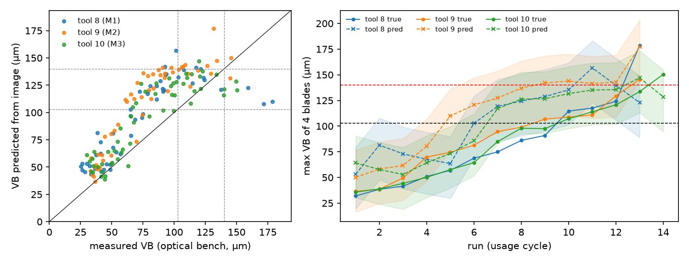

**ระดับดอก (VB เฉลี่ย 4 ใบ = สิ่งที่ระบบใช้ตัดสิน)**

| ชุด | n (ดอก×รอบ) | MAE v1 → v2 (µm) | โซนถูก v1 → v2 | recall หมดอายุ |
|---|---|---|---|---|
| CV ดอก 1–7 | 88 | 20.2 → **17.2** | 69% → **73%** | 70% → 60% |
| test ดอก 8–10 | 40 | 25.1 → **24.0** | 60% → 60% | 0/2 → 0/2 |

| ดอก (เครื่อง) ตอนถอด | VB เฉลี่ยจริง | AI v1 | AI v2 | ช่วง P10–P90 v2 | ผล v2 |
|---|---|---|---|---|---|
| 8 (M1) | 161.7 (หมดอายุ) | 117.4 | 115.4 | 88–136 | ใกล้หมดอายุ → ควรเปลี่ยนตามแผน · ช่วงคร่อม 103 → แนะนำวัดยืนยัน |
| 9 (M2) | 139.1 (ใกล้หมดอายุ) | 145.0 | 151.5 | 124–172 | หมดอายุ (เกินจริง 12 µm — ฝั่งปลอดภัย) · ช่วงคร่อม 140 → แนะนำวัด |
| 10 (M3) | 144.9 (หมดอายุ) | 118.6 | 121.6 | 94–142 | ใกล้หมดอายุ · ช่วงคร่อม 103 และ 140 → แนะนำวัดยืนยัน |

**อ่านผลอย่างตรงไปตรงมา**
- v2 ดีขึ้นบนดอกทดสอบ 1.4 µm (5%) ทั้งรายใบและระดับดอก ซึ่ง **น้อยกว่าที่ CV ดีขึ้น** (11–15%) — ดอก 8–10 ยังถูกทายเกินทั้งดอก (+14 ถึง +29 µm) แบบเดียวกับดอก 7 คือความคลาดคงที่รายดอกที่หัวข้อ 5.4 แก้ได้เพียงบางดอก · ดอก 10 ดีขึ้นมาก (21.9 → 18.3) ดอก 8 แย่ลงเล็กน้อย
- ผลตัดสินระดับดอกตอนถอดทั้ง 3 ดอกเหมือน v1 — ไม่มีดอกใดที่หมดอายุแล้วถูกบอกว่า "ปกติ" และทุกดอกระบบแนะนำให้วัดยืนยัน (ช่วง P10–P90 คร่อมเกณฑ์)
- ช่วง P10–P90 ครอบค่าจริงบนดอกทดสอบ **71%** (v1: 62%, ตั้งใจ 80%) — แต่ช่วงบนของค่าเฉลี่ยดอกแคบลง (+20 µm) ดอก 8 ที่หมดอายุ (161.7) จึงได้ช่วง 88–136 ที่ไม่ถึง 140 ระบบยังแนะนำให้วัดเพราะคร่อม 103 แต่ไม่ได้เตือนว่าอาจหมดอายุแล้ว
- ลอง calibration เชิงเส้นแล้วแย่ลงทั้งบนดอกทดสอบของ v1 (25.9 → 27.4) และบน CV ของ stage D (20.5 → 23.0) จึงไม่ใช้
- ต้นทุน: CPU 0.2 s/ภาพ (5 ตัว) = ~1 วินาทีต่อการตรวจ 1 ดอก ซึ่งยังเร็วกว่าการวัดด้วยมือมาก

**เทียบกับ v3 (best checkpoint ดอก 7 — ทดลองหลังเห็นผลชุดนี้ จึงไม่เป็นกลาง)**

| ดอกทดสอบ 8–10 | v2 (ใช้งาน) | v3 |
|---|---|---|
| MAE รายใบ / ระดับดอก · โซนถูกรายใบ | 24.5 / 24.0 · 62% | 13.6 / 11.0 · 83% |
| MAE ตาม VB จริง < 103 / 103–140 / ≥ 140 µm (121 / 31 / 8 ภาพ) | 25.4 / 19.4 / **32.0** | 9.4 / 16.6 / **64.8** |
| ภาพตอนถอด (รอบสุดท้าย, 12 ภาพ) | **29.6** | 53.7 |
| ดอกที่หมดอายุแล้วถูกบอกว่า "ปกติ" (รอบสุดท้ายของดอก 8 / 10) | ไม่มี | **2 ดอก** |
| ภาพที่หน้าเว็บใช้เมื่อถอดตอน REPLACE_NOW (ดอก 8 รอบ 12 / 9 รอบ 12 / 10 รอบ 13) | ใกล้หมดอายุถูก 3/3 | ใกล้หมดอายุถูก 3/3 |

v3 ดีกว่าโดยรวมเพราะภาพส่วนใหญ่ยังคม แต่แย่กว่ามากในช่วงที่ระบบใช้ตัดสินเปลี่ยน/จัดการดอก — จึงใช้ v2

### 5.6 เทียบกับการจำแนก 3 คลาสโดยตรง (ปกติ / ใกล้หมดอายุ / หมดอายุ)

คำถาม: ถ้าเป้าหมายสุดท้ายคือ 3 ระดับตามเกณฑ์เดียวกับแบบจำลอง RUL ฝึกเป็น classifier ตรง ๆ จะดีกว่าทาย VB แล้วแปลงเป็นคลาสไหม
— ฝึก classifier ด้วย **สูตรเดียวกันทุกอย่าง** (ResNet-18, augmentation แรง, 60 epoch, EMA) ต่างแค่หัว 3 คลาส + cross-entropy ถ่วงน้ำหนักคลาสผกผันกับความถี่ (ภาพหมดอายุมีน้อย) · คลาสตัดที่ 103 / 140 µm · leave-one-tool-out ดอก 1–7, ensemble 2 seed ทั้งสองฝั่ง · ระดับดอกของ classifier = เฉลี่ยความน่าจะเป็นของ 4 ใบ (`results_vb/compare_classifier.csv`)

| ระดับ | แบบจำลอง | โซนถูก | recall เฉลี่ย 3 คลาส | recall หมดอายุ | precision หมดอายุ | หมดอายุแต่ทายว่าปกติ | ปกติแต่ทายว่าหมดอายุ |
|---|---|---|---|---|---|---|---|
| ใบ (352) | **ทาย VB → คลาส** | **69.9%** | **60.7%** | **51.1%** | **54.5%** | 4 | **3** |
| ใบ (352) | classifier 3 คลาส | 66.8% | 57.4% | 44.7% | 35.0% | **2** | 14 |
| ดอก (88) | **ทาย VB → คลาส** | **72.7%** | **65.5%** | **60%** | **50%** | 1 | **1** |
| ดอก (88) | classifier 3 คลาส | 69.3% | 62.2% | 50% | 38.5% | **0** | 3 |

- เมื่อ classifier ใช้สูตรของ regression ทาย VB ดีกว่าเกือบทุกตัวชี้วัดแม้วัดด้วยเกณฑ์ของ classifier เอง (ความถูกต้องของคลาส) — การฝึกด้วยตัวเลขใช้ข้อมูลมากกว่า: ใบที่ 104 กับ 139 µm คือ "คลาสเดียวกัน" สำหรับ classifier แต่ regression รู้ว่าต่างกัน 35 µm และรู้ว่าคลาสเรียงลำดับกัน
- classifier พลาดแบบร้ายแรง (หมดอายุแต่บอกว่าปกติ) น้อยกว่าเล็กน้อย (2 vs 4 ใบ) แต่แลกด้วยการเตือนผิด "หมดอายุ" มากขึ้นเกือบ 5 เท่า (14 vs 3 ใบ) จากการถ่วงน้ำหนักคลาสที่มีน้อย
- ข้อได้เปรียบเชิงระบบของการทาย VB: ระดับดอกใช้ค่าเฉลี่ย 4 ใบได้ตรงนิยามของ label RUL, มีช่วง P10–P90 บอกว่าใกล้เกณฑ์แค่ไหน (แนะนำให้วัดเฉพาะใบที่คร่อม), และค่าที่ช่างวัดจริงใช้ retrain ได้เต็มรายละเอียด · หน้าเว็บยังแสดงผลเป็น 3 ระดับเหมือนเดิม

**จูน classifier แยกต่างหาก (ทดลองเพิ่ม — `search_vb.py --cls-search`)** — ตารางข้างบนใช้สูตรของ regression ทั้งหมด ซึ่งอาจไม่ยุติธรรมกับ classifier จึงลองอีก 4 สูตรด้วย leave-one-tool-out ดอก 1–7 (2 seed) แบบเดียวกัน (`results_vb/cls_search_summary.csv`):

| classifier | โซนถูก ใบ / ดอก | recall หมดอายุ ใบ / ดอก | หมดอายุแต่ทายว่าปกติ ใบ / ดอก | ปกติแต่ทายว่าหมดอายุ ใบ / ดอก |
|---|---|---|---|---|
| สูตร regression (60 epoch — ตารางข้างบน) | 66.8% / 69.3% | 44.7% / 50% | 2 / 0 | 14 / 3 |
| 15 epoch | 69.0% / 68.2% | 57.4% / 50% | 4 / 1 | 5 / 1 |
| 30 epoch + label smoothing 0.1 | **71.6%** / 73.9% | 48.9% / 50% | 3 / 1 | 6 / 1 |
| **60 epoch + label smoothing 0.1** | 70.5% / **76.1%** | 48.9% / 60% | 3 / 1 | 5 / 0 |
| ordinal: P(VB ≥ 103), P(VB ≥ 140), 30 epoch | 65.3% / 64.8% | 57.4% / 50% | **0 / 0** | 5 / 2 |
| *ทาย VB → คลาส (ตัวใช้งาน)* | *69.9% / 72.7%* | *51.1% / 60%* | *4 / 1* | *3 / 1* |

- เมื่อจูนแล้ว classifier ที่ดีที่สุด (label smoothing ลดความมั่นใจเกินของ cross-entropy) **ใกล้เคียงกับการทาย VB**: โซนถูกสูงกว่าเล็กน้อย (+2 ใบจาก 352, +3 ดอกจาก 88) และพลาดแบบอันตรายน้อยกว่า 1 ใบ แต่จับใบหมดอายุได้น้อยกว่า 1 ใบ (23 vs 24 จาก 47) และเตือนหมดอายุผิดมากกว่า (5 vs 3 ใบ) — ต่างกันในระดับความแปรปรวนระหว่าง seed จึงถือว่า **เสมอกัน** ไม่ใช่ "ทาย VB ดีกว่าชัด" อย่างที่ตารางแรกบอก
- ยังใช้การทาย VB เพราะระบบต้องใช้ตัวเลข (ค่าเฉลี่ย 4 ใบ, ช่วง P10–P90, การจัดการดอกตาม VB ในใบเบิก, retrain ด้วยค่าที่วัดจริง) — classifier ที่ผลเสมอกันไม่คุ้มกับการออกแบบส่วนเหล่านี้ใหม่

---

## 6. การใช้งานในระบบ (ecosystem)

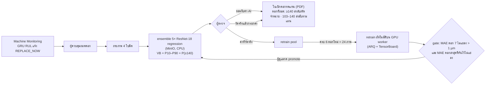

- **แบบจำลองเก็บใน MinIO** (`models/tool-vision/<version>/model.pt + meta.json`) — backend ตรวจ sha256 + self-test ก่อนใช้, meta มีเกณฑ์, ช่วงความไม่แน่นอน, ผลประเมิน และกราฟการฝึกรายสมาชิก · `model.pt` 1 ไฟล์เก็บน้ำหนักของทุกสมาชิก ensemble + config การเตรียมภาพ · **ใช้งานอยู่ = `tool-vision-vb-resnet18-20261007-135808`** (v2.0.0 retrain ด้วยค่าวัดจริง) · v2.0.0 = previous สลับกลับได้ที่หน้า Model Registry · v1.0.0 / v3.0.0 เก็บใน `models/archive-*`
- **โค้ดเดียวกันทุกขั้น**: การทดลอง, retrain และ inference ใช้ `vb_model.py` ชุดเดียว (preprocessing ตรงกัน)
- **ตัดสินระดับดอกด้วย VB เฉลี่ย 4 ใบ** (นิยามเดียวกับ label ของ RUL) → **ใบเบิกดอกทดแทน** 1 ใบต่อการถอด (ดาวน์โหลด PDF ได้) → รับดอกจากคลัง → ติดตั้ง แล้ว Machine Monitoring เริ่มรอบใหม่ในสถานะหยุดชั่วคราวจนผู้ควบคุมกดเริ่มตัด · ดอกที่ถอดจัดการตามระดับ (ส่งลับ/ตัดจำหน่าย/เก็บสำรอง) · VB รายใบบอกคมที่สึกมากสุดและคมที่เกิน 140 µm เฉพาะใบ เพื่อให้วิศวกรตรวจรอยสึกเฉพาะจุด/การเยื้องศูนย์
- **ผู้ตรวจ 2 ทางเลือกต่อใบ**: ยอมรับค่า AI · กรอกค่าที่วัด — ช่องกรอกเติมผลวัด optical bench ของใบนั้นจากชุดข้อมูลให้ (แทนผลจากเครื่องวัด) และผู้ตรวจแก้ได้ · UI แนะนำให้วัดเมื่อช่วง P10–P90 คร่อมเกณฑ์ 103 หรือ 140 µm · ค่าจริงถูกส่งทีละใบเมื่อเลือกวัดใบนั้นเท่านั้น ใบที่ยอมรับค่า AI จะไม่ถูกเปิดเผยค่าจริงภายหลัง
- **retrain ใช้เฉพาะค่าที่วัดจริง** — ค่าที่แค่ยอมรับจาก AI คือคำตอบของแบบจำลองเอง ถ้านำไปฝึกจะเป็นการยืนยันความผิดของตัวเอง (confirmation bias) ไม่ได้ข้อมูลใหม่ · ภาพเดียวกันนับครั้งเดียว
- **retrain เริ่มอัตโนมัติ** (ผู้ใช้ไม่ต้องกด) เมื่อค่าที่วัดจริงจากดอกใหม่ครบ **6 ดอก = 24 ภาพ** (M1–M3 ใช้งาน 2 รอบ) และไม่มีงานกำลังฝึกหรือ candidate รอตัดสิน — ตรวจทุกครั้งที่ผู้ตรวจยืนยันผลและหลังผู้ดูแลตัดสิน candidate · ดอกที่เคยถูกลองฝึกในงานที่ถูก reject ไม่นับซ้ำ (ต้องมีดอกใหม่ครบอีก 6 ดอกจึงลองใหม่) · ปรับเกณฑ์ได้ที่ `VISION_RETRAIN_MIN_TOOLS`
- retrain = fine-tune **ทุกสมาชิกของ ensemble** จากน้ำหนักของเวอร์ชันที่ใช้งาน (lr ต่ำลง 3 เท่า, 15 epoch/ตัว) บนดอก 1–6 + ค่าวัดจากคน · ดอกล่าสุด 20% (อย่างน้อย 1 ดอก) ถูกกันไว้ตรวจ gate **ทั้งดอก** — นับตามดอกจริงที่เป็นที่มาของภาพ (เครื่องเดียวกันหลายรอบได้ภาพของดอกจริงเดียวกันคนละช่วงสึก จึงกันทุกรอบของดอกนั้น) · ดอกใหม่ของเครื่อง (รอบถัดไป) ได้ภาพช่วงท้ายอายุชุดที่ยังไม่เคยตรวจ · กราฟสดแสดงเส้นของแต่ละสมาชิก · candidate ใช้งานเมื่อผ่าน gate และผู้ดูแลกด promote เท่านั้น
- **retrain จริงครั้งแรกในระบบ (7 ต.ค. 2026)** — เดินขั้นตอนจริง M1–M3 สองรอบ (ถอดตาม REPLACE_NOW → ผู้ตรวจวัดทุกใบ) · รอบ 1: ค่าวัด 12 ใบ ฝึก 8 ใบ → ดอก 7 30.7 → 31.1 µm (ผ่าน) แต่ดอกล่าสุดที่กันไว้ 16.0 → 16.6 µm (แย่ลง) **ไม่ผ่าน gate → reject** · รอบ 2 (ดอกใหม่ได้ภาพชุดที่ยังไม่เคยตรวจ): ค่าวัด 24 ใบ ฝึก 16 ใบจากดอก 8/9 (ดอกละ 2 ช่วงสึก) กันดอก 10 ทั้ง 2 รอบ (8 ใบ) → **ดอก 7 30.7 → 26.2 µm, ดอก 10 13.5 → 7.8 µm, โซนถูก 51.8 → 57.1% / 87.5 → 100% → ผ่าน gate → admin promote** · ข้อควรรู้: ภาพดอก 8/9 กลายเป็นข้อมูลฝึกแล้ว ตัวเลขดอกทดสอบในหัวข้อ 5.5 จึงเป็นของ v2 · ผลของเวอร์ชันนี้คือ gate (ดอก 7 + ดอก 10 ที่ไม่เคยใช้ฝึก) ซึ่งข้อมูลยังน้อย (8 ใบ)

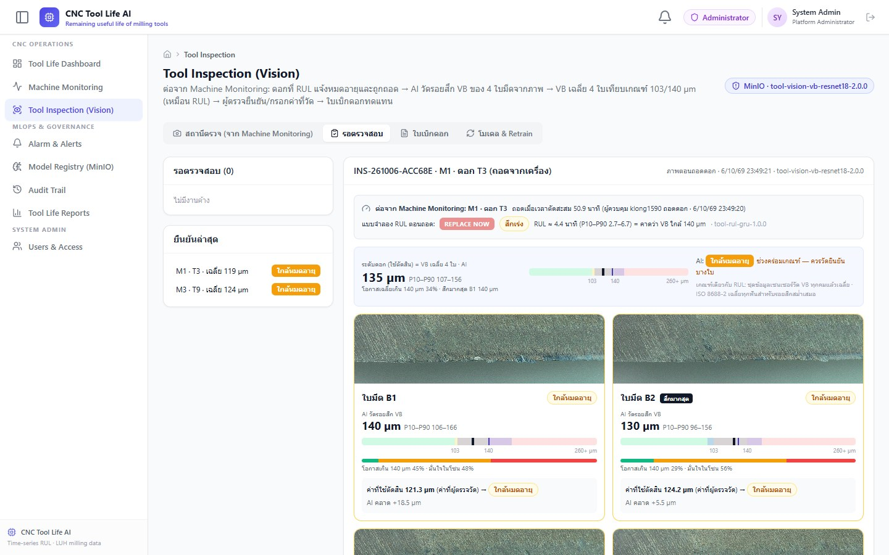
*หน้า Tool Inspection แท็บรอตรวจสอบ: ดอก T3 ที่ถอดจาก M1 ตามคำแนะนำ REPLACE_NOW (ยืนยันแล้ว) — บริบทจากแบบจำลอง RUL ตอนถอด, ระดับดอกจาก AI (VB เฉลี่ย 4 ใบ 135 µm, P10–P90 107–156 คร่อมเกณฑ์ → "ควรวัดยืนยันบางใบ"), ค่าที่ AI วัดของแต่ละใบพร้อมแถบเกณฑ์ 103/140 µm และค่าที่ผู้ตรวจวัดจริงซึ่งใช้ตัดสิน (AI คลาด +18.5 / +5.5 µm) · ระหว่างรอตรวจ แต่ละใบมีปุ่ม "ใช้ค่า AI" / "กรอกค่าที่วัด"*

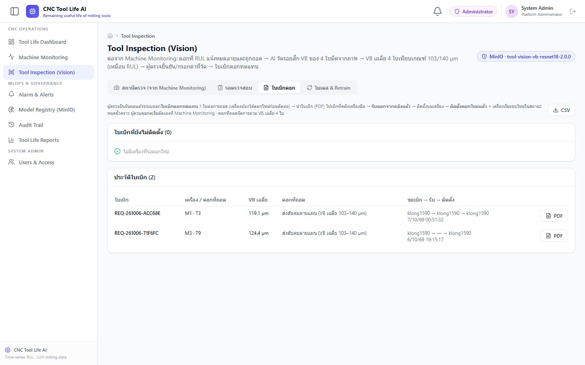
*แท็บใบเบิกดอก: 1 ใบต่อการถอด — การจัดการดอกที่ถอดตาม VB เฉลี่ย 4 ใบ, ผู้ขอเบิก → รับจากคลัง → ติดตั้ง และดาวน์โหลด PDF*

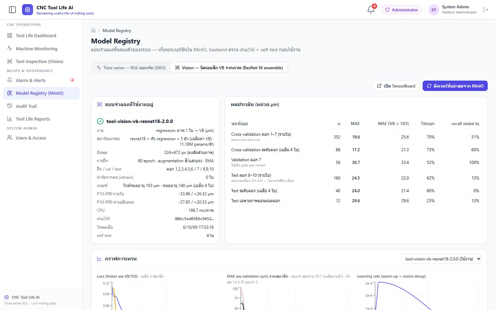
*หน้า Model Registry แท็บ Vision: v2.0.0 ที่ใช้งาน (ensemble 5 ตัว), ผลประเมิน CV/val/test และกราฟการฝึกรายสมาชิก — ตารางเวอร์ชันด้านล่างสลับเวอร์ชันได้ (ภาพถ่ายตอนยังใช้ v2.0.0 · ปัจจุบันใช้ตัวที่ retrain แล้ว และ v2.0.0 เป็น previous)*

---

## 7. ข้อจำกัดและงานต่อ
1. **ข้อมูลน้อย (10 ดอก)** เป็นข้อจำกัดหลัก — ความคลาดส่วนใหญ่เป็นแบบคงที่รายดอก (หัวข้อ 5.4) ซึ่งการปรับการเตรียมภาพ/augmentation/backbone/การเทียบภาพตอนดอกใหม่ (รวม 19 ชุด) ลดได้เพียงบางดอก · ทางแก้ที่ตรงจุดคือดอกฝึกเพิ่ม — ค่าที่ผู้ตรวจวัดจริงจากการใช้งานคือทางเพิ่มข้อมูลที่ระบบออกแบบไว้
2. **ทายต่ำเมื่อ VB สูงมาก** (> 140 µm ยังคลาด −34 µm บน CV) — ทดลองแล้วสองทางที่ไม่ช่วย: หยุดฝึกเร็ว (v3: แย่ลงเป็น −65 µm) และสุ่มภาพช่วงสูงบ่อยขึ้น (S5: ไม่ดีขึ้น) เพราะชุดฝึกเรียนช่วงนี้ได้แล้ว (6.7 µm) ความคลาดมาจากความต่างระหว่างดอก → งานต่อ: เก็บภาพช่วงหมดอายุจากดอกเพิ่ม (ผ่าน retrain จากค่าที่วัดจริง)
3. **U-Net วัดแถบรอยสึกโดยตรง** — ทำ mask ด้วย CVAT/SAM2 (เนื้อหาเรื่อง Making a dataset) แล้ววัดความสูงของแถบเป็นพิกเซล × สเกล µm/พิกเซล จะอธิบายผลได้และอาจแม่นกว่าเมื่อข้อมูลน้อย
4. ช่วง P10–P90 แคบไปบนดอกใหม่ — ปรับด้วย residual จากค่าที่วัดจริงในระบบเมื่อมีมากพอ

---

## 8. เชื่อมโยงกับเนื้อหารายวิชา

| เนื้อหา (สไลด์) | ใช้ในงานนี้อย่างไร |
|---|---|
| Introduction to Deep Learning — หน่วยย่อย (Conv, BatchNorm, ReLU, Max/Average Pooling), Residual Network, "Backbone + Data → your problem" | CNN baseline สร้างจากหน่วยย่อยเหล่านี้, ResNet-18 เป็นตัวที่ใช้งาน, ลองทั้ง average และ max pooling ที่หัว |
| How YOLO works — backbone + prediction head, YOLO มองการหาวัตถุเป็นการทาย "ตัวเลข" (box regression) | backbone ของ YOLOv8n-cls เป็นผู้สมัคร, หัว regression ทายตัวเลขเหมือน box regression |
| U-Net & YOLACT | พิจารณาเป็นทางเลือก (segmentation แถบรอยสึก) — ไม่เลือกเพราะไม่มี mask; เป็นงานต่อ |
| Making a dataset — train/val/test, รูปแบบชุดข้อมูล, เครื่องมือ annotation | แบ่งตามดอก (กันข้อมูลรั่ว), manifest + dataset card (ตาราง/ฮิสโตแกรม), ไม่ต้อง annotate เพราะใช้ค่าที่ bench วัด |
| TensorBoard — log loss/metric/LR, กราฟโครงข่าย, histogram น้ำหนัก, mini-batch, regularization loss (L2) | `SummaryWriter` ครบทุกอย่างทั้งตอนทดลองและ retrain, AdamW weight decay = L2, mini-batch 16 |
| Enhancing Model Performance — data augmentation (ระวังการแปลงที่มากเกินไป), ปรับโครงข่ายที่ฝึกมาแล้ว (เปลี่ยนชั้นบนให้ตรงงาน), LR decay + warm-up (`torch.optim.lr_scheduler`) | augmentation แบบไม่เปลี่ยนสเกล + ทดสอบความทนทาน, ตัดหัว 1000 คลาสใส่หัว regression, warm-up + cosine decay, ทดลองแช่แข็ง/ไม่แช่แข็ง backbone |

---

## 9. คำถามที่อาจถูกถาม

**ทำไมไม่จำแนก 3 คลาสต่อ?** — คลาสของชุดข้อมูลคือ VB แบ่งช่วงที่ 71/110 µm ซึ่งไม่ใช่เกณฑ์ของระบบ (103/140 µm) และ ~5% ของ label ไม่ตรงเกณฑ์ของตัวเอง · ทาย VB ตรง ๆ แปลงเป็นคลาสตามเกณฑ์ใดก็ได้ เทียบกับเกณฑ์ชุดเดียวกับแบบจำลอง RUL ได้ และให้ช่วงความไม่แน่นอนเพื่อตัดสินว่าใบไหนควรวัดซ้ำ

**ถ้าจำแนก 3 คลาสที่เกณฑ์ 103/140 µm (ตรงกับ RUL) ล่ะ?** — ทดลองแล้ว (หัวข้อ 5.6): ถ้าใช้สูตรของ regression classifier แพ้ (คลาสถูก 66.8% vs 69.9%, เตือน "หมดอายุ" ผิดเกือบ 5 เท่า) แต่เมื่อจูนแยก (label smoothing) ได้ใกล้เคียงกัน (70.5% vs 69.9% รายใบ, 76.1% vs 72.7% ระดับดอก) แลกกับจับใบหมดอายุได้น้อยกว่า 1 ใบและเตือนผิดมากกว่า — ถือว่าเสมอ จึงเลือกการทาย VB เพราะระบบต้องใช้ค่า µm (ค่าเฉลี่ย 4 ใบ, ช่วง P10–P90, retrain) และหน้าเว็บก็แสดงเป็น 3 ระดับอยู่แล้ว

**140/103 µm มาจาก ISO ไหม?** — ISO 8688-2 กำหนด *วิธีวัด* VB และให้ตั้งเกณฑ์ล่วงหน้า (ตัวอย่าง VB1 = 0.3 mm) ค่า 140 µm เป็นเกณฑ์เฉพาะงานตามจุดที่ชุดข้อมูลหยุดใช้ดอก และ 103 µm หาได้จากข้อมูล (จุดเปลี่ยนอัตราสึก) — ดูหัวข้อ 1.1

**ทำไม ResNet-18 ไม่ใช่ YOLO ทั้งที่เรียน YOLO?** — ทดลองแล้ว: backbone YOLOv8n-cls ได้ MAE 27.7 µm เทียบกับ ResNet-18 22.4 µm บน CV ชุดเดียวกัน · YOLO detection ออกแบบมาหาหลายวัตถุแบบเร็ว แต่ที่นี่มีใบมีด 1 ใบต่อภาพและต้องการตัวเลข 1 ค่า ความเร็วไม่ใช่ข้อจำกัด (36 ms/ภาพบน CPU)

**ทำไมไม่ใช้ U-Net ทั้งที่ VB คือความกว้างของแถบ?** — ต้องมี mask ระดับพิกเซลซึ่งชุดข้อมูลไม่มี (ต้องวาดเอง 512 ภาพ) และต้องรู้สเกล µm/พิกเซล · regression ใช้ค่าที่วัดไว้แล้วได้ทันที · U-Net เป็นงานต่อที่วางแผนไว้

**ทำไมไม่ฝึกจากศูนย์ / ทำไม fine-tune ทั้งตัว?** — ablation: ฝึกจากศูนย์แย่ลง 7 µm, แช่แข็ง backbone ทำให้ recall การหมดอายุเหลือ 23% และแกว่งระหว่างดอกมากขึ้น

**ทำไมภาพไม่เป็น 224×224?** — VB คือความสูงของแถบรอยสึก การบีบภาพ 3:1 เป็นสี่เหลี่ยมทำให้สัดส่วนเพี้ยน ผลแย่ลง 2.6 µm (8 µm ในช่วงตัดสิน)

**augmentation ไม่ได้ทำให้ MAE ดีขึ้น แล้วใช้ทำไม?** — บนภาพสะอาดผลเท่ากัน แต่เมื่อแสง/โฟกัสเปลี่ยน กรณีแย่ที่สุดในช่วงตัดสินดีกว่า 22.0 vs 31.1 µm · ไม่ใช้ scale/crop เพราะเปลี่ยนคำตอบ

**ทำไมใช้ Huber loss?** — ใกล้ MSE (แบบเดียวกับ box regression) เมื่อคลาดน้อย แต่ไม่ให้ภาพสุดโต่ง (ดอก 5 ที่ 347 µm) ดึงทั้งแบบจำลอง

**ข้อมูลรั่วไหม?** — แบ่งตามดอก, ดอก 8–10 ไม่ถูกใช้ทั้งฝึกและเลือก, ค่า VB จริงของชุดข้อมูลไม่อยู่ในข้อมูลที่ส่งหน้าเว็บตามปกติ (ส่งทีละใบเมื่อผู้ตรวจเลือกวัดใบนั้น), retrain ไม่นำค่าที่ยอมรับจาก AI ไปฝึก

**MAE ~24.5 µm แม่นพอไหม?** — ไม่พอจะใช้แทนการวัดทุกใบ จึงออกแบบให้เป็นเครื่องคัดกรอง: AI วัดทุกใบทันทีพร้อมช่วงความไม่แน่นอน, ดอกที่ช่วงคร่อมเกณฑ์ถูกแนะนำให้วัดจริง (ทั้ง 3 ดอกทดสอบตอนถอด) และค่าที่วัดได้กลับไปฝึกให้แม่นขึ้น · ค้นหาเพิ่ม 19 ชุด (stage D) ได้ CV ดีขึ้น 11% แต่ดอกทดสอบดีขึ้น 5% เพราะความคลาดหลักเป็นแบบคงที่รายดอก ซึ่งต้องแก้ด้วยข้อมูลจากดอกเพิ่ม ไม่ใช่โครงข่ายที่ใหญ่ขึ้น

**ทำไมไม่ใช้ backbone ที่ใหญ่กว่า (ResNet-50, ConvNeXt)?** — ทดลองแล้วบน CV ชุดเดียวกัน: ResNet-34 20.9, RegNetY 21.2, ConvNeXt-T 21.6, ResNet-50 22.0 µm เทียบกับ ResNet-18 19.9 µm (สูตรเดียวกัน) · ข้อมูลฝึกมีแค่ 6 ดอก ~300 ภาพ แบบจำลองใหญ่ขึ้นจึงไม่ได้เปรียบ

**ทำไมใช้ ensemble 5 ตัว?** — ผลของแต่ละ seed ต่างกัน ±0.4–0.8 µm การเฉลี่ยหลายตัวลดความแปรปรวนนี้ (CV 19.9 → 19.6 µm ด้วย 2 ตัว) แลกกับเวลา CPU 0.2 s/ภาพ ซึ่งยังเร็วพอสำหรับการตรวจดอกละ 4 ภาพ · retrain ปรับทุกตัวด้วยค่าวัดชุดเดียวกัน

**ทำไมตัดสินด้วยค่าเฉลี่ย 4 ใบ ไม่ใช่ใบที่สึกมากสุด?** — label ของแบบจำลอง RUL (ชุดข้อมูล LUH) คือ VB เฉลี่ยของ 4 คม ถ้าภาพใช้ค่าสูงสุดจะเข้มกว่า RUL และให้ผลขัดกัน เช่น ดอก N9 ตอนถอด: เฉลี่ย 139 µm (ใกล้หมดอายุ) แต่ใบสูงสุด 146 µm (หมดอายุ) · ISO 8688-2 ก็ใช้ค่าเฉลี่ยทุกฟันสำหรับรอยสึกสม่ำเสมอ และให้เกณฑ์เฉพาะจุดสูงกว่า · ค่ารายใบยังแสดงเพื่อบอกคมที่ผิดปกติ

**ทำไม retrain อัตโนมัติเริ่มที่ 6 ดอก (24 ภาพ)?** — (1) นับเป็นดอก ไม่ใช่ภาพ เพราะความคลาดหลักเป็นแบบคงที่รายดอก (หัวข้อ 5.4) 4 ใบของดอกเดียวกันจึงให้ข้อมูลใหม่ราว 1 ดอก ไม่ใช่ 4 ตัวอย่างอิสระ · (2) gate ต้องกันทั้งดอก (ถ้าบางใบของดอกเดียวกันอยู่ในชุดฝึก แบบจำลองจะเรียนความคลาดของดอกนั้นไปแล้ว gate จะผ่านง่ายเกินจริง) และชุดฝึกต้องมีหลายดอก ไม่ให้แบบจำลองแค่เลื่อนค่าตามความคลาดของดอกเดียว → ขั้นต่ำทางหลักการ = ฝึก 2 + ตรวจ 1 = 3 ดอก · (3) **ผลจริงในระบบ (หัวข้อ 6):** รอบที่มีค่าวัด 3 ดอก (12 ใบ ฝึกได้ 8 ใบ) candidate ไม่ผ่าน gate · รอบที่สะสมครบ 6 ดอก (24 ใบ ฝึก 16 ใบ) ผ่าน gate — เป็นการลองจริงเพียงรอบละครั้ง ไม่ใช่ข้อพิสูจน์ แต่ชี้ว่า 3 ดอกน้อยเกิน จึงตั้งเกณฑ์ที่ 6 ดอก ไม่ให้เปลืองรอบฝึกกับข้อมูลที่ยังน้อยเกินจะผ่าน gate · (4) 6 ดอก = M1–M3 ใช้งาน 2 รอบ · ข้อจำกัดของชุดข้อมูล demo: ภาพช่วงท้ายอายุของดอก 8–10 มีเพียง 9 ชุด (36 ภาพ) ถึงเกณฑ์ได้ครั้งเดียว หลังจากนั้นภาพที่ใช้ฝึกแล้วไม่นับซ้ำ (ในโรงงานจริงทุกดอกที่ถอดมีภาพใหม่) · เกณฑ์นี้เป็นจุด "เริ่มลอง" ไม่ใช่การรับประกันว่าดีขึ้น — ถ้า candidate ไม่ผ่าน gate ผู้ดูแล reject แล้วระบบรอดอกใหม่อีก 6 ดอก

**ทำไมไม่ early stopping / เก็บ best แบบ YOLO?** — val ของดอก 7 ดอกเดียวต่ำสุดช่วงต้นแล้วสูงขึ้น แต่ค่าเฉลี่ยของ 7 fold ลดลงจนจบ (epoch 6: 29.1 → epoch 60: 20.1 µm) และการเลือก epoch แบบไม่ดูดอกที่ทดสอบได้ผลแย่กว่า (20.7 µm) — ดูตารางในหัวข้อ 4 · ใช้จำนวน epoch คงที่ที่เลือกด้วย CV (30 → 45 → 60 epoch ดีขึ้นต่อเนื่องเมื่อ augmentation แรง) จึงไม่จูนกับดอกใดดอกหนึ่ง และดอก 7 ยังเป็น gate ของ retrain ได้ · **ทดลองจริงแล้ว (v3)**: best checkpoint ได้ epoch 4–8 ตอน LR สูงสุด, MAE รวมบนดอกทดสอบดีขึ้น (24.5 → 13.6) แต่ underfit (ชุดฝึก 26.6 µm) และทายดอกหมดอายุว่าปกติ 2 ดอก — ตามหลักการ การเลือกจาก val ต่ำสุดเหมาะเมื่อ val เหมือนข้อมูลตอนใช้งาน ใหญ่พอ และวัดด้วยตัวชี้วัดที่ตรงงาน ซึ่ง val ดอกเดียวที่ภาพส่วนใหญ่ยังคมไม่ครบ

**ชุดฝึก MAE 4.7 µm แต่ดอกทดสอบ 24.5 µm — overfit หรือเปล่า?** — มีช่องว่างจริง แต่ไม่ใช่ overfit จากการฝึกนานเกิน: (1) ค่าเฉลี่ย CV 7 ดอกลดลงจนจบ 60 epoch (29.1 → 20.8 → 20.1 µm) ถ้าฝึกนานแล้ว overfit ค่านี้ต้องกลับขึ้น (2) หยุดเร็วกว่า (v3) ช่องว่างหายแต่ underfit (ชุดฝึก 26.6 µm) และช่วงหมดอายุแย่ลง (3) ความคลาดบนดอกที่ไม่เคยเห็นเป็นแบบคงที่ทั้งดอก (ดอก 4 −24, ดอก 7 +31 µm) คือหน้าตาของแต่ละดอกต่างกัน — ช่องว่างนี้เกิดจากดอกฝึกมีแค่ 6 ดอก ลดได้ด้วย augmentation สี/แสง (ทำแล้ว ลด CV 22.2 → 21.2) และ weight decay/dropout/EMA/ensemble ส่วนที่เหลือต้องแก้ด้วยข้อมูลจากดอกเพิ่ม ไม่ใช่การหยุดฝึกหรือสุ่มภาพ (S5)

---

## ภาคผนวก: รันซ้ำ
```bash
# stage A–C (v1.0.0)
docker compose run --rm -v "$(pwd)/nontime_docs/tool_vb_vision:/work" -w /work trainer-worker sh -c \
  "uv pip install -q --python /app/.venv/bin/python 'tensorboard>=2.17' && /app/.venv/bin/python experiments_vb.py --epochs 30"
# stage D (ค้นหา) → ตัวใช้งานจริง v2.0.0 → เทียบกับการจำแนก 3 คลาส
docker compose run --rm -v "$(pwd)/nontime_docs/tool_vb_vision:/work" -w /work -e TORCH_HOME=/work/.torch_cache trainer-worker \
  /app/.venv/bin/python search_vb.py --stage s1          # s2, s3 … (ผลที่มีแล้วถูกข้าม)
docker compose run --rm -v "$(pwd)/nontime_docs/tool_vb_vision:/work" -w /work -e TORCH_HOME=/work/.torch_cache trainer-worker sh -c \
  "uv pip install -q --python /app/.venv/bin/python 'tensorboard>=2.17' && /app/.venv/bin/python search_vb.py --final s3_sa_e60 --members 5"
docker compose run --rm -v "$(pwd)/nontime_docs/tool_vb_vision:/work" -w /work trainer-worker /app/.venv/bin/python search_vb.py --cls s3_sa_e60
# การทดลองหลังเลือก: S5 (สุ่มภาพช่วง VB เท่ากัน) และ v3 (best checkpoint ดอก 7 — เขียนทับ models/ ต้องย้ายไป archive-3.0.0 เอง)
docker compose run --rm -v "$(pwd)/nontime_docs/tool_vb_vision:/work" -w /work -e TORCH_HOME=/work/.torch_cache trainer-worker /app/.venv/bin/python search_vb.py --only s5_e60_bal
docker compose run --rm -v "$(pwd)/nontime_docs/tool_vb_vision:/work" -w /work -e TORCH_HOME=/work/.torch_cache trainer-worker sh -c   "uv pip install -q --python /app/.venv/bin/python 'tensorboard>=2.17' && /app/.venv/bin/python search_vb.py --final s3_sa_e60 --members 5 --patience 10 --tag v3"
cd backend && uv run python scripts/publish_tool_vb_model.py --version tool-vision-vb-resnet18-2.0.0
tensorboard --logdir nontime_docs/tool_vb_vision/runs
```
ผลดิบ: `results_vb/cv_summary.csv` + `oof_*.csv` (stage A–C), `results_vb/search/` + `search_summary.csv` (stage D, ทุก seed + กราฟรายรอบ), `compare_classifier.csv`, `test_predictions.csv`, `summary_v2.json` · ไฟล์ของ v1.0.0 / v3.0.0 อยู่ที่ `models/archive-1.0.0/`, `models/archive-3.0.0/` (+ `summary_v3.json`)
