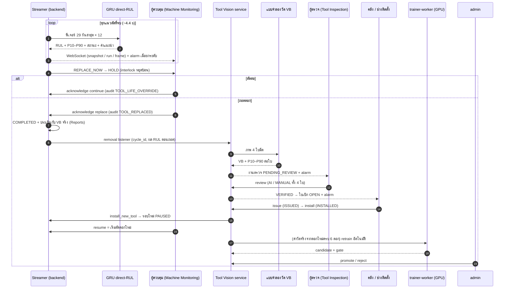
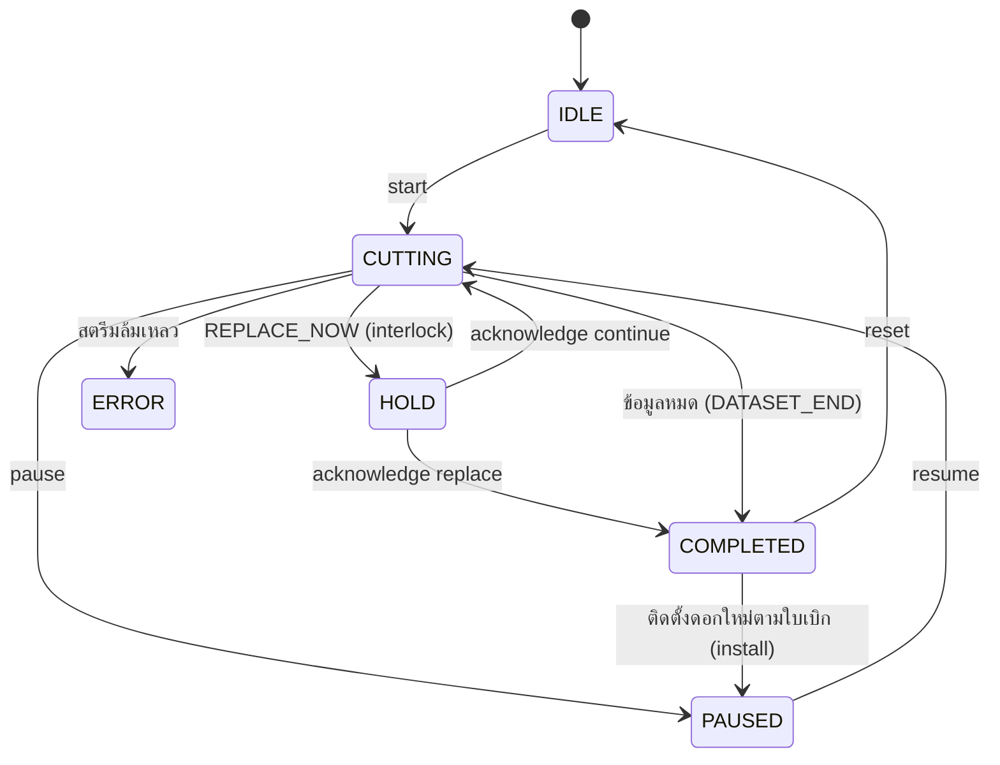

# 02 · Loop การทำงานของระบบ (ทีละขั้น)

ภาพรวม: **ตัด → พยากรณ์ทุกแนว → เตือน/interlock → ถอดดอก → ประเมินผล + ถ่ายภาพ → AI วัด VB → ผู้ตรวจยืนยัน → ใบเบิก → รับจากคลัง → ติดตั้ง → เริ่มตัดดอกใหม่** และวงจรย่อย **ค่าที่วัดจริง → retrain → gate → promote**



---

## ขั้น 0 · เริ่มระบบ (`backend/main.py` → `lifespan`)
1. สร้างตารางใน PostgreSQL + `ensure_schema` (เพิ่มคอลัมน์ใหม่ให้ฐานข้อมูลเดิม, ย้ายข้อมูลรูปแบบเก่า) + สร้างบัญชีตั้งต้นของเครื่องพัฒนา (admin, engineer)
2. สร้าง bucket `models` ใน MinIO
3. `StreamManager.start()` — โหลดแบบจำลอง RUL จาก MinIO (sha256 + self-test) · อ่านผลประเมินเดิมจาก `logs/tool_life_evaluations.jsonl` · สร้างสตรีม M1/M2/M3 = ดอกที่สงวนไว้ใน metadata ของแบบจำลอง (T3/T6/T9) · ทุกเครื่องอยู่ในสถานะ `IDLE` (หยุด) จนผู้ควบคุมกด **เริ่มตัด** ที่ Machine Monitoring (ตั้ง `TOOL_LIFE_AUTOSTART=true` ถ้าต้องการให้เริ่มเอง) · ถ้าโหลดแบบจำลองไม่ได้ ลองใหม่ทุก 30 วินาที
4. ผูก `removal_listeners` ← `tool_vision.service.on_tool_removed` (ถอดดอกแล้วส่งต่อให้งานตรวจภาพ)
5. โหลดแบบจำลองภาพจาก MinIO ใน thread แยก (ไม่บล็อกการเริ่มระบบ) + ให้แบบจำลองวัดรายการที่รอตรวจซึ่งสร้างโดยแบบจำลองรุ่นเก่าใหม่
6. ลงทะเบียน gauge ของ observability (ถ้าเปิดชุด observability)

## ขั้น 1 · สตรีมข้อมูลตามเวลาจริง (`tool_life/streamer.py`)
- อ่านไฟล์ .h5 ของแนวตัดถัดไป **ล่วงหน้า** ระหว่างเล่นแนวปัจจุบัน
- ส่ง **frame** สัญญาณดิบ (Fx, Fy, Fz, แรงบิด spindle, แกน x/y, ตำแหน่ง y) ทุก 0.1 วินาที ≤ 50 จุด/สัญญาณ เฉพาะ client ที่เลือกดูเครื่องนั้น
- ใช้ **deadline scheduling** — เวลาที่ใช้คำนวณไม่สะสมเป็นความช้า (วัดได้ 4.41 s/รัน = ความยาวไฟล์พอดี)
- แนวตัดที่ชุดข้อมูลไม่ได้บันทึก (15 จาก 44 แนว/ชั้น) เครื่องยังตัดอยู่จริง → รอเท่าส่วนต่างของเวลาตัดสะสม (ข้อความ `gap`)
- ความเร็ว 1× = เวลาจริง · 2/5/10/20× = เร่งเพื่อทดสอบ (ETA บนนาฬิกาปรับตามอัตรา "วินาทีนาฬิกา/นาทีเวลาตัด" ที่วัดจริง)

## ขั้น 2 · พยากรณ์ทุกแนวตัดที่จบ (`_on_run_complete` + `runtime.py`)
```
สัญญาณความละเอียดเต็มของแนวนั้น → run_features (ช่วงตัดเสถียร y 5–90 mm: ค่าเฉลี่ย 7 สัญญาณ)
→ CausalCleaner (ตัด spike ด้วยอดีตเท่านั้น) → FeatureState (เทียบค่าตั้งต้นของดอก)
→ หน้าต่าง 29 รันล่าสุด × 12 อินพุต → GRU ensemble 5 ตัว → [เวลาถึง 103 µm, เวลาถึง 140 µm]
→ EOLTracker (มัธยฐานของ t + RUL̂ ทุกครั้งที่ผ่านมา) → RUL → ช่วง P10–P90 → สถานะการสึก → คำแนะนำ
```
| เฟส | เมื่อไร | มีผลพยากรณ์ไหม |
|---|---|---|
| `BREAK_IN` | เวลาตัดสะสม < 170 วินาที (≈ ชั้นแรก ดอกยังสึกเร็วผิดปกติ) | ไม่ |
| `BASELINE` | เก็บ 29 รันแรกหลัง break-in → มัธยฐาน = ค่าตั้งต้นของดอก | ไม่ |
| `MONITOR` | หลังได้ค่าตั้งต้น (~5 นาทีของเวลาตัดแรก) | ใช่ ทุกแนว |

กันสปอย: ถ้าดอกที่สตรีมอยู่ในรายชื่อดอกฝึกของแบบจำลองเวอร์ชันนั้น ระบบ **ไม่พยากรณ์** (`blocked`) · เปลี่ยนเวอร์ชันแบบจำลองกลางทาง = เริ่มรวมค่าประมาณ (EOLTracker) ใหม่

**สถานะการสึก** (จากเวลาถึงเกณฑ์ทั้งสอง จึงสอดคล้องกับ RUL เสมอ): RUL = 0 → `END_OF_LIFE` · RUL ถึง 103 µm = 0 → `ACCELERATED` · ไม่เช่นนั้น `STEADY`

**คำแนะนำ** (ใช้ **ค่าล่าง P10** = ฝั่งระวัง):

| คำแนะนำ | เงื่อนไข | alarm | ผล |
|---|---|---|---|
| `OK` | ปกติ | – | – |
| `WATCH` | เข้าช่วงสึกเร่ง | INFO | – |
| `PLAN_REPLACEMENT` | P10 ≤ 3 ชั้นงาน (8.2 นาที) | WARNING | เตรียมดอกใหม่ / จัดคิวหยุดเครื่อง |
| `REPLACE_NOW` | P10 ≤ 1 ชั้นงาน (2.73 นาที) หรือ END_OF_LIFE | CRITICAL | **interlock: สถานะ `HOLD` หยุดป้อน** (`TOOL_LIFE_HOLD_ON_REPLACE`) |

alarm แจ้งเฉพาะตอน **ยกระดับ** (ไม่แจ้งซ้ำระดับเดิม) · alarm ที่ยังไม่อ่านของเครื่อง/ดอก/ต้นทางเดียวกันถูกอัปเดตแทนสร้างใหม่

## ขั้น 3 · ผู้ควบคุมตัดสินใจ (`POST /tool-life/machines/{m}/acknowledge`)
- **`continue`** (override) → audit `TOOL_LIFE_OVERRIDE` → ตัดต่อ · ระดับเตือนสูงสุดถูกจำไว้ จึงไม่ HOLD ซ้ำในรอบดอกนี้ (ความรับผิดชอบอยู่ที่ผู้กดและบันทึกไว้แล้ว)
- **`replace`** (ถอดดอก) → audit `TOOL_REPLACED` → สถานะ `COMPLETED` → ขั้น 4 และ 5 · request รอให้ภาพถูกวิเคราะห์เสร็จ (≤ 60 วินาที) เพื่อให้หน้าเว็บพาไปหน้าตรวจได้ทันที
- ถ้าข้อมูลการทดลองหมดก่อน → `COMPLETED` เหตุผล `DATASET_END` (ทำขั้น 4–5 เหมือนกัน)

## ขั้น 4 · ประเมินผลหลังถอดดอก (`_evaluate`) — **จุดเดียวที่อ่าน VB จริงของ LUH**
อ่าน `ground_truth` ของดอกนั้น → หาเวลาที่ VB ข้าม 103/140 µm จริง → คำนวณ MAE ของ RUL ทั้งอายุ/20% ท้าย, bias, % พยากรณ์เกินจริง, ช่วง P10–P90 ครอบค่าจริงกี่ %, เวลา PLAN/REPLACE_NOW ครั้งแรก, ระยะเผื่อก่อนหมดอายุ, เปลี่ยนช้าเกินเกณฑ์ไหม, % อายุดอกที่ใช้, VB ตอนถอด → เก็บลง `logs/tool_life_evaluations.jsonl` → หน้า **Reports**

## ขั้น 5 · ถ่ายภาพใบมีด + AI วัด VB (`tool_vision.service.capture_eol`)
1. 1 รอบการใช้งานดอก (`cycle_id`) = ตรวจได้ 1 ครั้ง (เรียกซ้ำได้ผลเดิม · มี lock กันสร้างซ้ำ)
2. เลือกภาพช่วงท้ายอายุที่สึกเท่าดอกจริงตอนถอดและยังไม่เคยตรวจ (`eol_run_for(..., exclude=รอบที่ใช้แล้ว)`) → อ่านภาพ 4 ใบ
3. `registry.predict` → ต่อใบ: `vb_um`, ช่วง P10–P90 (จาก residual นอกชุดฝึก), ความน่าจะเป็น 3 โซน
4. สรุประดับดอก: VB เฉลี่ย 4 ใบ + ช่วง P10–P90 ของค่าเฉลี่ย + ใบที่สึกมากสุด + ใบที่เกิน 140 µm
5. บันทึก `vision_inspections` (สถานะ `PENDING_REVIEW`, `rul_context` = สิ่งที่แบบจำลอง RUL บอก ณ ตอนถอด — ไม่มีค่าจริง) + `vision_blades` 4 แถว → อัปโหลดภาพเข้า MinIO bucket `inspections` → commit
6. audit `VISION_INSPECTION` + alarm INFO "ตรวจใบมีด M?/T?" ที่ลิงก์ไปหน้า review
ถ้าขั้นนี้ล้มเหลว (เช่น แบบจำลองภาพยังไม่พร้อม) ผู้ใช้กด **ถ่ายซ้ำ** ได้ที่ `POST /tool-vision/stations/{m}/capture`

## ขั้น 6 · ผู้ตรวจยืนยัน (`POST /tool-vision/inspections/{id}/review`)
- หน้าเว็บเรียงงานที่ "AI ไม่มั่นใจ" (ช่วงของค่าเฉลี่ยคร่อม 103 หรือ 140) ขึ้นก่อน และแนะนำให้วัดใบที่ช่วงคร่อมเกณฑ์ (`near_threshold`)
- ต่อใบเลือก **ยอมรับค่า AI** (`AI` → `CONFIRMED`) หรือ **กรอกค่าที่วัด** (`MANUAL` → `MEASURED`, 0–1000 µm) — เลือกกรอกแล้วเว็บดึง `GET …/blades/{b}/measurement` มาเป็นค่าเริ่มต้น (ค่าที่ bench วัดในชุดข้อมูล) ผู้ตรวจแก้ได้
- ต้องครบ 4 ใบ → ระดับดอกจากค่าที่ยืนยัน → สถานะ `VERIFIED` → **ออกใบเบิก `REQ-…` สถานะ `OPEN`**
- audit `VISION_REVIEW` + alarm "ใบเบิกดอก …" (WARNING ถ้าระดับดอก REPLACE) พร้อมการจัดการดอกที่ถอด:

| VB เฉลี่ย 4 ใบ | ระดับดอก | การจัดการดอกที่ถอด |
|---|---|---|
| ≥ 140 µm | `REPLACE` | ส่งลับคม / ตัดจำหน่าย |
| 103–140 µm | `MONITOR` | ส่งลับคมตามแผน |
| < 103 µm | `OK` | เก็บเป็นดอกสำรอง |

เครื่องต้องได้ดอกใหม่ทุกครั้งที่ถอด จึงออกใบเบิกทุกการถอดไม่ว่าระดับใด
- หลังยืนยัน ระบบตรวจทันทีว่าถึงเกณฑ์ retrain อัตโนมัติหรือยัง (ขั้น 9)

## ขั้น 7 · ใบเบิกดอกทดแทน
`OPEN` (รอเบิก) → `POST …/requisitions/{id}/issue` → `ISSUED` (รับดอกจากคลังแล้ว, audit `TOOL_ISSUED`) → `POST …/install` → `INSTALLED` (audit `TOOL_INSTALLED`) · ข้ามขั้นไม่ได้ (409) · PDF ขนาด A4 สร้างในเบราว์เซอร์จากข้อมูล `GET /tool-vision/requisitions` (html2canvas + jsPDF) · CSV ส่งออกได้

## ขั้น 8 · ติดตั้งดอกใหม่ → เริ่มรอบใหม่
`install` → `MachineStream.install_new_tool` (เฉพาะเมื่อเครื่องยังรอดอกจากการถอดครั้งนั้น — `cycle_id` ตรงกัน) → ล้างสถานะ, `cycle_id` ใหม่, สถานะ **`PAUSED`** + `installed` {at, by, req_no} → Machine Monitoring แสดงแบนเนอร์ "ติดตั้งดอกใหม่แล้ว" → ผู้ควบคุมกด **เริ่มตัด (ดอกใหม่)** (`resume`) · ระหว่างนี้ `start` ดอกที่ถอดแล้วได้ `409` (ต้องผ่านใบเบิกเท่านั้น)

## ขั้น 9 · retrain อัตโนมัติ (`maybe_auto_retrain` → ARQ → `worker_tasks.run_retrain`)
เงื่อนไขเริ่ม (ตรวจหลัง `review` และหลัง `promote`/`reject`):
- ค่าที่ **วัดจริง** (MANUAL) จาก **ดอกใหม่** ที่ยังไม่เคยถูกลองฝึก ครบ `VISION_RETRAIN_MIN_TOOLS` = **6 ดอก = 24 ภาพ** (นับเป็นดอก ไม่ใช่ภาพ)
- ไม่มีงานกำลังฝึก และไม่มี candidate รอตัดสิน · แบบจำลองปัจจุบันพร้อม

ในงาน (trainer-worker, GPU, ทีละ 1 งาน, timeout 2 ชม.):
1. แยกค่าวัดจริงเป็น ฝึก / ตรวจ gate **ตามดอกจริงที่เป็นที่มาของภาพ**: ดอกล่าสุด 20% (≥ 1 ดอกเมื่อมี ≥ 3 ดอก) ไม่ใช้ฝึก — ทุกรอบของดอกนั้น
2. ข้อมูลฝึก = ภาพดอก 1–6 เดิม + ภาพที่วัดจริง · val = ดอก 7 (คงที่)
3. fine-tune **ทุกสมาชิกของ ensemble** จากน้ำหนักเวอร์ชันที่ใช้งาน (lr ÷ 3, 15 epoch/ตัว) · ความคืบหน้ารายรอบเขียนลง Redis (หน้าเว็บวาดกราฟสดทุก 3 วินาที) + TensorBoard
4. **gate**: MAE บนดอก 7 แย่ลงไม่เกิน 1 µm **และ** MAE บนดอกล่าสุดที่กันไว้ไม่แย่กว่าเดิม
5. อัปโหลด candidate เข้า MinIO (`status = candidate`, ยังไม่ใช้งาน)
6. admin ดูผลแล้ว **promote** (ปุ่มเปิดเฉพาะเมื่อผ่าน gate) → `latest.json` ชี้เวอร์ชันใหม่, เวอร์ชันเดิม = `previous`, โหลดใหม่ทันที, ใบที่ใช้ฝึกถูกทำเครื่องหมาย `trained_in_version` · หรือ **reject** → ดอกชุดนั้นไม่ถูกนับซ้ำ ต้องรอดอกใหม่อีก 3 ดอก

## ขั้น 10 · จัดการเวอร์ชันแบบจำลอง
- RUL: `POST /tool-life/model/reload {version}` (admin) — ดึงจาก MinIO, ตรวจ sha256 + self-test; ไม่ผ่าน = ไม่พยากรณ์ (ไม่มีแบบจำลองสำรอง)
- ภาพ: `POST /tool-vision/model/activate {version}` (admin) — สลับ/ย้อนเวอร์ชัน; โหลดไม่สำเร็จ = ถอยกลับเวอร์ชันเดิมอัตโนมัติ

---

## State machine ที่ควรรู้

### เครื่อง (`MachineStream.state`)


### งานตรวจใบมีด / ใบเบิก / ใบมีด
| สิ่ง | สถานะ |
|---|---|
| `vision_inspections.status` | `PENDING_REVIEW` → `VERIFIED` (· `ARCHIVED` = รายการรูปแบบเก่าที่ไม่ผูกกับรอบการใช้งานดอก) |
| `vision_inspections.req_status` | `OPEN` → `ISSUED` → `INSTALLED` |
| `vision_blades.review` | `PENDING` → `CONFIRMED` (ยอมรับค่า AI) / `MEASURED` (วัดจริง) |
| `vision_training_jobs.status` | `QUEUED` → `RUNNING` → `DONE` → `PROMOTED` / `REJECTED` · หรือ `FAILED` |
| `meta.json` ของแบบจำลองภาพ | `production` · `previous` · `candidate` · `rejected` |

## เหตุการณ์ที่บันทึก (Audit Trail) และแจ้งเตือน (Alarm)
| เหตุการณ์ | Audit | Alarm |
|---|---|---|
| คำแนะนำ RUL ยกระดับ | – | `ToolLife_RUL`: INFO / WARNING / CRITICAL |
| ผู้ควบคุมตัดต่อ / ถอดดอก | `TOOL_LIFE_OVERRIDE` / `TOOL_REPLACED` | – |
| ถ่ายภาพ + AI วัด VB | `VISION_INSPECTION` | `ToolVision_QC`: INFO |
| ผู้ตรวจยืนยัน → ออกใบเบิก | `VISION_REVIEW` | `ToolVision_QC`: WARNING (REPLACE) / INFO |
| รับดอกจากคลัง / ติดตั้ง | `TOOL_ISSUED` / `TOOL_INSTALLED` | – |
| retrain เริ่ม (ผู้ทำ = `auto-retrain`) | `VISION_RETRAIN_REQUESTED` | – |
| promote / reject / สลับเวอร์ชัน | `VISION_MODEL_PROMOTED` / `_REJECTED` / `_ACTIVATED` | – |

ผู้ทำรายการ = ผู้ใช้ของ token เสมอ (backend ไม่รับ `actor` จาก body)
