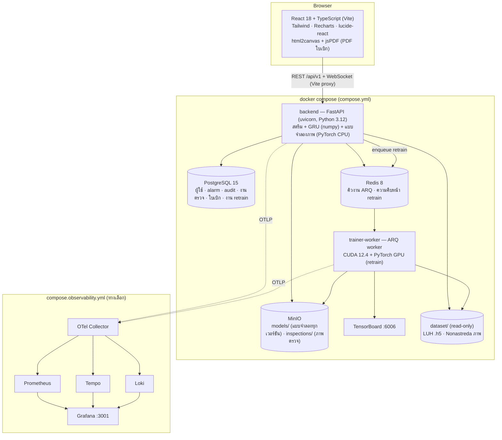

# 04 · เทคโนโลยีที่ใช้ทั้งหมด — ใช้ทำอะไร และทำไมเลือก

## สถาปัตยกรรม

## Container และ port

| Container | Image | Port | หน้าที่ |
|---|---|---|---|
| `frontend` | node:20-alpine (Vite dev server) | 3000 | หน้าเว็บ + proxy `/api` (รวม WebSocket) → backend |
| `backend` | python:3.12-slim + uv | 8000 | API, สตรีม, inference ทั้ง 2 แบบจำลอง (CPU) · healthcheck `GET /api/v1/health` · mount `./backend` (แก้โค้ดแล้ว `docker compose restart backend`) |
| `trainer-worker` | nvidia/cuda:12.4.1-runtime + Python 3.12 + uv | – | ARQ worker รันงาน retrain บน GPU (ทีละ 1 งาน) · ใช้รันการทดลองใน `nontime_docs` ด้วย |
| `db` | postgres:15.4-alpine | 5432 | ฐานข้อมูล |
| `redis` | redis:8.8.0-alpine | 6379 | คิวงาน + ความคืบหน้า |
| `minio` | MinIO | 9000 (API), 9001 (console) | object storage ของแบบจำลองและภาพ |
| `tensorboard` | python:3.12-slim + tensorboard | 6006 | กราฟการฝึก: retrain (`logs/tensorboard`) + การทดลอง (`nontime_docs/tool_vb_vision/runs`) |
| `otel-collector`, `prometheus`, `tempo`, `loki`, `grafana` | (ชุด observability) | 4317/4318, 9090, 3200, 3100, 3001 | trace / metric / log → dashboard |

---

## Backend (Python 3.12, จัดการ dependency ด้วย uv)

| เทคโนโลยี | ใช้ทำอะไร | ทำไมเลือก |
|---|---|---|
| **FastAPI** + uvicorn | REST + WebSocket, dependency injection สำหรับ auth, Swagger/OpenAPI อัตโนมัติ | async (สตรีม 3 เครื่อง + WebSocket ใน process เดียว), Pydantic ตรวจ request, เอกสาร API สร้างเองตรงกับโค้ด |
| **Pydantic** / pydantic-settings | schema ของ request/response · โหลดค่าจาก `.env` | ตรวจชนิดข้อมูล/ค่าอัตโนมัติ, ค่าตั้งค่ารวมที่เดียว (`core/config.py`) |
| **SQLAlchemy 2** + psycopg2 | ตาราง users, alarms, audit_logs, vision_inspections, vision_blades, vision_training_jobs | ORM มาตรฐาน · `ensure_schema` เพิ่มคอลัมน์ใหม่ให้ฐานข้อมูลเดิมโดยไม่ต้องใช้ migration tool |
| **PostgreSQL** | เก็บสถานะที่ต้องคงอยู่ (การตัดสินใจ, งานตรวจ, ใบเบิก, งาน retrain) | relational + transaction (เช่น บันทึกงานตรวจกับใบมีด 4 ใบพร้อมกัน), เป็นมาตรฐานโรงงาน/องค์กร |
| **Redis** + **ARQ** | คิวงาน retrain (backend → trainer-worker) · เก็บความคืบหน้ารายรอบให้หน้าเว็บวาดกราฟสด | งานฝึกใช้เวลานานและต้องใช้ GPU → แยกออกจาก API · ARQ เป็น asyncio เข้ากับ FastAPI, เบากว่า Celery, ติดตามสถานะงานได้ |
| **MinIO** (S3-compatible) | เก็บแบบจำลองทุกเวอร์ชัน (`models/tool-rul/…`, `models/tool-vision/…`, `latest.json`) และภาพตรวจ (`inspections/`) | แยกไฟล์ใหญ่ออกจากโค้ด/ฐานข้อมูล, version ได้, ย้ายไป S3 จริงได้ทันที, console ให้ดูไฟล์ |
| **numpy** | inference ของ GRU (เขียนสมการ GRU เอง) + ฟีเจอร์ + EOLTracker | backend ไม่ต้องพึ่ง PyTorch สำหรับ RUL (~1.6 ms/รัน) และใช้ไฟล์เดียวกับตอนสร้างชุดฝึก (กัน train/serve skew) · self-test ยืนยันว่าตรงกับ PyTorch |
| **PyTorch** + **torchvision** | แบบจำลองวัด VB (ResNet-18 ensemble): ฝึก, retrain (GPU), inference (CPU) · augmentation (`transforms.v2`) | backbone ที่ฝึกบน ImageNet พร้อมใช้, ecosystem ใหญ่, ใช้โค้ดเดียว (`vb_model.py`) ทั้งทดลอง ฝึก และใช้งาน |
| **h5py** + **pandas** | อ่านไฟล์ .h5 ของ LUH (สัญญาณ 25 kHz / 500 Hz) และตาราง `filelist.csv` / `labels*.csv` | รูปแบบไฟล์ของชุดข้อมูล |
| **Pillow** | อ่านภาพ JPEG | – |
| **TensorBoard** | loss/val MAE/lr รายรอบ, histogram น้ำหนัก, กราฟโครงข่าย — ทั้งการทดลองและ retrain | เนื้อหารายวิชา + ดูการฝึกเทียบกันได้ |
| **ultralytics** | backbone YOLOv8n-cls ที่ใช้เป็นผู้สมัครในการทดลอง (stage A) | ทีมเคยใช้ YOLOv8-cls จำแนกคลาส จึงนำมาเทียบอย่างเป็นธรรม (แพ้ ResNet-18) |
| **python-jose** (JWT) + **bcrypt** | ออก/ตรวจ access token (HS256) · hash รหัสผ่าน | JWT แบบ stateless ไม่ต้องเก็บ session ฝั่ง server · bcrypt เป็นมาตรฐาน hash รหัสผ่าน |
| **OpenTelemetry** (+ instrumentation FastAPI/SQLAlchemy/Redis/logging) | trace ทุก request + span งานหลัก (ถอดดอก → วัด VB, retrain ข้ามคิว), metric ของระบบ, log พร้อม trace_id | มาตรฐานเปิด ไม่ผูก vendor · **ปิดเองถ้าไม่ตั้ง `OTEL_EXPORTER_OTLP_ENDPOINT`** (ระบบหลักไม่ต้องพึ่ง) |
| **pytest** | 34 test (auth guard, RUL, vision) | กันความถดถอย: train/serve skew, กันสปอย, ขั้นตอนงาน, สิทธิ์ |

## Frontend

| เทคโนโลยี | ใช้ทำอะไร | ทำไมเลือก |
|---|---|---|
| **React 18** + **TypeScript** (strict) | 9 หน้า + component | type ของข้อมูลจาก backend ทั้งหมดอยู่ใน `types/index.ts` จับข้อผิดพลาดตอน compile |
| **Vite 6** | dev server :3000 + proxy `/api` (รวม WebSocket) + build | เร็ว, proxy ทำให้ใช้ origin เดียวกับ backend |
| **Tailwind CSS 3** | สไตล์ทั้งหมด | เขียนเร็ว สม่ำเสมอ ไม่ต้องดูแลไฟล์ CSS แยก |
| **Recharts** | กราฟ RUL ตามเวลาตัด + ช่วง P10–P90, สัญญาณสด, health indicator, กราฟการฝึก | กราฟ React แบบ declarative |
| **react-router-dom 7** | เส้นทาง + `ProtectedRoute` | – |
| **lucide-react** | ไอคอน | – |
| **html2canvas + jsPDF** | สร้าง **PDF ใบเบิกดอก** ในเบราว์เซอร์ (โหลดเมื่อกดเท่านั้น) | ภาษาไทยใช้ฟอนต์ของหน้าเว็บได้ทันที ไม่ต้องฝังฟอนต์/สร้าง PDF ฝั่ง server |
| WebSocket (native) | รับข้อมูลสด (`services/telemetryStream.ts`) — ต่อใหม่อัตโนมัติ, ปิดด้วย 4401 → หน้า login | push แทน poll: สัญญาณ 10 เฟรม/วินาที |

## ML / วิเคราะห์ข้อมูล (นอก backend)
| เครื่องมือ | ที่ไหน | ใช้ทำอะไร |
|---|---|---|
| Jupyter notebook | `timeseries_docs/tool_rul_forecast/Tool_RUL_Forecasting.ipynb` | EDA, trend/seasonality/ADF/KPSS, STL, ACF/PACF, SETAR, ผลทั้งหมดของรายงาน |
| statsmodels · scipy · scikit-learn · matplotlib | `wear_ts.py`, `extract_run_features.py`, notebook | ADF, KPSS, STL, ACF/PACF (statsmodels) · periodogram/Welch, Kendall τ, Wilcoxon (scipy) · Ridge soft sensor ของ StateSpace (scikit-learn) · รูปในรายงาน |
| PyTorch | `rul_ts.py`, `experiments_rul.py` | ฝึก GRU (แล้วส่งออกน้ำหนักเป็น numpy `.npz`) |
| particle filter (เขียนเอง) | `wear_ts.py` | แบบจำลอง StateSpace ที่ใช้เปรียบเทียบ |
| `experiments_vb.py` · `search_vb.py` | `nontime_docs/tool_vb_vision/` | การทดลองแบบจำลองภาพ stage A–D, ฝึกตัวใช้งานจริง, เทียบ classifier |

## Observability (ทางเลือก — `compose.observability.yml`)
| ส่วน | ใช้ทำอะไร |
|---|---|
| OTel Collector | รับ OTLP จาก backend + trainer-worker → แยกส่ง |
| **Prometheus** | metric: เวลาพยากรณ์ RUL, จำนวนคำแนะนำแต่ละระดับ, การถอดดอก, เวลาวัด VB, งานตรวจตามผล AI, ที่มาของค่า VB (AI/MANUAL), \|AI − ค่าวัดจริง\|, งาน retrain + เวลา, การเปลี่ยนแบบจำลอง + gauge (RUL/P10/drift/สถานะรายเครื่อง, ผลหลังถอดดอก, งานรอตรวจ, ใบเบิกค้าง, pool retrain, MAE สะสมของ AI, การเชื่อมต่อ DB/Redis/MinIO, แบบจำลองที่โหลด) |
| **Tempo** | trace: request → DB/Redis · ถอดดอก → ถ่ายภาพ/วัด VB · review → retrain ใน worker (trace เดียวกันข้ามคิว) |
| **Loki** | log ทุก service พร้อม trace_id (กดจาก log ไป trace ได้) |
| **Grafana** | dashboard "AI Ecosystem — CNC Tool Life" (สร้างจาก `observability/grafana/make_dashboard.py`) |

ทำไมทำเป็นทางเลือก: ระบบหลักต้องรันได้บนเครื่องธรรมดา (7 container) · เปิดชุดนี้เมื่อต้องการดูสุขภาพระบบ/แบบจำลองระยะยาว (data drift, คุณภาพ AI หลังใช้งาน)

## เครื่องมือพัฒนา
| เครื่องมือ | ใช้ทำอะไร |
|---|---|
| **Docker Compose** | รันทุกอย่างด้วยคำสั่งเดียว (`docker compose up -d`) · GPU ผ่าน `deploy.resources.devices` |
| **uv** | จัดการ dependency Python (`pyproject.toml` + `uv.lock`) — ติดตั้งเร็ว ล็อกเวอร์ชันซ้ำได้ |
| npm | dependency ของ frontend |
| `backend/scripts/publish_*.py` | อัปโหลดแบบจำลองที่ฝึกแล้วขึ้น MinIO (คำนวณ sha256, ตั้ง latest) |
