# รายงาน: การวิเคราะห์อนุกรมเวลาและแบบจำลองพยากรณ์ "อายุใช้งานที่เหลือ" (RUL) ของดอกกัด CNC

**รายวิชา:** การวิเคราะห์อนุกรมเวลาและแบบจำลองการพยากรณ์ (อ.สหพงศ์) — 10 คะแนน
**ชุดข้อมูล:** *Multivariate time series data of milling processes with varying tool wear and machine tools* (Leibniz Universität Hannover; Denkena, Klemme & Stiehl, *Data in Brief*, 2023; Mendeley Data DOI 10.17632/zpxs87bjt8)
**ไฟล์ประกอบ:** `Tool_RUL_Forecasting.ipynb` (โค้ดและผลรันทั้งหมด) · `rul_runtime.py` · `rul_ts.py` · `experiments_rul.py` · `wear_ts.py` · `extract_run_features.py` · `figures/` · `results_rul/` · `models/tool_rul_model.{npz,json}` · ระบบใช้งานจริงใน `backend/app/features/tool_life/` และ `frontend/`

> **บทสรุป**
> - **โจทย์:** บอกระหว่างผลิตว่า "ดอกกัดนี้ใช้ได้อีกกี่นาที" (**RUL**) โดย **ไม่ต้องหยุดเครื่องวัดรอยสึก VB** — อินพุตคือ *เวลาตัดสะสม + ค่าเฉลี่ยรายรันของแรงบิด spindle, แรง/แรงบิดมอเตอร์แกนป้อน X/Y, แรงตัด Fx/Fy/Fz/แรงลัพธ์ + เครื่อง + ตำแหน่งแนวตัด* ส่วน VB ใช้เป็น label ตามเกณฑ์อายุดอก (นิยาม VB ตาม ISO 8688-2; หมดอายุที่ 140 µm, เริ่มสึกเร่งที่ 103 µm)
> - **ข้อมูล:** ดอกกัด 9 ดอกใช้จนหมดอายุบน 3 เครื่อง (6,418 แนวตัด) · อินพุตมี trend ไม่นิ่ง (ADF/KPSS) + **ฤดูกาลคาบ 29 รันจากตำแหน่งบนชิ้นงาน** · อัตราสึกเปลี่ยนระบอบที่ VB ≈ 103 µm · **อายุดอกต่างกันมากระหว่างเครื่อง (M2 ยาวกว่า ~1.5 เท่า) แต่ใกล้กันมากภายในเครื่อง (CV 0.7–3%)**
> - **แบบจำลองที่เปรียบเทียบ:** (1) Fleet reference = อายุเฉลี่ยของเครื่อง (baseline) (2) **StateSpace** — พยากรณ์ VB แฝงด้วย particle filter แล้วหาจุดตัดเกณฑ์ (ทางอ้อม) (3) **GRU direct-RUL** — อ่านหน้าต่าง 29 รัน (= 1 คาบฤดูกาล) แล้วพยากรณ์เวลาถึงเกณฑ์โดยตรง + **ข้อจำกัดฟิสิกส์ "เวลาหมดอายุของดอกเป็นค่าคงที่"** (เลือกโครงสร้างแบบ nested โดยไม่แตะดอกทดสอบ)
> - **ผล (leave-one-tool-out, หน่วย นาทีของเวลาตัด):** GRU MAE ทั้งอายุ **1.11** (Fleet 1.16, StateSpace 1.58) · 20% ท้าย 0.91 (Fleet 0.90, StateSpace 1.75) · **ไม่เคยพยากรณ์อายุเกินจริงเกิน 1 ชั้นงาน** (StateSpace 13% ของรัน) · เซนเซอร์ช่วยเมื่อฝึกด้วยสัญญาณรบกวนเสริม (GRU ไม่มีเซนเซอร์ 1.31) · การเรียน RUL โดยตรงดีกว่าการพยากรณ์ VB แล้วหาจุดตัด
> - **ทดสอบจริงกับดอกที่สงวนไว้ (T3, T6, T9 ไม่เคยใช้ฝึก):** MAE 0.55–2.29 นาที, เปลี่ยนดอกช้าเกินเกณฑ์ 0 ดอก, สั่งเปลี่ยนก่อนหมดอายุ 3.9–7.0 นาที (ใช้อายุดอก 88–93%) และแจ้งวางแผนล่วงหน้า 9–12 นาที
> - **การใช้งาน:** แบบจำลองเก็บใน **MinIO** backend ตรวจ sha256 + self-test ก่อนใช้ · สตรีมไฟล์ .h5 จริงของดอกที่สงวนไว้ **ตามเวลาจริง** · หน้าเว็บ Dashboard / Machine Monitoring / Model Registry / Reports **ไม่แสดงค่าจริงจนกว่าจะถอดดอก** · ทดสอบอัตโนมัติ 5/5
> - **ข้อควรระวัง:** 9 ดอกภายใต้เงื่อนไขการตัดคงที่ → baseline แข็งมาก และข้อได้เปรียบของ GRU ยังไม่มีนัยสำคัญทางสถิติ · เครื่องใหม่ที่ไม่มีประวัติคลาด 11–24 นาที · นโยบาย fixed-life ที่อิงประวัติเครื่องใช้อายุดอกได้มากกว่าเล็กน้อยในข้อมูลนี้ แต่ระยะปลอดภัยต่ำสุดบางกว่ามาก

---

## 1. ภาพรวมของโครงงาน

### 1.1 ปัญหาที่ต้องการแก้ไข
คมตัดของดอกกัด (end mill) สึกหรอสะสมตลอดการใช้งาน วัดด้วย **ความกว้างรอยสึกด้านข้าง (flank wear, VB)** ตามนิยามใน ISO 8688-2 การตัดสินใจ "เปลี่ยนดอกเมื่อไร" มีต้นทุนทั้งสองทาง:

| เปลี่ยนเร็วเกินไป | เปลี่ยนช้าเกินไป |
|---|---|
| ทิ้งอายุดอกที่ยังใช้ได้, หยุดเครื่องบ่อย, ค่าดอกกัดสูง | ผิวงานเสีย/ขนาดเพี้ยน, ดอกแตก, เสี่ยงความเสียหายต่อ spindle และชิ้นงาน |

แนวปฏิบัติที่พบบ่อยคือเปลี่ยนตามอายุคงที่ (fixed-life) หรือหยุดเครื่องวัดด้วยกล้องแล้วค่อยตัดสินใจ (reactive) ซึ่งเสียเวลาผลิต สิ่งที่ฝ่ายผลิตต้องการรู้ระหว่างผลิตจริง ๆ ไม่ใช่ค่า VB แต่คือ **"ดอกนี้ยังใช้ได้อีกนานเท่าไร" = อายุใช้งานที่เหลือ (Remaining Useful Life, RUL)** โครงงานนี้จึงสร้างแบบจำลองอนุกรมเวลาที่ **พยากรณ์ RUL โดยตรงจากข้อมูลที่เครื่องบันทึกเองทุกแนวตัด** และนำไปใช้ในระบบ Predictive Maintenance ของโครงงาน (FastAPI + React + MinIO)

### 1.2 ชุดข้อมูล
| รายการ | รายละเอียด |
|---|---|
| การทดลอง | กัดบ่า (shoulder milling) เหล็กหล่อ ความลึก 2 mm ด้วย end mill คาร์ไบด์ 4 คม เงื่อนไขการตัดเดียวกันทุกดอก |
| ดอกกัด / เครื่อง | 9 ดอก บนเครื่อง 5 แกน 3 เครื่อง (M1: T1–T3 แกนป้อนบอลสกรู, M2: T4–T6 และ M3: T7–T9 แกนป้อน linear direct drive) ใช้จากดอกใหม่จนหมดอายุ (VB ≈ 150 µm) |
| ขนาด | 6,418 ไฟล์ .h5 (~10 GB) — 1 ไฟล์ = กัด 1 แนว (≈ 4.4 วินาที) |
| สัญญาณ | แรงตัด Fx, Fy, Fz จาก dynamometer 25 kHz; แรงบิด spindle, ตำแหน่ง, แรง/แรงบิดมอเตอร์แกนป้อน, ความคลาดตำแหน่ง servo จาก controller 500 Hz |
| Label | VB (µm), เวลาตัดสะสม, เครื่อง, ดอก, ลำดับ |

**เหตุผลที่ใช้ชุดข้อมูลนี้แทน Nonastreda (ชุดข้อมูลเดิมของระบบ):** Nonastreda มีเพียง ~13 รอบตัดต่อดอก สั้นเกินกว่าจะทดสอบความนิ่ง แยกองค์ประกอบ หรือแบ่ง 80:20 ตามเวลาอย่างมีความหมาย ส่วน LUH เป็นข้อมูล *run-to-failure* ต่อเนื่องจนหมดอายุ จึงเหมาะกับงานอนุกรมเวลาและ RUL

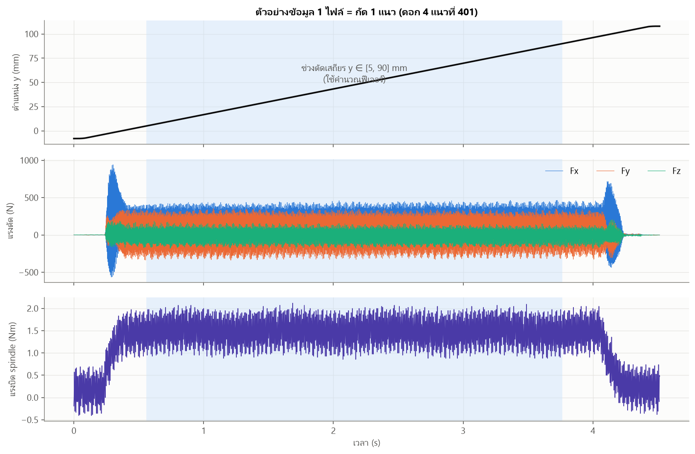
*รูปที่ 1 ข้อมูล 1 ไฟล์: ดอกกัดเดินตามแกน y จาก −8 ถึง 108 mm แรงตัดคงที่เฉพาะช่วงกลาง จึงคำนวณฟีเจอร์เฉพาะ "ช่วงตัดเสถียร" y ∈ [5, 90] mm*

### 1.3 สิ่งที่พยากรณ์และแนวทาง
- **เป้าหมาย:** เวลาตัดที่เหลือ (นาที) จนถึง **เกณฑ์หมดอายุ VB = 140 µm** และจนถึง **จุดเริ่มสึกเร่ง VB = 103 µm** ณ ทุกแนวตัดที่จบ → แปลงเป็นสถานะ STEADY / ACCELERATED / END_OF_LIFE และคำแนะนำ OK / WATCH / PLAN_REPLACEMENT / REPLACE_NOW
- **เกณฑ์อายุดอก:** ISO 8688-2 ใช้รอยสึกด้านข้าง VB เป็นเกณฑ์อายุดอกกัดหลักและให้กำหนดค่าเกณฑ์ตามลักษณะงาน (ค่าที่ใช้กันทั่วไปในงานกัดคือ VB ≈ 0.3 mm งานเก็บผิวใช้ค่าต่ำกว่า) ในชุดข้อมูลนี้ผู้ทดลองหยุดใช้ดอกที่ VB ≈ 150 µm จึงกำหนด **เกณฑ์เฉพาะงาน 140 µm** (ทุกดอกผ่านจริง) ส่วน **103 µm มาจากข้อมูล** (จุดเปลี่ยนระบอบของอัตราสึก หัวข้อ 3.6 = เริ่มช่วงสึกเร่งของเส้นโค้งการสึก 3 ช่วง)
- **ข้อกำหนดการใช้งานจริง:**
  1. **ห้ามใช้ VB เป็นอินพุต** (ต้องถอดดอกไปส่องกล้อง) — ใช้เฉพาะสิ่งที่เครื่องบันทึกเอง
  2. **ห้ามใช้ข้อมูลอนาคต** — ทุกขั้นตอน (รวมการจัดการ outlier) ต้อง causal เหมือนตอนสตรีม
  3. **ดอก T3, T6, T9 สงวนไว้** ไม่ใช้ฝึกแบบจำลองที่ใช้งานจริง เพื่อสตรีมบนเว็บเป็นข้อมูลที่แบบจำลองไม่เคยเห็น
  4. **ฟิสิกส์:** VB ไม่ลดลง ดังนั้นเวลาที่ดอกจะหมดอายุเป็นค่าคงที่ของดอก RUL ต้องลดลงตามเวลาตัดอย่างสม่ำเสมอ
- **ขั้นตอน:** สกัดฟีเจอร์จาก .h5 → EDA + คุณภาพข้อมูล → trend/seasonality/cyclic/ADF → วิเคราะห์ฟิสิกส์การสึก → สร้าง label RUL → เลือกแบบจำลองจากลักษณะข้อมูล → nested selection → leave-one-tool-out + 80:20 ตามเวลา → ย้อนเล่นการตัดสินใจ → ส่งออกขึ้น MinIO → สตรีมจริงบนเว็บ

---

## 2. การวิเคราะห์ข้อมูลเบื้องต้น (EDA)

ไฟล์ .h5 ทั้งหมดถูกย่อเป็นตาราง 1 แถวต่อ 1 แนวตัดด้วย `extract_run_features.py` (สถิติ mean / RMS / std / ช่วง p0.5–p99.5 ของ Fx, Fy, Fz, แรงลัพธ์ และแรงบิด spindle ในช่วงตัดเสถียร + แรง/แรงบิดมอเตอร์แกนป้อน + ตัวชี้วัดคุณภาพข้อมูล) แกนป้อนของ M1 เป็นบอลสกรูบันทึกเป็นแรงบิด (Nm) ส่วน M2/M3 เป็น linear direct drive บันทึกเป็นแรง (N) — หน่วยต่างกัน จึงใช้เป็น % การเปลี่ยนแปลงจากค่าตั้งต้นของดอกเดียวกัน

### 2.1 สถิติเชิงพรรณนา (Descriptive Statistics)

**สรุปรายดอก**

| ดอก | เครื่อง | แนวตัด | ชั้นงาน | VB เริ่ม → จบ (µm) | เวลาตัดรวม (นาที) | เวลาถึง VB 103 µm (นาที) | เวลาถึง VB 140 µm (นาที) |
|---:|:--:|---:|---:|:--:|---:|---:|---:|
| 1 | M1 | 609 | 21 | 3 → 158 | 57.6 | 42.2 | 54.5 |
| 2 | M1 | 609 | 21 | 3 → 145 | 57.0 | 47.3 | 56.3 |
| 3 | M1 | 638 | 22 | 3 → 152 | 60.8 | 46.5 | 57.9 |
| 4 | M2 | 928 | 32 | 3 → 149 | 86.2 | 68.9 | 81.5 |
| 5 | M2 | 928 | 32 | 3 → 148 | 86.2 | 70.3 | 83.5 |
| 6 | M2 | 928 | 32 | 3 → 147 | 86.4 | 70.5 | 84.0 |
| 7 | M3 | 609 | 21 | 3 → 153 | 57.3 | 44.0 | 53.7 |
| 8 | M3 | 560 | 20 (เริ่มชั้น 2) | **34** → 150 | 57.9 | 40.9 | 54.3 |
| 9 | M3 | 609 | 21 | 3 → 160 | 57.5 | 41.4 | 53.5 |

**สถิติเชิงพรรณนาระดับแนวตัด (n = 6,418)**

| ตัวแปร | mean | std | min | Q1 | median | Q3 | max | skew |
|---|---:|---:|---:|---:|---:|---:|---:|---:|
| VB (µm) | 81.34 | 30.15 | 3.00 | 58.00 | 79.00 | 100.00 | 160.00 | 0.36 |
| เวลาตัดสะสม (นาที) | 35.41 | 21.74 | 0.18 | 17.42 | 34.13 | 50.88 | 86.35 | 0.35 |
| แกนป้อนทิศตัด y \|mean\| (controller)* | 238.63 | 225.10 | 1.04 | 1.50 | 129.56 | 450.92 | 748.03 | 0.38 |
| แกนป้อน x \|mean\| (controller)* | 259.34 | 183.71 | 0.60 | 1.41 | 303.84 | 399.77 | 690.40 | −0.30 |
| Fx mean (N) | 318.11 | 91.01 | 144.38 | 236.42 | 307.87 | 394.88 | 564.65 | 0.31 |
| Fy mean (N) | 64.31 | 62.39 | −21.78 | 8.57 | 51.52 | 111.22 | 262.44 | 0.62 |
| Fz mean (N) | −7.59 | 22.92 | −80.90 | −25.52 | −1.88 | 11.84 | 30.10 | −0.61 |
| แรงลัพธ์ \|F\| mean (N) | 385.16 | 110.72 | 163.28 | 293.73 | 371.58 | 468.07 | 706.72 | 0.33 |
| แรงบิด spindle RMS (Nm) | 1.39 | 0.20 | 0.96 | 1.23 | 1.39 | 1.54 | 1.86 | 0.07 |

\* หน่วยต่างกันตามเครื่อง (M1 = Nm, M2/M3 = N) สถิติรวมจึงใช้ดูช่วงค่าเท่านั้น

**ตัวแปรเซนเซอร์ใดสะท้อนการสึก** (Spearman ρ กับ VB รายดอก — ระดับแรงต่างกันตามเครื่องจึงต้องดูรายดอก)

| ตัวแปร | ρ รายดอก (T1…T9) | \|ρ\| ต่ำสุด | ใช้เป็นอินพุต |
|---|---|---:|:--:|
| Fy mean | 0.99 – 1.00 | 0.99 | ✓ |
| Fx mean | 0.98 – 1.00 | 0.98 | ✓ |
| แรงมอเตอร์แกนป้อนทิศตัด y (controller) | 0.97 – 1.00 | 0.97 | ✓ |
| แรงบิด spindle RMS (controller) | 0.97 – 1.00 | 0.97 | ✓ |
| Fz mean | −0.96 – −0.99 | 0.96 | ✓ |
| แรงลัพธ์ mean | 0.84 – 1.00 | 0.84 | ✓ |
| แรงมอเตอร์แกนป้อน x (controller) | 0.80 – 0.94 | 0.80 | ✓ |
| Fy std | 0.58 – 1.00 | 0.58 | – |
| ความคลาดตำแหน่ง servo แกน y (std) | −0.10 – 1.00 | 0.10 | – |
| Fx std | −0.88 – 0.49 (กลับทิศตามเครื่อง) | 0.02 | – |
| แอมพลิจูดความถี่ฟันกัด | −0.67 – 0.26 | 0.12 | – |

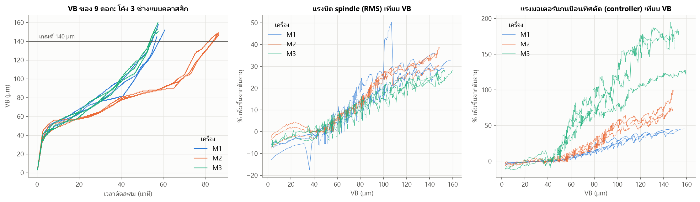
*รูปที่ 2 ซ้าย: VB ของ 9 ดอกเทียบเวลาตัดสะสม กลาง/ขวา: % การเพิ่มขึ้นของแรงบิด spindle และแรงมอเตอร์แกนป้อนทิศตัด (controller) จากค่าต้นอายุของดอกนั้น เทียบ VB*

**ข้อค้นพบ**
1. VB ทุกดอกเป็น **โค้งการสึก 3 ช่วงแบบคลาสสิก**: break-in (ชั้นแรก 0 → ~40 µm) → steady → **accelerated**
2. **ผลของเครื่องจักรเป็นแหล่งความแปรปรวนหลัก:** M2 อายุ ≈ 83 นาทีของเวลาตัด เทียบ ≈ 54–56 นาทีของ M1/M3 แม้พารามิเตอร์ตัดเดียวกัน
3. ค่าเฉลี่ยของแรงตัด แรงบิด spindle และแรงมอเตอร์แกนป้อนสัมพันธ์กับ VB แบบเอกภาพสูงมากทุกดอก (|ρ| ≥ 0.80) — ใช้ **7 ตัวนี้แบบสัมพัทธ์** (เทียบค่าตั้งต้นของดอกเดียวกัน) เป็นอินพุต ส่วนตัวแปรความผันผวน (std, แอมพลิจูดฟันกัด) ไม่สม่ำเสมอระหว่างเครื่อง จึงไม่ใช้
4. VB ≥ 140 µm มีเพียงส่วนน้อยของข้อมูล — ช่วงที่สำคัญที่สุดต่อการตัดสินใจมีข้อมูลน้อยที่สุด

### 2.2 การตรวจสอบและจัดการข้อมูลสูญหาย (Missing Values)

| ระดับ / รายการตรวจ | ผล |
|---|---|
| NaN ในสัญญาณดิบทุกไฟล์ / ไฟล์ที่อ่านไม่ได้ / ค่าว่างในตารางฟีเจอร์ | 0 / 0 / 0 |
| label VB และเวลาตัดสะสม: filelist.csv เทียบใน .h5 | ตรงกันทุกไฟล์ |
| แถวซ้ำ (tool, run) / เลข run ขาดช่วง | 0 / 0 |
| ความยาวไฟล์ | 4.41–4.52 s แต่ช่วงตัดเสถียรยาวเท่ากัน 3.18–3.23 s |
| สัดส่วนสัญญาณแบน (flat-line) สูงสุด | 0.02 |
| **โครงสร้างการทดลอง:** แนวที่บันทึกต่อชั้น | 29 แนว ทุกชั้น (จาก 44 แนว) ยกเว้น 1 ชั้น |
| **ข้อมูลหายช่วงต้นอายุ** | ดอก 8 ไม่มีชั้นที่ 1 และชั้นที่ 2 มีเพียง 9 แนว (เริ่มที่ VB = 34 µm, เวลาตัดสะสม 177 s) |
| หน่วยเวลาตัดสะสม | attribute ใน .h5 ระบุ "min" แต่เพิ่ม 3–4 หน่วยต่อแนวที่ยาว ~3.2 s และเอกสารต้นทางระบุวินาที → เป็นวินาที |

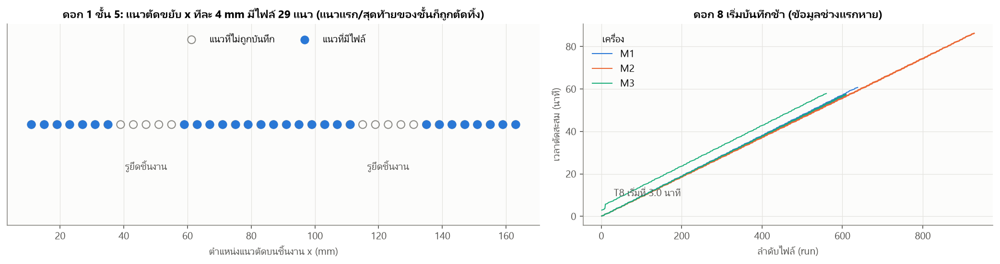
*รูปที่ 3 ซ้าย: ใน 1 ชั้นงาน ดอกกัดขยับแนวละ 4 mm ตามแกน x แนวที่ทับรูยึดชิ้นงานและแนวแรก/สุดท้ายของชั้นไม่ถูกบันทึก ขวา: เวลาตัดสะสม — ดอก 8 เริ่มบันทึกช้า*

**วิธีจัดการ**
- **ค่าในไฟล์:** ไม่มีข้อมูลสูญหาย ไม่ต้อง impute
- **แนวตัดที่ไม่ถูกบันทึก (15/44 แนวต่อชั้น):** "การสูญหายตามโครงสร้าง" ที่ผู้จัดทำตัดออก แต่ดอกกัด *ยังตัดและสึกจริง* → **แกนเวลาของแบบจำลองคือเวลาตัดสะสม** (นับแนวที่ไม่ถูกบันทึกแล้ว) ไม่ใช่ลำดับไฟล์ และตอนสตรีมบนเว็บ ช่วงที่ไม่มีไฟล์ถูกเล่นเป็น "กำลังตัดแนวที่ไม่ถูกบันทึก" ตามส่วนต่างของเวลาตัดจริง
- **ดอก 8:** ไม่สร้างข้อมูลช่วง break-in ขึ้นเอง (เดาไม่ได้อย่างน่าเชื่อถือ) — แบบจำลองไม่ใช้ช่วง break-in อยู่แล้ว ค่าตั้งต้นของดอกคือ 29 รันแรกหลังเวลาตัด 170 วินาที ซึ่งดอก 8 มีครบ

### 2.3 การตรวจสอบและจัดการค่าผิดปกติ (Outliers)

**(ก) VB — ตรวจด้วยกฎทางฟิสิกส์:** VB ลดลงจากแนวก่อนหน้า 0 ครั้ง, นอกช่วง 0–200 µm 0 ค่า, ΔVB ต่อชั้นสูงสุด 20 µm (อยู่ในช่วงสึกเร่งของหลายดอก — พฤติกรรมจริง), ชั้นที่ ΔVB > 25 µm 0 ชั้น → **ไม่พบ outlier ใน VB**

**(ข) อินพุตเซนเซอร์ — วิเคราะห์ย้อนหลังด้วย STL แบบ robust** (แปลง log ให้ฤดูกาลเป็นแบบบวก → STL period 29 → ตีธงเมื่อ |robust z ของ residual| > 4 **และ** เบี่ยงจากค่าคาดหมาย > 3%)

| ตัวแปร | T1 | T2 | T3 | T4 | T5 | T6 | T7 | T8 | T9 | รวม | % |
|---|---:|---:|---:|---:|---:|---:|---:|---:|---:|---:|---:|
| แรงบิด spindle RMS | 33 | 0 | 4 | 4 | 2 | 5 | 2 | 9 | 2 | 61 | 0.95 |
| แกนป้อนทิศตัด y \|mean\| | 0 | 0 | 0 | 1 | 2 | 1 | 17 | 16 | 25 | 62 | 0.97 |
| แกนป้อน x \|mean\| | 34 | 6 | 8 | 13 | 26 | 6 | 90 | 14 | 15 | 212 | 3.30 |
| Fx mean | 49 | 8 | 11 | 9 | 44 | 8 | 9 | 8 | 12 | 158 | 2.46 |
| แรงลัพธ์ mean | 45 | 5 | 8 | 0 | 22 | 5 | 5 | 49 | 68 | 207 | 3.23 |

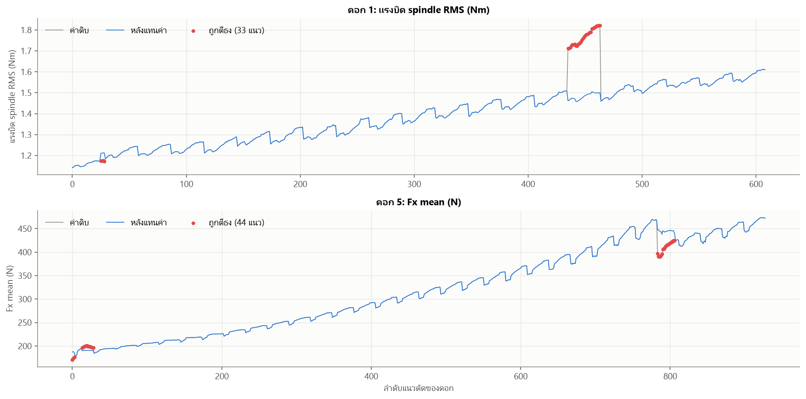
*รูปที่ 4 บน: ดอก 1 แรงบิด spindle ทั้งชั้นที่ 16 กระโดดขึ้น ~17% แล้วกลับลง (collective outlier) ล่าง: ดอก 5 Fx ชั้นที่ 28*

ค่าผิดปกติที่เด่นเป็นแบบ **กลุ่มทั้งชั้น (collective)** เช่นดอก 1 ชั้น 16 ขณะที่ VB เพิ่มตามปกติ → เหตุการณ์ภายนอก (การจับยึด เศษโลหะ ความแข็งชิ้นงานเฉพาะจุด) ไม่ใช่การสึก

**(ค) ตัวกรองที่ใช้ตอนใช้งานจริง — แบบ causal** STL ใช้ข้อมูลทั้งอนุกรม (รวมอนาคต) ซึ่งตอนสตรีมไม่มี จึงออกแบบ `CausalCleaner` (ใช้ **โค้ดชุดเดียวกัน** ตอนสร้างชุดฝึกและใน backend):
1. $r_t = \log x_t - \log x^{\text{ชั้นก่อน}}_{\text{ตำแหน่ง x เดียวกัน}}$ — หักฤดูกาลเชิงตำแหน่ง (Fy, Fz ที่ข้ามศูนย์ได้ใช้ผลต่าง/แรงลัพธ์)
2. $e_t = r_t - r_{t-1}$ — หัก trend ของการสึก (= residual ของ SARIMA(0,1,0)(0,1,0)$_{29}$)
3. ผิดปกติเมื่อ $|e_t - \mathrm{median}(e)| > \max(4 \cdot 1.4826\,\mathrm{MAD},\ 3\%)$ → แทนด้วยค่าคาดหมาย; ถูกตีธงติดกันเกิน 2 รัน = การเปลี่ยนระดับจริง → ยอมรับ
4. ค่าอ้างอิงที่เก็บไว้ใช้ชั้นถัดไปเป็นค่าดิบเสมอ และไม่เทียบข้ามรอยต่อชั้น (กันการล็อกค่าผิดต่อเนื่อง)

| ตัวแปร | sp | ay | ax | Fx | Fres | Fy | Fz | รันที่ถูกตีธง |
|---|---:|---:|---:|---:|---:|---:|---:|---:|
| จำนวน (9 ดอก) | 8 | 1 | 3 | 3 | 10 | 0 | 10 | **31 / 6,418 (0.48%)** |

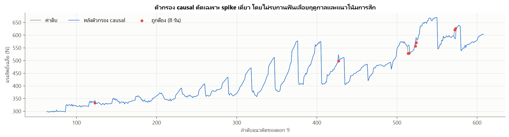
*รูปที่ 5 ตัวกรอง causal ตัดเฉพาะ spike เดี่ยว (ดอก 9 แรงลัพธ์) โดยไม่รบกวนฟันเลื่อยฤดูกาลและแนวโน้มการสึก*

**ความไวของแบบจำลอง RUL ต่อวิธีจัดการ outlier** (GRU, leave-one-tool-out, หน่วยนาที)

| วิธี | MAE ทั้งอายุ | MAE 20% ท้าย | % พยากรณ์เกินจริง > 1 ชั้น |
|---|---:|---:|---:|
| **causal filter (ใช้งานจริง)** | **1.112** | **0.913** | 0 |
| STL แบบมองเห็นอนาคต (ใช้จริงไม่ได้) | 1.139 | 0.930 | 0 |
| ไม่ทำความสะอาด | 1.169 | 0.941 | 0 |

**ข้อสรุป:** outlier แบบกลุ่มทั้งชั้นยืนยันไม่ได้ในเวลาจริง (ต้องรอชั้นถัดไปกลับมาก่อน) ระบบจึงรับมือ 3 ชั้น: (1) ฝึก GRU ด้วยสัญญาณรบกวนเสริม (2) ข้อจำกัดฟิสิกส์รวมค่าประมาณด้วยมัธยฐาน ชั้นผิดปกติ 1 ชั้นขยับผลได้น้อย (3) ตัววัด drift ของอินพุตบน dashboard — และผลยืนยันว่า **ตัวกรอง causal ที่ใช้จริงให้ผลดีที่สุด**

---

## 3. การเตรียมข้อมูล (Data Preprocessing)

### 3.0 VB รายแนวเป็นค่าประมาณ — ผลต่อการสร้าง label
เอกสารต้นทางระบุว่า VB ถูกวัดด้วยกล้อง **หลังจบแต่ละชั้นงาน** (กลางอายุวัดทุก 2 ชั้น) ค่าของแนวอื่น *ประมาณเชิงเส้น* ระหว่างจุดวัด — ยืนยันจากข้อมูล: **ทั้ง 221/221 ชั้น VB รายแนวคลาดจากเส้นตรงไม่เกิน ±1 µm** (มัธยฐาน 0.51 µm = การปัดเศษ) และ ΔVB รายแนวเป็น 0 ถึง 81.7%

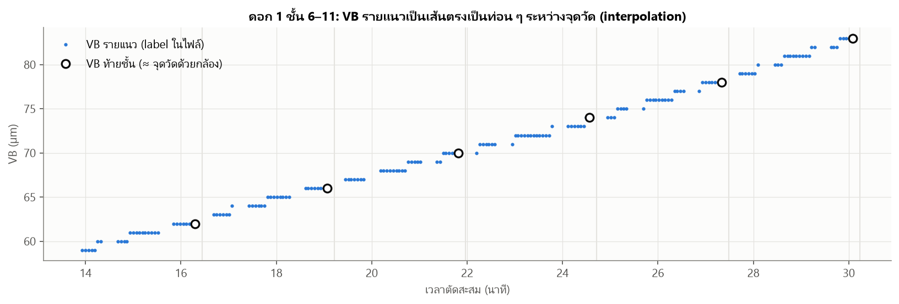
*รูปที่ 6 VB รายแนวเป็นเส้นตรงเป็นท่อน ๆ ระหว่างจุดวัดท้ายชั้น*

ผลที่ตามมา: (1) การวิเคราะห์อนุกรมของ **VB** (หัวข้อ 3.1–3.6) ทำที่ความถี่ของการวัดจริง = รายชั้นงาน (ตัดชั้น break-in ออก ได้ 9 อนุกรม ยาว 19–31 จุด) (2) **label ของแบบจำลอง RUL ไม่ใช่ VB รายแนว** แต่เป็น *เวลาที่ VB ข้ามเกณฑ์* (ค่าคงที่ 1 ค่าต่อดอก) ซึ่งอยู่ระหว่างจุดวัดสองจุดที่คร่อมเกณฑ์ ความคลาดจากการ interpolate จึงจำกัดอยู่ภายในระยะระหว่างจุดวัด และไม่รั่วข้อมูลเข้าอินพุต (อินพุตเป็นเซนเซอร์ล้วน)

### 3.1 การตรวจสอบแนวโน้ม (Trend)
**Mann-Kendall** (Kendall's τ ระหว่างค่ากับเวลา) บนอนุกรมรายชั้น และ **ความแรงของ trend จาก STL** บนอนุกรมรายแนว $F_T = \max(0,\ 1 - \mathrm{Var}(R)/\mathrm{Var}(T+R))$

| ตัวแปร | Kendall τ (9 ดอก) | p-value | STL $F_T$ |
|---|---|---|---|
| VB | 0.99 – 1.00 | < 0.001 ทุกดอก | — |
| แรงบิด spindle (สัมพัทธ์) | 0.95 – 1.00 | < 0.001 | 0.993 – 0.999 |
| แรงมอเตอร์แกนป้อนทิศตัด (สัมพัทธ์) | 0.93 – 1.00 | < 0.001 | — |
| Fx (สัมพัทธ์) | 0.94 – 1.00 | < 0.001 | 0.994 – 1.000 |

**มี trend เพิ่มขึ้นทางเดียวที่แรงมากในทุกดอก** — ทั้งเป้าหมายและอินพุต สอดคล้องกับฟิสิกส์ที่รอยสึกสะสมและไม่ลดลง

### 3.2 การตรวจสอบฤดูกาล (Seasonality)
ตัด trend ด้วย rolling median 59 แนว แล้วหาคาบเด่นด้วย periodogram และวัดความแรงด้วย STL ($F_S$)

| ตัวแปร | คาบเด่น (แนว) ทั้ง 9 ดอก | STL $F_S$ |
|---|---|---|
| log แรงบิด spindle | 29.0 (ดอก 8 = 29.5) | 0.51 – 0.95 |
| log Fx | 29.0 (ดอก 8 = 29.5) | 0.64 – 0.99 |

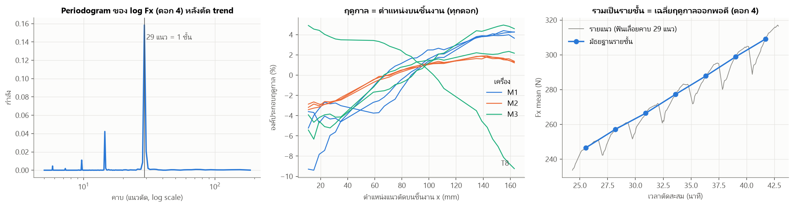
*รูปที่ 7 ซ้าย: periodogram มียอดที่ 29 แนว กลาง: องค์ประกอบฤดูกาลเทียบตำแหน่งแนวตัด x ขวา: ถ้ารวมเป็นรายชั้น ฤดูกาลหายไป*

**ข้อค้นพบ:** ฤดูกาลคาบ **29 แนว** ชัดเจนทุกดอกทุกเครื่อง (29 = แนวที่บันทึกต่อชั้นพอดี) เป็นฟันเลื่อย: แรงเพิ่มเมื่อดอกเลื่อนจาก x = 11 → 163 mm แล้วรีเซ็ตเมื่อขึ้นชั้นใหม่ → **"ฤดูกาลเชิงตำแหน่ง"** (ตำแหน่งบนชิ้นงาน/ระยะจากจุดจับยึดและ dynamometer) ไม่ใช่การสึก ดอก 8 มีรูปแบบกลับทิศ (−8.8% ต่อ 100 mm เทียบ +3.3 ถึง +8.6% ของดอกอื่น) ซึ่งสอดคล้องกับที่เอกสารต้นทางระบุว่าการทดลองของ T7/T8 ชิ้นงานเอียง 1–2° — ยืนยันว่าเป็นผลเชิงเรขาคณิตของการตัด
**ผลต่อการสร้างแบบจำลอง:** แบบจำลอง RUL ต้องอัปเดตทุกรัน จึงไม่รวมเป็นรายชั้น แต่ใช้ **หน้าต่างอินพุต 29 รันล่าสุด (= 1 คาบเต็ม)** และให้ **ตำแหน่ง x ของแนวตัด** เป็นอินพุต เพื่อให้แบบจำลองแยกฤดูกาลเชิงตำแหน่งออกจากการสึกเอง (แทนการตัดฤดูกาลด้วย SARIMA/Holt-Winters ก่อน) ส่วน VB เองไม่มีฤดูกาล (หัวข้อ 3.5)

### 3.3 การตรวจสอบวัฏจักร (Cyclic)
วัฏจักร = การขึ้นลงที่ไม่มีคาบตายตัว ตรวจจาก residual หลังแยก trend และ seasonal ด้วย STL

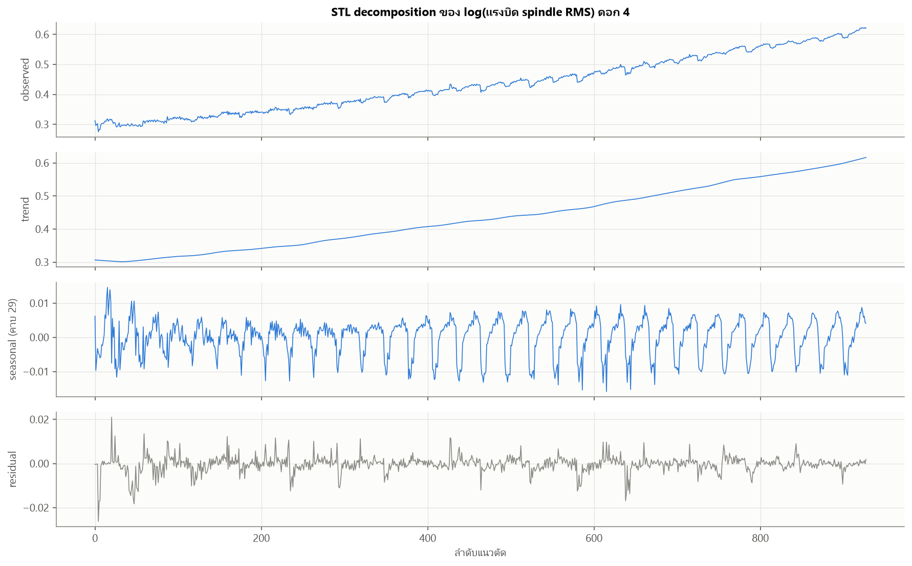
*รูปที่ 8 STL decomposition ของ log แรงบิด spindle ดอก 4*

| ดอก | ACF lag 1 | ACF lag 29 | ACF lag 58 | lag ที่ ACF หมดนัยสำคัญ | ACF lag 1 ของ residual รายชั้น | \|residual รายชั้น\| (%) |
|---:|---:|---:|---:|---:|---:|---:|
| 1 | 0.88 | −0.02 | 0.06 | 10 | −0.23 | 0.07 |
| 2 | 0.74 | 0.00 | **0.41** | 9 | 0.04 | 0.06 |
| 3 | 0.90 | −0.13 | −0.06 | 18 | −0.15 | 0.17 |
| 4 | 0.47 | −0.12 | **0.15** | 11 | **−0.50** | 0.14 |
| 5 | 0.69 | −0.10 | 0.09 | 11 | −0.25 | 0.17 |
| 6 | 0.38 | −0.14 | **0.34** | 10 | **−0.75** | 0.19 |
| 7 | 0.26 | −0.02 | −0.06 | 3 | 0.07 | 0.16 |
| 8 | 0.18 | −0.13 | −0.05 | 2 | −0.50 | 0.06 |
| 9 | 0.22 | −0.08 | −0.02 | 2 | −0.31 | 0.09 |

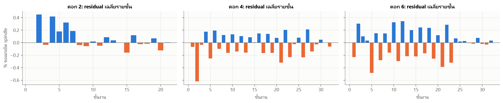
*รูปที่ 9 residual เฉลี่ยรายชั้น: เครื่อง M2 สลับขึ้น–ลงทีละชั้นในช่วงกลางอายุ*

**ข้อค้นพบ:** residual มีความจำระยะสั้น (หมดนัยสำคัญภายใน 2–18 แนว) ไม่มียอดที่ lag 29 · ดอก 2, 4, 6 มี ACF lag 58 (= 2 ชั้น) เด่น และ residual รายชั้นของ M2 สลับขึ้น–ลงทีละชั้นช่วงกลางอายุ → **องค์ประกอบวัฏจักร** ที่ตรงกับจังหวะถอดดอกไปวัด VB ทุก 2 ชั้นช่วงกลางอายุ (สมมติฐาน: การจับยึดใหม่เปลี่ยน runout เล็กน้อย) ขนาดเพียง ~0.06–0.19% ขณะที่การสึกเปลี่ยนแรงบิด ~1.5% ต่อชั้น → **ถือเป็นสัญญาณรบกวน** ส่วนการเปลี่ยนระยะการสึก (break-in → steady → accelerated) เกิดครั้งเดียวต่ออายุดอก จึงเป็น **การเปลี่ยนระบอบ** ไม่ใช่วัฏจักร (หัวข้อ 3.6)

### 3.4 การทดสอบความนิ่ง (Stationarity) ด้วย Augmented Dickey-Fuller (ADF) Test
- $H_0$: มี unit root (ไม่นิ่ง) vs $H_1$: นิ่ง · α = 0.05 · สมการ $\Delta y_t = \alpha + \gamma y_{t-1} + \sum_{i=1}^{p}\beta_i \Delta y_{t-i} + \varepsilon_t$ ทดสอบ $\gamma = 0$ · เลือก lag ด้วย AIC · เสริมด้วย **KPSS** ($H_0$: นิ่ง)

**(ก) VB รายชั้น** (ส่วน 80% แรกของแต่ละดอก — lag สูงสุด $\lfloor (n-1)^{1/3} \rfloor$ เพราะอนุกรมสั้น)

| ดอก | n | ADF p (VB) | ADF p (ΔVB) | ADF p (Δ²VB) | KPSS p (VB) | KPSS p (ΔVB) |
|---:|---:|---:|---:|---:|---:|---:|
| 1 | 16 | 1.0000 | 0.5488 | 0.0000 | 0.019 | 0.044 |
| 2 | 16 | 0.9913 | 0.3401 | 0.0005 | 0.018 | > 0.10 |
| 3 | 17 | 1.0000 | 0.1733 | 0.0395 | 0.016 | 0.082 |
| 4 | 25 | 0.9915 | 0.2894 | 0.0000 | 0.011 | > 0.10 |
| 5 | 25 | 0.8713 | **0.0001** | 0.0000 | 0.010 | > 0.10 |
| 6 | 25 | 0.9971 | 0.0916 | 0.0021 | 0.011 | > 0.10 |
| 7 | 16 | 0.9982 | 0.6571 | 0.0000 | 0.020 | 0.080 |
| 8 | 15 | 1.0000 | 0.4368 | 0.0003 | 0.022 | 0.063 |
| 9 | 16 | 0.9986 | 0.9153 | 0.0000 | 0.020 | > 0.10 |

**(ข) อินพุตรายรันของแบบจำลอง** (อนุกรมยาว 532–871 จุด)

| อินพุต | ระดับเดิม: ADF p | ระดับเดิม: KPSS | หลัง seasonal difference Δ29 | หลัง Δ1Δ29 |
|---|---|---|---|---|
| `sp_rel` (แรงบิด spindle) | 0.41–0.999 → ไม่นิ่ง 9/9 | ปฏิเสธความนิ่ง 9/9 | นิ่ง 9/9 | นิ่ง 9/9 |
| `fres_rel` (แรงลัพธ์) | 0.52–1.00 → ไม่นิ่ง 9/9 | ปฏิเสธความนิ่ง 9/9 | นิ่ง 3/9 | นิ่ง 9/9 |

**อ่านผล**
- **VB ไม่นิ่งทั้ง 9 ดอก** (ADF p = 0.87–1.00 และ KPSS ปฏิเสธความนิ่ง) · **Δ²VB นิ่งทั้ง 9 ดอก** แต่ ΔVB นิ่งเพียง 1/9 → อัตราสึก *ไม่ได้นิ่งรอบค่าเดียว แต่ระดับขึ้นกับสภาพการสึก* ถ้าใช้ ARIMA กับ VB ต้อง d = 2 ซึ่งเท่ากับต่อเส้นความชันล่าสุดออกไป ไม่รู้จักการเปลี่ยนระบอบ — เหตุผลหนึ่งที่ไม่ใช้ ARIMA รายดอก
- **อินพุตรายรันไม่นิ่ง** (trend จากการสึก + ฤดูกาลคาบ 29) และ **นิ่งทุกดอกหลัง Δ1Δ29** → เป็นอนุกรมแบบ "trend + ฤดูกาลเชิงตำแหน่ง" แบบจำลองจึงรับ *หน้าต่างเต็มคาบ* + ตำแหน่ง x แทนการ differencing เอง เพื่อไม่ทิ้ง *ระดับสะสม* ซึ่งคือข้อมูลการสึก
- **เป้าหมาย RUL$_t$ = $T_{EOL} - t$ ไม่นิ่งโดยนิยาม** (trend เชิงกำหนดความชัน −1) แต่ $T_{EOL}$ เป็น **ค่าคงที่ต่อดอก** → แปลงเป้าหมายที่ไม่นิ่งให้เป็นการประมาณค่าคงที่ (หัวข้อ 3.8) ซึ่งเป็นที่มาของข้อจำกัดฟิสิกส์ในแบบจำลอง

### 3.5 ACF / PACF หลัง differencing
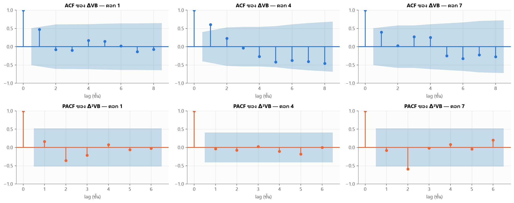
*รูปที่ 10 ACF ของ ΔVB และ PACF ของ Δ²VB (ดอก 1, 4, 7)*

ACF ของ ΔVB ลดลงช้า (ยังมี trend ในอัตราสึก) Δ²VB มีสหสัมพันธ์ติดลบที่ lag 1 ในบางดอก ส่วนหนึ่งมาจากการวัดทุก 2 ชั้นช่วงกลางอายุ ไม่พบ spike เป็นคาบ → VB ไม่มีฤดูกาล และไม่มีโครงสร้าง AR/MA รายดอกที่ชัดและคงที่ (อนุกรมรายชั้นสั้นเพียง 15–31 จุด) — สนับสนุนการใช้แบบจำลองที่เรียนพลวัตร่วมจากหลายดอก

### 3.6 การวิเคราะห์เชิงฟิสิกส์: อัตราการสึกขึ้นกับสภาพการสึกปัจจุบัน
เมื่อรอยสึกด้านข้างกว้างขึ้น พื้นที่เสียดสีระหว่างผิวหลบกับชิ้นงานเพิ่ม → อุณหภูมิที่คมตัดสูงขึ้น → กลไกการสึกที่ไวต่ออุณหภูมิเร่งตัว ถ้าเป็นจริง ΔVB ควรขึ้นกับระดับ VB ก่อนหน้า — ทดสอบด้วย SETAR (threshold autoregression) แบบค้นหา threshold

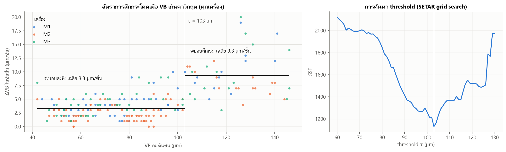
*รูปที่ 11 ซ้าย: ΔVB ในแต่ละชั้นเทียบ VB ณ ต้นชั้น (9 ดอก) ขวา: SSE จากการค้นหา threshold*

| ดอก | เครื่อง | ΔVB ระบอบคงที่ (VB < 103 µm) | ΔVB ระบอบสึกเร่ง (VB ≥ 103 µm) | อัตราส่วน |
|---:|:--:|---:|---:|---:|
| 1 | M1 | 4.14 | 10.20 | 2.46 |
| 2 | M1 | 3.75 | 12.33 | 3.29 |
| 3 | M1 | 3.93 | 9.80 | 2.49 |
| 4 | M2 | 2.29 | 7.50 | 3.27 |
| 5 | M2 | 2.60 | 8.20 | 3.15 |
| 6 | M2 | 2.16 | 8.40 | 3.89 |
| 7 | M3 | 4.00 | 11.75 | 2.94 |
| 8 | M3 | 4.33 | 7.50 | 1.73 |
| 9 | M3 | 4.64 | 10.60 | 2.28 |
| **รวม** | | **3.3** | **9.3** | **2.8** |

(หน่วย µm/ชั้น) **ข้อค้นพบสำคัญ:** อัตราสึกค่อนข้างคงที่จนถึง ~103 µm แล้ว **กระโดดขึ้น 1.7–3.9 เท่าในทุกดอกทุกเครื่อง** (SSE มีจุดต่ำสุดชัดที่ τ = 103 µm) → ข้อมูลมี 2 ระบอบที่กำหนดด้วยระดับของอนุกรมเอง จึงใช้ **103 µm เป็นเกณฑ์ "เริ่มสึกเร่ง"** (สถานะ ACCELERATED) และแบบจำลองต้องรองรับพลวัตไม่เชิงเส้นนี้ ช่วงสุดท้ายของอายุ (ช่วงทดสอบ 20% ท้าย) อยู่ในระบอบสึกเร่งเกือบทั้งหมด

### 3.7 จาก VB สู่ label: RUL และสถานะตามเส้นโค้งการสึก
สำหรับทุกดอก หาเวลาตัดสะสมที่ VB ข้ามเกณฑ์ ($T_{ACC}$ ที่ 103 µm, $T_{EOL}$ ที่ 140 µm) ด้วยการ interpolate เชิงเส้นระหว่างแนวที่คร่อมเกณฑ์ แล้วสร้าง label ทุกรัน:
$$\text{RUL}_t = \max(T_{EOL} - t,\ 0), \qquad \text{RUL}^{ACC}_t = \max(T_{ACC} - t,\ 0)$$
สถานะ: **STEADY** (VB < 103) → **ACCELERATED** (103 ≤ VB < 140) → **END_OF_LIFE** (VB ≥ 140)

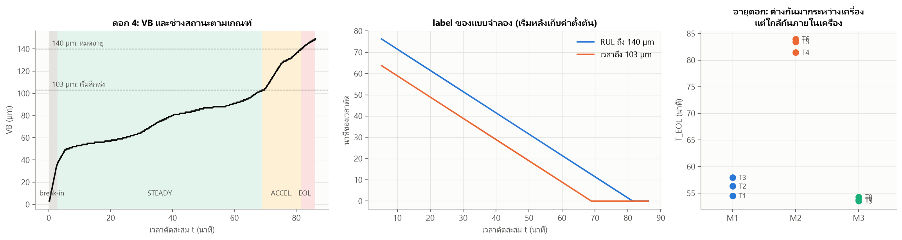
*รูปที่ 12 ซ้าย: VB ของดอก 4 และช่วงสถานะ กลาง: label ของแบบจำลอง ขวา: อายุดอกของ 9 ดอกแยกเครื่อง*

| เครื่อง | อายุเฉลี่ย $T_{EOL}$ (นาที) | SD | ต่ำสุด–สูงสุด | CV |
|:--:|---:|---:|:--:|---:|
| M1 | 56.24 | 1.72 | 54.50–57.93 | 3.05% |
| M2 | 82.98 | 1.33 | 81.48–84.00 | 1.60% |
| M3 | 53.83 | 0.39 | 53.50–54.27 | 0.73% |

ช่วงสึกเร่งเริ่มที่ 75–85% ของอายุดอก · **อายุดอกภายในเครื่องเดียวกันต่างกันน้อยมาก** (เงื่อนไขการตัดคงที่) แต่ต่างกันมากระหว่างเครื่อง → หมายเลขเครื่องต้องเป็นอินพุต และ "อายุเฉลี่ยของเครื่อง" เป็น baseline ที่แข็งมาก

### 3.8 อินพุตรายรัน, หน้าต่าง 29 รัน และการแปลงเป้าหมาย
ทุกรันที่จบ ระบบคำนวณค่าเฉลี่ยในช่วงตัดเสถียรของสัญญาณ 7 ตัว แล้วแปลงเป็น **การเปลี่ยนแปลงจากค่าตั้งต้นของดอก** (มัธยฐานของ 29 รันแรกหลังเวลาตัด 170 วินาที = หลัง break-in — รู้ได้ในโรงงานโดยไม่ต้องวัด VB) ซึ่งตัดผลต่างระดับ/หน่วยระหว่างเครื่องออก

| อินพุต (12 ตัวต่อรัน) | ที่มา | การแปลง |
|---|---|---|
| `sp_rel` แรงบิด spindle RMS | controller | $x/x_0 - 1$ |
| `ay_rel`, `ax_rel` แรง/แรงบิดมอเตอร์แกนป้อน Y (ทิศตัด), X | controller | $\lvert\bar x\rvert/\lvert\bar x_0\rvert - 1$ |
| `fx_rel`, `fres_rel` แรง Fx, แรงลัพธ์ | dynamometer | $x/x_0 - 1$ |
| `fy_d`, `fz_d` แรง Fy, Fz (ข้ามศูนย์ได้) | dynamometer | $(x - x_0)/F_{res,0}$ |
| `t_hours` เวลาตัดสะสม | controller | ชั่วโมง |
| `m1, m2, m3` เครื่อง | แผนการผลิต | one-hot |
| `x_norm` ตำแหน่งแนวตัด | controller | $(x - 87)/76$ |
| ~~VB~~ | กล้องจุลทรรศน์ | **ไม่ใช้เป็นอินพุต** (label ตอนฝึกเท่านั้น) |

**อินพุตของแบบจำลอง = หน้าต่าง 29 รันล่าสุด × 12 ตัว** (29 รัน = 1 ชั้นงาน = 1 คาบฤดูกาลพอดี) ทุก standardize ด้วยค่าเฉลี่ย/SD จากดอกฝึกเท่านั้น

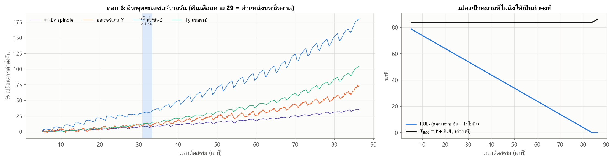
*รูปที่ 13 ซ้าย: อินพุตเซนเซอร์รายรันของดอก 6 (ฟันเลื่อยคาบ 29) และหน้าต่าง 29 รัน ขวา: เป้าหมาย RUL ที่ไม่นิ่ง ↔ $T_{EOL}$ ที่เป็นค่าคงที่*

**การแปลงเป้าหมาย (ข้อจำกัดฟิสิกส์):** ทุกรันแปลงค่าพยากรณ์เป็น $\hat T_{EOL,t} = t + \widehat{\text{RUL}}_t$ แล้วประมาณค่าคงที่นี้ด้วย **มัธยฐานของทุกค่าที่ผ่านมา** (`EOLTracker` — causal, ทนต่อค่าหลุด) RUL ที่รายงาน $= \max(\tilde T_{EOL,t} - t,\ 0)$ จึงลดลง 1 นาทีต่อเวลาตัด 1 นาทีตามธรรมชาติ ไม่แกว่งตามสัญญาณรายรัน (ทำแบบเดียวกันกับ $T_{ACC}$)

### 3.9 การแบ่งข้อมูล Train / Test (80 : 20 ตามเวลา + ตามดอก)
อนุกรมเวลาห้ามสุ่มแบ่ง และ label ของรันต้น ๆ ต้องรู้เวลาหมดอายุ (อนาคต) ของดอก จึงแบ่ง 3 ชั้น:
1. **ตามดอก (production):** ฝึกแบบจำลองใช้งานจริงด้วย T1, T2, T4, T5, T7, T8 (เครื่องละ 2) และ **สงวน T3, T6, T9** ไว้สตรีมบนเว็บ — ไม่ถูกใช้ฝึก เลือกโครงสร้าง หรือปรับเทียบช่วงความเชื่อมั่น
2. **Leave-one-tool-out (LOTO) 9 รอบ:** ใช้เปรียบเทียบแบบจำลอง — ดอกทดสอบไม่มีข้อมูลใดของตัวเองถูกใช้ฝึก
3. **80 : 20 ตามเวลาภายในดอกทดสอบ:** อนุกรมที่ติดตามแบ่งเป็น 80% แรก (ประวัติ) และ **20% ท้าย = ช่วงทดสอบหลัก** ซึ่งเป็นช่วงที่ต้องตัดสินใจเปลี่ยนดอก

| ดอก | เครื่อง | บทบาท | รันทั้งหมด | รันที่พยากรณ์ | 80% แรก | 20% ท้าย | จุดแบ่ง (นาที) | $T_{EOL}$ |
|---:|:--:|---|---:|---:|---:|---:|---:|---:|
| 1 | M1 | ฝึก production | 609 | 552 | 442 | 110 | 47.4 | 54.5 |
| 2 | M1 | ฝึก production | 609 | 552 | 442 | 110 | 46.8 | 56.3 |
| 3 | M1 | **สตรีม (held-out)** | 638 | 581 | 465 | 116 | 50.1 | 57.9 |
| 4 | M2 | ฝึก production | 928 | 871 | 697 | 174 | 70.2 | 81.5 |
| 5 | M2 | ฝึก production | 928 | 871 | 697 | 174 | 70.2 | 83.5 |
| 6 | M2 | **สตรีม (held-out)** | 928 | 871 | 697 | 174 | 70.5 | 84.0 |
| 7 | M3 | ฝึก production | 609 | 552 | 442 | 110 | 47.1 | 53.7 |
| 8 | M3 | ฝึก production | 560 | 532 | 426 | 106 | 48.2 | 54.3 |
| 9 | M3 | **สตรีม (held-out)** | 609 | 552 | 442 | 110 | 47.3 | 53.5 |
| **รวม** | | | 6,418 | 5,934 | 4,750 (80.0%) | 1,184 (20.0%) | | |

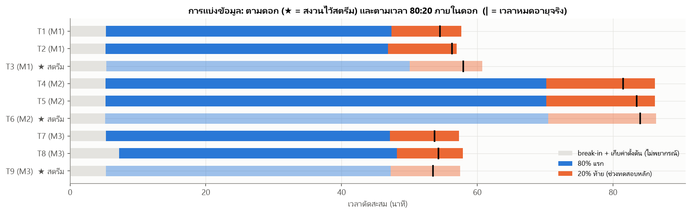
*รูปที่ 14 การแบ่งข้อมูลตามดอก (★ = สงวนไว้สตรีม) และตามเวลา 80:20 ภายในดอก (| = เวลาหมดอายุจริง)*

---

## 4. การเปรียบเทียบแบบจำลองการพยากรณ์ (อินพุตไม่มี VB)

### 4.1 จากลักษณะข้อมูลสู่ข้อกำหนดของแบบจำลอง
| ลักษณะที่พบ (หัวข้อ) | ข้อกำหนด |
|---|---|
| ทั้ง VB และอินพุตมี trend ทางเดียว ไม่นิ่ง (3.1, 3.4) | เรียนจาก *ระดับสะสม* ไม่ใช่แค่การเปลี่ยนแปลงสั้น ๆ |
| ฤดูกาลเชิงตำแหน่งคาบ 29 รัน (3.2) | หน้าต่างอินพุต ≥ 1 คาบ + ตำแหน่ง x |
| การเปลี่ยนระบอบที่ VB ≈ 103 µm (3.6) | แทนพลวัตไม่เชิงเส้น/หลายระบอบได้ |
| อายุต่างกันตามเครื่องมาก แต่ใกล้กันภายในเครื่อง (3.7) | ต้องรู้เครื่อง และต้องชนะ baseline "อายุเฉลี่ยของเครื่อง" |
| มีเพียง 9 ดอก | กัน overfit กับลายเซ็นของดอกฝึก และเลือกโครงสร้างแบบ nested |
| RUL$_t$ = $T_{EOL} - t$ โดย $T_{EOL}$ คงที่ (3.8) | บังคับข้อจำกัดฟิสิกส์ให้ RUL ลดลงตามเวลาอย่างสม่ำเสมอ |

### 4.2 แบบจำลองที่เปรียบเทียบ (3 แบบ)
**(1) Fleet reference — baseline:** $\widehat{\text{RUL}}_t = \overline{T}_{EOL}(\text{เครื่อง}) - t$ ใช้เวลาตัด + เครื่องเท่านั้น (สิ่งที่โรงงานทำได้โดยไม่มี AI ถ้ามีประวัติดอกเก่า)

**(2) StateSpace — ทางอ้อม (พยากรณ์ VB ก่อนแล้วหาจุดตัดเกณฑ์):** VB เป็นสถานะแฝงรายชั้น
$$\text{VB}_L = \text{VB}_{L-1} + \eta_L,\quad \eta_L \sim \text{Gamma}\!\left(\tfrac{\kappa\,\Delta\text{ref}_m(L)}{\phi},\ \phi\right)$$
เมื่อ $\Delta\text{ref}_m$ = ส่วนเพิ่มของเส้นทางการสึกอ้างอิงของเครื่อง (มีระบอบสึกเร่งอยู่ในตัว), $\kappa$ = ตัวคูณประจำดอก (random effect), Gamma บังคับให้ VB ไม่ลดลง · สังเกต "VB เสมือน" จาก soft sensor (Ridge บน health indicator รายชั้น) ด้วย particle filter 4,000 อนุภาค · RUL = เวลาที่เส้นทาง VB เฉลี่ยข้าม 140 µm (อัปเดตทุกชั้นงาน)

**(3) GRU direct-RUL — ที่เสนอ:** GRU 1 ชั้น (hidden 32) อ่านหน้าต่าง 29 รัน × 12 อินพุต
$$r_t=\sigma(W_r x_t + U_r h_{t-1} + b_r),\quad z_t=\sigma(W_z x_t + U_z h_{t-1} + b_z)$$
$$\tilde h_t=\tanh\big(W_h x_t + r_t\odot (U_h h_{t-1}) + b_h\big),\quad h_t=(1-z_t)\odot\tilde h_t + z_t\odot h_{t-1}$$
$$[\widehat{\text{RUL}}^{ACC},\ \widehat{\text{RUL}}] = 20\cdot\mathrm{softplus}(W_o h_{29} + b_o)$$
- loss = L1(RUL) + 0.5·L1(RUL$^{ACC}$) · Adam (lr 3×10⁻³, weight decay 10⁻⁴) 30 epochs · ensemble 3 ตัว (production 5 ตัว)
- **สัญญาณรบกวนเสริม** $\mathcal N(0, 1^2)$ (หน่วย SD) บนอินพุตเซนเซอร์ตอนฝึก — จำลองความต่างของสัญญาณระหว่างดอก กันการจำลายเซ็นเฉพาะของดอกฝึก
- ตามด้วย **ข้อจำกัดฟิสิกส์ EOLTracker** (หัวข้อ 3.8) และ **ช่วง P10–P90** จาก quantile ของความคลาดเคลื่อน leave-one-tool-out แยกตามช่วงค่า RUL ที่พยากรณ์
- สถานะการสึก **อนุมานจากเวลาถึงเกณฑ์ทั้งสอง** (RUL = 0 → END_OF_LIFE; RUL$^{ACC}$ = 0 → ACCELERATED) จึงสอดคล้องกับ RUL เสมอ

**ทำไมไม่ใช้ ARIMA/SARIMA:** ต้อง fit รายดอกจากอนุกรมสั้น (VB) ซึ่งต้อง d = 2 และไม่รู้จักการเปลี่ยนระบอบ (3.4) อีกทั้ง ARIMA บน VB ต้องมี VB เป็นอินพุตหรือ VB เสมือนที่เอียงรายดอก — งานก่อนหน้าของโครงงานพบว่า ARIMA บน VB เสมือนพยากรณ์อายุเกินจริงบ่อยมาก จึงไม่นำมาเป็นตัวเลือก

### 4.3 โปรโตคอลกัน "จูนกับชุดทดสอบ"
1. **Nested selection:** เลือกรูปแบบ GRU จาก 4 ตัวเลือก ด้วย LOTO *ภายในดอกฝึก production 6 ดอกเท่านั้น* (ไม่แตะ T3/T6/T9) เกณฑ์: MAE ทั้งอายุต่ำสุด โดย % พยากรณ์เกินจริง > 1 ชั้นในช่วง 20% ท้าย ≤ 1%
2. **LOTO 9 ดอก:** เปรียบเทียบ 3 แบบจำลอง + ablation ของอินพุตและข้อจำกัดฟิสิกส์ (ช่วงความเชื่อมั่นของดอกทดสอบคำนวณจากความคลาดของ "ดอกอื่น" เท่านั้น)
3. **Held-out สตรีม:** แบบจำลอง production ที่ส่งออกจริง เล่นกับ T3/T6/T9 ผ่านโค้ด runtime เดียวกับ backend (หัวข้อ 6)

**ตัวชี้วัด** (หน่วย: นาทีของเวลาตัด): MAE / RMSE / Bias ของ RUL ทั้งอายุและช่วง 20% ท้าย, **% ของรันที่พยากรณ์อายุเกินจริงมากกว่า 1 ชั้นงาน (2.73 นาที)** = ความเสี่ยงที่ระบบจะบอกว่ายังใช้ได้ทั้งที่หมดอายุแล้ว, ความถูกต้องของสถานะ (accuracy, macro-F1), ผลการตัดสินใจ (ระยะเผื่อก่อนหมดอายุ, เปลี่ยนช้าเกินเกณฑ์, การแจ้งล่วงหน้า)

### 4.4 ผลการเลือกแบบ nested (LOTO ภายในดอกฝึก 6 ดอก)
| ตัวเลือก | MAE ทั้งอายุ | MAE 20% ท้าย | % เกินจริง > 1 ชั้น |
|---|---:|---:|---:|
| (Fleet reference) | 1.368 | 1.091 | 0.0 |
| direct (เรียน RUL ตรง) | 2.044 | 1.735 | 5.5 |
| **direct + noise σ = 1** | **1.327** | **1.063** | **0.0** |
| prior (ปรับแก้อายุอ้างอิงของเครื่อง ±10%) | 1.351 | 1.082 | 0.0 |
| prior + noise | 1.358 | 1.081 | 0.0 |

GRU ที่เรียน RUL ตรง ๆ **โดยไม่มี noise จำลายเซ็นของดอกฝึก** จนแย่กว่า baseline มาก เมื่อเพิ่มสัญญาณรบกวนเสริม ความคลาดลดเหลือ 1.33 นาทีและไม่มีการพยากรณ์เกินจริง → **เลือก `direct + noise`**

### 4.5 ผลแบบ leave-one-tool-out (9 ดอก)
| แบบจำลอง | MAE ทั้งอายุ | MAE 20% ท้าย | RMSE 20% ท้าย | Bias 20% ท้าย | % เกินจริง > 1 ชั้น (20% ท้าย) | % เกินจริง > 1 ชั้น (ทั้งอายุ) |
|---|---:|---:|---:|---:|---:|---:|
| Fleet reference | 1.159 | **0.895** | **1.024** | +0.05 | 0.0 | 0.0 |
| StateSpace (VB แฝง → จุดตัดเกณฑ์) | 1.585 | 1.753 | 1.988 | +0.05 | 13.3 | 14.7 |
| **GRU direct-RUL (เซนเซอร์ + เวลา + เครื่อง)** | **1.112** | 0.913 | 1.053 | −0.19 | **0.0** | **0.0** |

**MAE 20% ท้าย รายดอก (นาที)**

| แบบจำลอง | T1 | T2 | T3 | T4 | T5 | T6 | T7 | T8 | T9 |
|---|---:|---:|---:|---:|---:|---:|---:|---:|---:|
| Fleet reference | 2.11 | 0.07 | 1.55 | 1.73 | 0.58 | 1.22 | 0.10 | 0.38 | 0.32 |
| StateSpace | 1.73 | 1.00 | 0.86 | 0.79 | 2.40 | 0.65 | 1.98 | 2.33 | 4.04 |
| **GRU direct-RUL** | 1.40 | 0.89 | 1.49 | 1.52 | 0.76 | 1.19 | 0.63 | 0.08 | 0.25 |

Wilcoxon signed-rank GRU vs Fleet รายดอก: MAE ทั้งอายุ p = 0.50 (GRU ดีกว่า 6/9 ดอก), MAE 20% ท้าย p = 0.82 (6/9 ดอก)

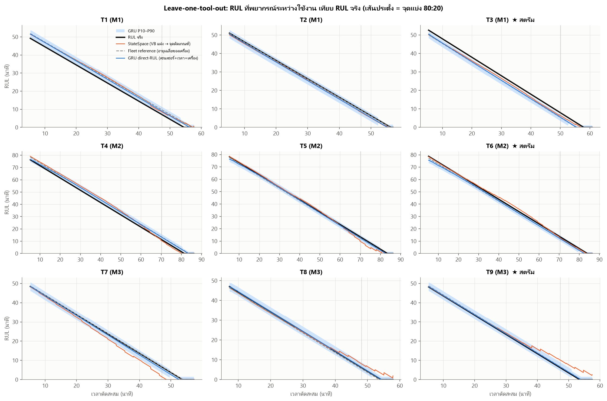
*รูปที่ 15 RUL ที่พยากรณ์ระหว่างใช้งานเทียบ RUL จริง ของทั้ง 9 ดอก (leave-one-tool-out; เส้นประตั้ง = จุดแบ่ง 80:20)*

**อ่านผล**
- **GRU direct-RUL แม่นที่สุดตลอดอายุ** (1.11 นาที) และ **ไม่เคยพยากรณ์อายุเกินจริงเกิน 1 ชั้นงาน** ช่วง 20% ท้าย GRU กับ Fleet ใกล้เคียงกัน (0.91 vs 0.90 นาที) และความต่างทั้งหมดยังไม่มีนัยสำคัญด้วยข้อมูล 9 ดอก
- **StateSpace (ทางอ้อม) แย่ที่สุดในช่วงตัดสินใจ** (MAE 1.75, เกินจริง 13% ของรัน, ดอก 9 คลาด 4 นาที): ต้องผ่าน VB เสมือนที่มีความเอียงต่างกันรายดอก ความคลาดของ VB ใกล้เกณฑ์ถูกขยายเป็นความคลาดของเวลาข้ามเกณฑ์ (ความชันการสึกช่วงท้ายสูง) และอัปเดตได้เพียงทุกชั้นงาน → **ตอบคำถามของโครงงาน: การเรียนเวลาถึงเกณฑ์โดยตรงดีกว่าการพยากรณ์ VB แล้วหาจุดตัด** สำหรับข้อมูลชุดนี้
- Fleet reference แข็งมากเพราะอายุดอกในเครื่องเดียวกันต่างกันเพียง 0.7–3% ประโยชน์ของ GRU คือใช้สัญญาณของดอกนั้นเองปรับค่าประมาณ (ดีกว่า Fleet ช่วงท้ายใน T1, T3, T4, T6, T8, T9 แต่แย่กว่าใน T2, T5, T7) ให้ช่วงความเชื่อมั่น/สถานะ และยังใช้ได้เมื่อเงื่อนไขการตัดเปลี่ยน ซึ่ง baseline ทำไม่ได้

### 4.6 ผลของข้อจำกัดฟิสิกส์และการเลือกอินพุต (ablation)
| GRU | ข้อจำกัดฟิสิกส์ | MAE ทั้งอายุ | MAE 20% ท้าย | % เกินจริง > 1 ชั้น (20% ท้าย) | % เกินจริง (ทั้งอายุ) |
|---|:--:|---:|---:|---:|---:|
| เซนเซอร์ + เวลา + เครื่อง | ไม่มี | 1.278 | 1.275 | 0.0 | 0.0 |
| **เซนเซอร์ + เวลา + เครื่อง** | **มี** | **1.112** | **0.913** | **0.0** | **0.0** |
| เวลา + เครื่อง (ไม่มีเซนเซอร์) | ไม่มี | 1.319 | 1.159 | 6.7 | 2.4 |
| เวลา + เครื่อง (ไม่มีเซนเซอร์) | มี | 1.312 | 0.944 | 0.0 | 0.0 |
| เซนเซอร์ + เวลา (ไม่ระบุเครื่อง) | ไม่มี | 3.467 | 1.457 | 6.3 | 19.2 |
| เซนเซอร์ + เวลา (ไม่ระบุเครื่อง) | มี | 4.888 | 0.925 | 0.0 | 32.4 |

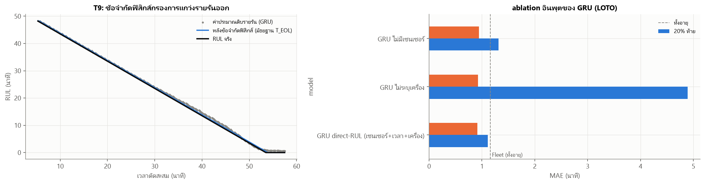
*รูปที่ 16 ซ้าย: ค่าประมาณดิบรายรันของ GRU (จุด) เทียบหลังข้อจำกัดฟิสิกส์ (เส้น) — ดอก 9 ขวา: ablation อินพุต*

**อ่านผล**
- **ข้อจำกัดฟิสิกส์** ลด MAE ทั้งอายุ 1.28 → 1.11 และช่วงท้าย 1.28 → 0.91 นาที โดยไม่ต้องฝึกใหม่ และตัดการพยากรณ์เกินจริงของทุกรูปแบบในช่วงท้ายเป็น 0
- **เซนเซอร์ช่วยจริงเมื่อฝึกอย่างถูกวิธี:** มีเซนเซอร์ 1.11 vs ไม่มีเซนเซอร์ 1.31 นาที (ทั้งอายุ) — เซนเซอร์ทำหน้าที่ *ปรับแก้รายดอก* บนฐาน "เวลาตัด + เครื่อง"
- **ไม่ระบุเครื่องไม่ได้:** GRU ที่ไม่รู้ว่าเป็นเครื่องใดพยากรณ์อายุเกินจริงในช่วงต้นอายุถึง 32% ของรัน (สับสนว่าเป็นเครื่อง M2 ที่อายุยาว) แม้ช่วงท้ายจะแม่น เพราะสัญญาณใกล้หมดอายุชัดขึ้น

### 4.7 การจำแนกสถานะการสึก
| แบบจำลอง | accuracy | macro-F1 |
|---|---:|---:|
| Fleet reference | 0.944 | 0.881 |
| StateSpace | 0.894 | 0.751 |
| **GRU direct-RUL** | **0.936** | **0.865** |

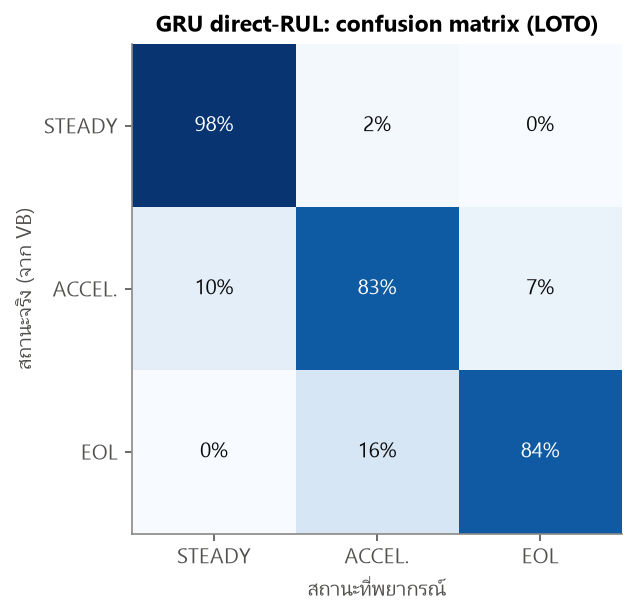
*รูปที่ 17 confusion matrix ของสถานะ (GRU, LOTO รวม 5,934 รัน)*

ความผิดพลาดของ GRU อยู่ที่ *รอยต่อ* ระหว่างสถานะเท่านั้น (บอกเข้าช่วงสึกเร่ง/หมดอายุเร็วหรือช้ากว่าจริงไม่กี่นาที) **ไม่มีการข้ามสองขั้น** (STEADY ↔ END_OF_LIFE = 0 รัน)

### 4.8 กรณีเครื่องใหม่ที่ไม่มีประวัติ (leave-one-machine-out)
| วิธี | MAE ทั้งอายุ | MAE 20% ท้าย | % เกินจริง > 1 ชั้น (20% ท้าย) |
|---|---:|---:|---:|
| Fleet (อายุเฉลี่ยของเครื่องอื่นทั้งหมด) | 16.57 | 10.66 | 66.7 |
| GRU เวลาอย่างเดียว | 18.96 | 14.26 | 66.7 |
| GRU เซนเซอร์ + เวลา | 23.80 | 18.01 | 66.7 |

เมื่อเครื่องไม่เคยอยู่ในข้อมูลฝึก ทุกวิธีคลาดมาก เพราะอายุดอกถูกกำหนดด้วยเครื่องเป็นหลัก: ทดสอบ M1/M3 ด้วยแบบจำลองที่มี M2 (อายุยาว) ในข้อมูลฝึก → พยากรณ์อายุเกินจริง ทดสอบ M2 → ต่ำกว่าจริง และเซนเซอร์อย่างเดียวบอกไม่ได้ว่าเครื่องใหม่จะทำให้ดอกอายุยืนเท่าใด → **ก่อนใช้กับเครื่องใหม่ต้องเก็บข้อมูลดอกแรก ๆ จนหมดอายุ (พร้อมวัด VB) อย่างน้อย 1–2 ดอก**

### 4.9 หลักเกณฑ์การเลือกแบบจำลองที่เหมาะสมที่สุด
| เกณฑ์ | Fleet reference | StateSpace | **GRU direct-RUL** |
|---|---|---|---|
| ความแม่นทั้งอายุ (MAE, นาที) | 1.16 | 1.58 | **1.11** |
| ความแม่นช่วงตัดสินใจ 20% ท้าย | **0.90** | 1.75 | 0.91 |
| ความปลอดภัย: % พยากรณ์เกินจริง > 1 ชั้น | 0 | 13.3 | **0** |
| ใช้ข้อมูลของดอกนั้นเอง | ไม่ | ผ่าน VB เสมือน | **ใช่ (โดยตรง)** |
| อัปเดต / ช่วงความเชื่อมั่น / สถานะ | – / ไม่ / ไม่ | ทุกชั้น / มี / มี | **ทุกรัน / มี / มี** |
| สอดคล้องฟิสิกส์ (RUL ลดลงตามเวลา) | ใช่ | ใช่ | ใช่ (EOLTracker) |
| ต้องวัด VB ตอนใช้งาน | ไม่ | ไม่ | ไม่ |
| ใช้ได้เมื่อเงื่อนไขการตัดเปลี่ยน | ไม่ | บางส่วน | **ได้ (ถ้ามีข้อมูลฝึก)** |
| ต้นทุนตอนใช้งาน | ต่ำ | สูง (particle filter) | ต่ำ (numpy ~1.6 ms/รัน, 4,482 พารามิเตอร์/ตัว) |

**เลือก GRU direct-RUL** เป็นแบบจำลองเดียวของระบบ — แม่นที่สุดตลอดอายุ ปลอดภัยเท่า baseline ใช้ข้อมูลเซนเซอร์ของดอกนั้นเอง ให้ข้อมูลประกอบการตัดสินใจครบ และรันเร็ว โดยยอมรับอย่างตรงไปตรงมาว่าในข้อมูลที่เงื่อนไขการตัดคงที่ ข้อได้เปรียบเหนือ baseline ยังเล็ก

---

## 5. การวิเคราะห์และสรุปผล

### 5.1 ผลการพยากรณ์นำไปช่วยการตัดสินใจอย่างไร
**นโยบายของระบบ:** **REPLACE_NOW** เมื่อค่าล่าง P10 ของ RUL ≤ 1 ชั้นงาน (2.73 นาที) หรือสถานะ END_OF_LIFE · **PLAN_REPLACEMENT** เมื่อ P10 ≤ 3 ชั้น (8.2 นาที) · **WATCH** เมื่อเข้าช่วงสึกเร่ง เทียบกับ **fixed-life** ที่โรงงานทำได้โดยไม่มี AI: เปลี่ยนเมื่อเวลาตัดถึงอายุ *สั้นที่สุด* ของดอกอื่นบนเครื่องเดียวกันลบ 1 ชั้น (ย้อนเล่นทั้ง 9 ดอกแบบ leave-one-tool-out)

| นโยบาย | เปลี่ยนช้าเกินเกณฑ์ | เปลี่ยนก่อนหมดอายุ เฉลี่ย (นาที) | ต่ำสุด (นาที) | ใช้อายุดอก | แจ้งวางแผนล่วงหน้า (นาที) |
|---|---:|---:|---:|---:|---:|
| Fixed-life (อายุสั้นสุดของเครื่อง − 1 ชั้น) | 0/9 | 3.48 | **0.75** | **94.5%** | – |
| Fleet reference + นโยบาย P10 | 0/9 | 5.19 | 2.00 | 91.7% | 10.7 |
| StateSpace + นโยบาย P10 | 0/9 | 7.02 | 0.25 | 89.1% | 11.7 |
| **GRU direct-RUL + นโยบาย P10** | **0/9** | 4.89 | **2.32** | 92.1% | 10.4 |

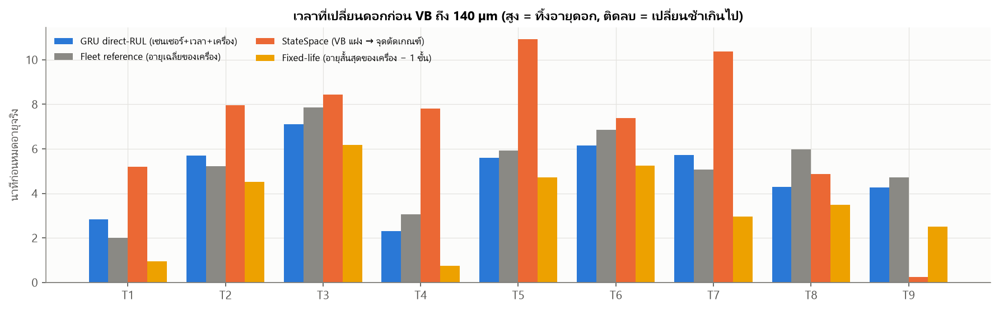
*รูปที่ 18 เวลาที่เปลี่ยนดอกก่อน VB ถึง 140 µm (สูง = ทิ้งอายุดอก, ติดลบ = เปลี่ยนช้าเกินไป)*

**การตีความเพื่อการตัดสินใจ**
- ระบบ GRU สั่งเปลี่ยนดอกก่อนหมดอายุจริงเฉลี่ย 4.9 นาที (≈ 1.8 ชั้นงาน ใช้อายุดอก ~92%) มี **ระยะปลอดภัยต่ำสุดสูงที่สุด (2.3 นาที)** และแจ้ง **PLAN_REPLACEMENT ล่วงหน้า ~10 นาที** ให้เตรียมดอกใหม่/จัดคิวหยุดเครื่อง — ทั้งหมด *โดยไม่ต้องหยุดเครื่องวัด VB*
- **ข้อสังเกตที่ตรงไปตรงมา:** fixed-life ที่อิงประวัติเครื่องใช้อายุดอกได้มากกว่าในข้อมูลนี้ (~94.5%) เพราะอายุดอกในเครื่องเดียวกันต่างกันเพียง 0.7–3% แต่ระยะปลอดภัยต่ำสุดเหลือเพียง 0.75 นาที (≈ 0.3 ชั้น) และไม่มีข้อมูลรายดอก การเตือนล่วงหน้า หรือการตรวจจับความผิดปกติ ในโรงงานที่อายุดอกแปรปรวนมากกว่านี้ (วัสดุ/ความเร็วตัดหลากหลาย) fixed-life ต้องเผื่อเพิ่มตามความแปรปรวน ขณะที่ระบบพยากรณ์ปรับตามสัญญาณของดอกนั้นเอง
- **ความเข้มของนโยบายปรับได้** ด้วยเกณฑ์ P10 (เช่น ≤ 0.5 ชั้น จะใช้อายุดอกมากขึ้นแลกกับระยะปลอดภัยที่ลดลง) — เป็นการตัดสินใจเชิงธุรกิจระหว่างต้นทุนดอกกับความเสี่ยงงานเสีย ไม่ใช่เรื่องของแบบจำลอง
- **ใช้วางแผนหลายเครื่องพร้อมกัน:** RUL + ช่วงความเชื่อมั่นของทุกเครื่องบนแกนเวลาเดียวกัน (Replacement planner บน dashboard) ช่วยรวบการเปลี่ยนดอกหลายเครื่องในจังหวะหยุดเครื่องเดียว

### 5.2 ข้อจำกัดของการพยากรณ์สำหรับชุดข้อมูลนี้
1. **ข้อมูล 9 ดอกภายใต้เงื่อนไขการตัดคงที่** — ความต่างของอายุภายในเครื่องเล็กมาก baseline จึงแข็ง และความต่างระหว่างแบบจำลองยังไม่มีนัยสำคัญทางสถิติ (Wilcoxon p ≥ 0.5)
2. **เครื่องใหม่ต้องมีประวัติก่อน** (4.8) — ข้ามเครื่องคลาด 11–24 นาที
3. **เกณฑ์ 140 / 103 µm เฉพาะชุดข้อมูลนี้** — ถ้าโรงงานใช้เกณฑ์อื่น (เช่น VB 0.3 mm) ต้องสร้าง label และฝึกใหม่ (โค้ดรองรับด้วยการเปลี่ยนค่าคงที่)
4. **outlier แบบกลุ่มทั้งชั้นยืนยันไม่ได้ในเวลาจริง** — ลดผลด้วย noise augmentation + มัธยฐาน + ตัววัด drift แต่ไม่ได้ตัดออก
5. **ช่วงความเชื่อมั่นปรับเทียบจาก 6 ดอกฝึก** — ดอกที่อายุยาวกว่าดอกฝึกทุกดอก (T3) ช่วง P10–P90 ครอบค่าจริงเพียง 46% (แต่คลาดไปทางปลอดภัย = บอกอายุสั้นกว่าจริง)
6. **ไม่มีผลพยากรณ์ ~5 นาทีแรก** ของดอกใหม่ (break-in + เก็บค่าตั้งต้น 29 รัน) — ไม่กระทบการตัดสินใจเพราะอยู่ไกลจากเวลาหมดอายุ
7. **ความไม่แน่นอนของค่าจริง:** VB วัดทุก 1–2 ชั้น เวลาหมดอายุจริงจึงมีความไม่แน่นอนจากการ interpolate ราว ±1 ชั้น
8. **ไม่มีกรณีดอกแตก/บิ่นฉับพลัน** ในข้อมูล — แบบจำลองเรียนเฉพาะการสึกต่อเนื่อง เหตุการณ์ฉับพลันต้องอาศัยการเฝ้าระวังสัญญาณ (drift/alarm) แยกต่างหาก

---

## 6. การนำแบบจำลองไปใช้งาน (Deployment)

### 6.1 สถาปัตยกรรมในระบบจริงของโครงงาน
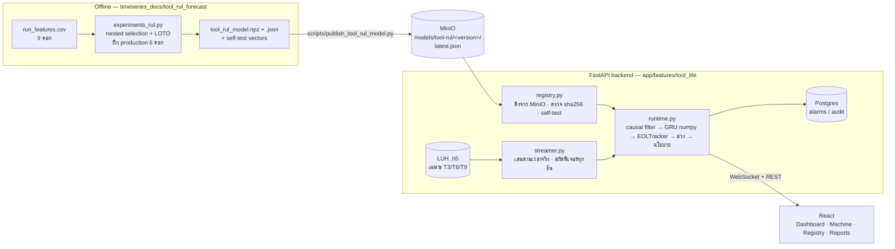

### 6.2 ไฟล์แบบจำลองและการเก็บใน MinIO
- `tool_rul_model.npz` (114 KB): น้ำหนัก GRU 5 ตัว (numpy), ค่า standardize, **เวกเตอร์ทดสอบตัวเอง** (หน้าต่างอินพุต 6 ชุด + ผลลัพธ์ที่คาดหวัง)
- `tool_rul_model.json`: เวอร์ชัน (`tool-rul-gru-1.0.0`), สถาปัตยกรรม, รายชื่ออินพุต, เกณฑ์ (103/140 µm), **ดอกที่ใช้ฝึก [1, 2, 4, 5, 7, 8] และดอกที่สงวนไว้ [3, 6, 9]**, ตารางช่วงความเชื่อมั่น, นโยบาย, sha256
- `evaluation.json`: ผล LOTO ของ GRU direct-RUL ที่ใช้งาน แบบ *ค่าเฉลี่ยรวม* (ไม่มีอายุจริงรายดอก — กันสปอยดอกที่สตรีม; ตัวเปรียบเทียบอื่นอยู่ในรายงานนี้เท่านั้น)
- อัปโหลด: `uv run python scripts/publish_tool_rul_model.py` → `models/tool-rul/tool-rul-gru-1.0.0/*` และ `models/tool-rul/latest.json`
- **backend ใช้แบบจำลองจาก MinIO เท่านั้น** ก่อนใช้งานตรวจ (1) sha256 ตรงกับ metadata (2) self-test: runtime ต้องคำนวณเวกเตอร์ทดสอบได้ค่าเดียวกับตอนส่งออก (คลาด 0.0 นาที) — ไม่ผ่าน = ไม่พยากรณ์ (ไม่มีแบบจำลองสำรองหรือค่าสมมุติ) และลองโหลดใหม่ทุก 30 วินาที

### 6.3 การสตรีมข้อมูลจริงตามเวลาจริงและการกันสปอยข้อมูล
- **ข้อมูลจริง:** backend อ่านไฟล์ .h5 ของชุดข้อมูล LUH โดยตรง (`/dataset` ใน Docker) ของดอก **T3, T6, T9 เท่านั้น** (อ่านจาก metadata ของแบบจำลอง และถ้ามีดอกใดอยู่ในรายชื่อดอกฝึก ระบบจะไม่พยากรณ์ดอกนั้น)
- **ความเร็วจริง:** ส่งสัญญาณทุก 0.1 วินาทีตามอัตราสุ่มจริง (controller 500 Hz; dynamometer 25 kHz เฉลี่ยบล็อกเป็น 500 Hz) ใช้ **deadline scheduling** จึงไม่สะสมความคลาด (วัดได้ 4.41 วินาทีต่อรัน = ความยาวไฟล์พอดี) ช่วงแนวที่ไม่ถูกบันทึกรอเท่าส่วนต่างของเวลาตัดจริง อ่านไฟล์รันถัดไปล่วงหน้าระหว่างเล่นรันปัจจุบัน ความเร็ว 2–20× มีไว้สำหรับทดสอบ (แสดงชัดว่า "เร่งเวลา")
- **ฟีเจอร์เดียวกับตอนฝึก:** คำนวณจากสัญญาณความละเอียดเต็มทุกครั้งที่จบรัน — ทดสอบแล้วตรงกับตารางที่ใช้ฝึกทุกค่า (tolerance 10⁻⁹)
- **ไม่สปอย:** ตารางเวลาสตรีมตัดคอลัมน์ VB ทิ้งตั้งแต่อ่าน, ไม่อ่าน `labels/wear` ใน .h5, **ไม่ส่งชื่อไฟล์** (ชื่อไฟล์มี VB ฝังอยู่ เช่น `…C11VB3.h5`), หน้าเว็บไม่แสดงค่าจริง — ค่าจริงอ่านได้เฉพาะหลังผู้ควบคุมกด "ถอดดอก" หรือสตรีมจบข้อมูล (เหมือนโรงงานที่วัด VB หลังถอดดอก)

### 6.4 API (FastAPI, `/api/v1`)
| Method | Path | หน้าที่ |
|---|---|---|
| GET | `/tool-life/fleet` | สถานะทุกเครื่อง: RUL, P10–P90, สถานะ, คำแนะนำ, ETA, drift, เหตุการณ์ |
| GET | `/tool-life/machines/{m}?history=true` | ประวัติรายรัน (ฟีเจอร์ดิบ/สัมพัทธ์ + ผลพยากรณ์) |
| POST | `/tool-life/machines/{m}/{start\|pause\|resume\|reset}` · `/speed` | ควบคุมสตรีม (speed 1 = เวลาจริง) |
| POST | `/tool-life/machines/{m}/acknowledge` | ตอบสนอง REPLACE_NOW: `replace` (ถอดดอก → ประเมินผล) / `continue` (override) — บันทึก Audit |
| GET / POST | `/tool-life/model` · `/model/versions` · `/model/reload` | แบบจำลองจาก MinIO, ทุกเวอร์ชันใน bucket, ดึงใหม่ |
| POST | `/tool-life/predict` | พยากรณ์จากฟีเจอร์รายรันที่ระบบอื่นส่งมา (stateless) |
| GET | `/tool-life/evaluations` · `/reports/tool-life-summary` · `/reports/export/csv` | ผลเทียบค่าจริงหลังถอดดอก |
| WS | `/tool-life/stream?waveform={m}` | `snapshot` / `run` / `event` / `frame` (สัญญาณดิบ) |

ตัวอย่างผลพยากรณ์ (1 รัน):
```json
{"rul_min": 44.8, "rul_lo": 42.7, "rul_hi": 47.7, "rul_accel_min": 33.3, "t_eol_est": 56.2,
 "wear_state": "STEADY", "recommendation": "OK", "life_used_pct": 20.3,
 "eta_utc": "2026-10-04T11:02:58Z", "model_version": "tool-rul-gru-1.0.0"}
```
เมื่อคำแนะนำยกระดับ (WATCH → PLAN_REPLACEMENT → REPLACE_NOW) ระบบสร้าง alarm (INFO/WARNING/CRITICAL) และเมื่อถึง REPLACE_NOW จะ **หยุดป้อน (interlock)** รอผู้ควบคุมตัดสินใจ

### 6.5 หน้าเว็บ
| หน้า | เนื้อหา |
|---|---|
| **Tool Life Dashboard** | KPI (เครื่องที่ตัด, RUL ต่ำสุด, เปลี่ยนดอกครั้งถัดไป, alarm), การ์ดรายเครื่อง (RUL + P10–P90, แถบอายุที่ใช้ไปพร้อมโซนสึกเร่ง, สถานะ, คำแนะนำ, sparkline, ETA), **Replacement planner**, **สุขภาพข้อมูล/drift ของอินพุต**, เหตุการณ์ล่าสุด, สรุปดอกที่ถอดแล้ว |
| **Machine Monitoring** | สัญญาณสด (แรงตัด/แรงบิด spindle/มอเตอร์แกน), RUL ตามเวลาตัด + ช่วง + ค่าดิบรายรัน + เส้นนโยบาย, แถบสถานะตามเวลา, health indicator รายรัน, ค่าของรันล่าสุด, ควบคุมสตรีม, **แบนเนอร์ interlock** |
| **Model Registry (MinIO)** | แบบจำลองที่ใช้งาน (แหล่ง, sha256, self-test, อินพุต/เอาต์พุต, ดอกฝึก/สงวน), ผล LOTO จาก `evaluation.json`, ทุกเวอร์ชันใน bucket + สลับเวอร์ชัน |
| **Tool Life Reports** | ผลหลังถอดดอก: RUL ที่ระบบบอก vs RUL จริง, เวลา REPLACE_NOW vs เวลาหมดอายุจริง, VB ตอนถอด, CSV |
| **Tool Image Wear** | หน้าจองไว้สำหรับแบบจำลองประเมินการสึกจากภาพใบมีด (ทีมพัฒนาอีกคน) — ไม่มีข้อมูลตัวอย่าง |
| Alarm & Alerts · Audit Trail · Users | แจ้งเตือนจากผลพยากรณ์จริง · การตัดสินใจของผู้ควบคุม · สิทธิ์ผู้ใช้ |

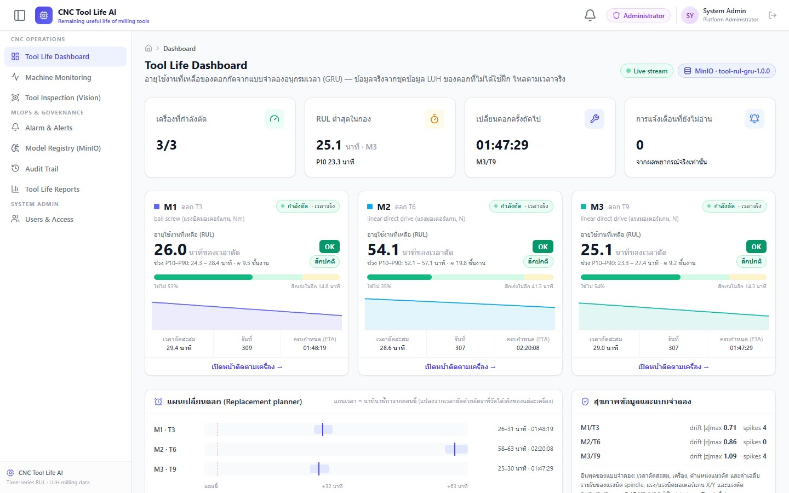
*รูปที่ 19 Tool Life Dashboard ขณะสตรีม 3 เครื่องตามเวลาจริง (M3 เพิ่งติดตั้งดอกใหม่ ยังอยู่ช่วง break-in)*

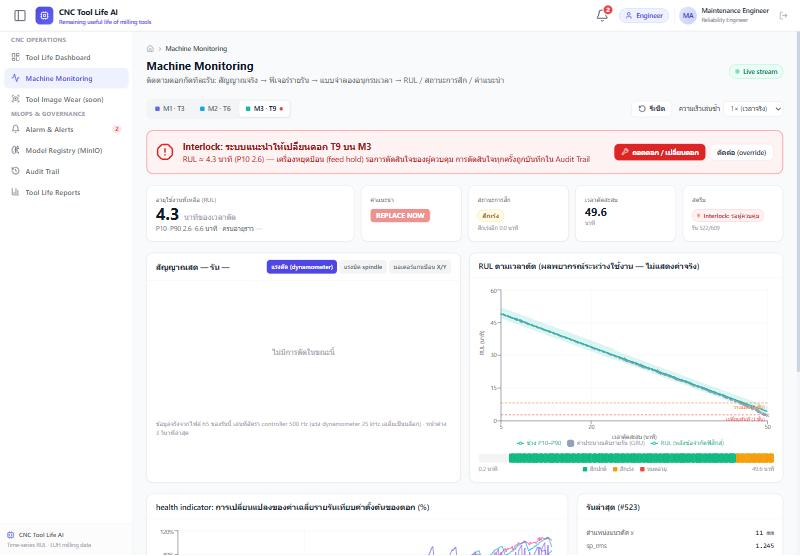
*รูปที่ 20 Machine Monitoring: ระบบสั่ง REPLACE_NOW ที่เวลาตัด 49.6 นาที (ดอก T9) และหยุดป้อนรอผู้ควบคุม*

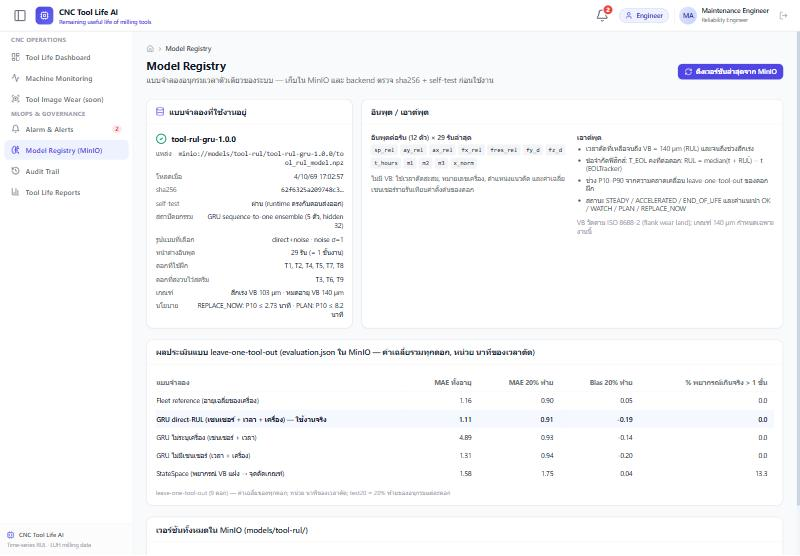
*รูปที่ 21 Model Registry: แบบจำลองที่ดึงจาก MinIO พร้อม sha256, self-test และผลประเมิน*

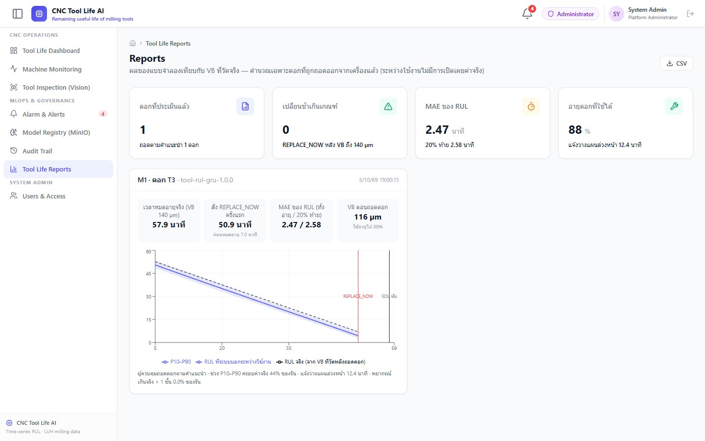
*รูปที่ 22 Reports หลังถอดดอก T9: REPLACE_NOW ที่ 49.6 นาที เทียบหมดอายุจริง 53.5 นาที, VB ตอนถอด 125 µm*

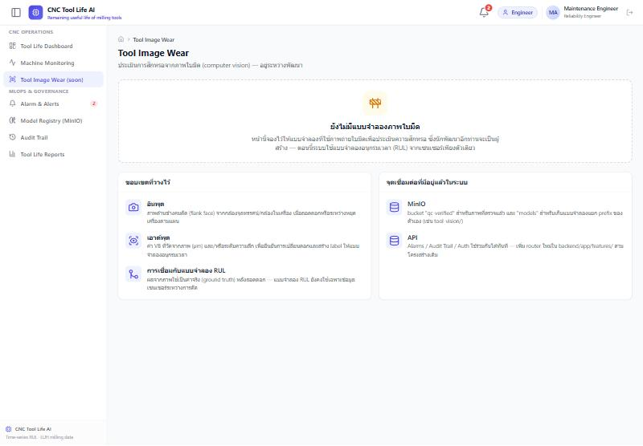
*รูปที่ 23 หน้าจองสำหรับแบบจำลองภาพใบมีด*

### 6.6 ผลกับข้อมูลที่แบบจำลองไม่เคยเห็น (ดอกที่สงวนไว้)
เล่นฟีเจอร์ทีละรันผ่าน `ToolLifeSession` ด้วยไฟล์แบบจำลองที่ส่งออกจริง (โค้ดเดียวกับ backend):

| ดอก | เครื่อง | MAE ทั้งอายุ | MAE 20% ท้าย | % เกินจริง > 1 ชั้น | P10–P90 ครอบค่าจริง | หมดอายุจริง | REPLACE_NOW | เผื่อก่อนหมดอายุ | แจ้งวางแผนล่วงหน้า | ใช้อายุดอก |
|---:|:--:|---:|---:|---:|---:|---:|---:|---:|---:|---:|
| T3 | M1 | 2.29 | 1.59 | 0 | 46% | 57.9 | 50.9 | 7.0 | 12.4 | 88% |
| T6 | M2 | 1.63 | 1.40 | 0 | 98% | 84.0 | 77.9 | 6.2 | 11.6 | 93% |
| T9 | M3 | 0.55 | 0.24 | 0 | 100% | 53.5 | 49.6 | 3.9 | 9.4 | 93% |

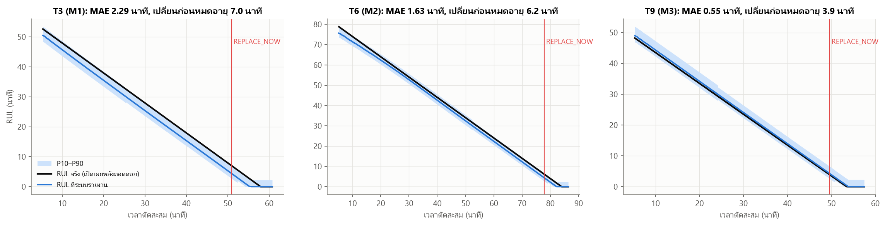
*รูปที่ 24 RUL ที่ระบบรายงานระหว่างสตรีมดอกที่สงวนไว้ เทียบ RUL จริง (เปิดเผยหลังถอดดอก)*

ทั้ง 3 ดอก **ไม่มีการเปลี่ยนช้าเกินเกณฑ์** T3 มีอายุยาวกว่าดอกฝึกของ M1 ทั้งสองดอก แบบจำลองจึงบอกอายุสั้นกว่าจริง (ทางปลอดภัย) และช่วงครอบค่าจริงได้น้อย — สอดคล้องกับข้อจำกัดข้อ 5 **ผลบนเว็บจริงตรงกับการเล่นออฟไลน์:** สตรีม T9 ผ่าน backend + MinIO แล้วกดถอดดอกเมื่อระบบสั่ง REPLACE_NOW ได้เวลา 49.6 นาที (หมดอายุจริง 53.5) VB ตอนถอด 125 µm ใช้อายุดอก 93%

### 6.7 การทดสอบ
| การทดสอบ | ผล |
|---|---|
| `backend/tests/test_tool_life.py` (pytest) | **5/5 ผ่าน** |
| · runtime ใน backend = ไฟล์ที่ใช้สร้างชุดฝึก (กัน train/serve skew) | ผ่าน |
| · self-test ของ artifact (numpy) | คลาด < 10⁻⁹ นาที |
| · ฟีเจอร์ที่ backend สกัดจาก .h5 ระหว่างสตรีม = ตารางที่ใช้ฝึก (ดอก 3, 6, 9 ต้น/กลาง/ท้าย) | ตรงทุกค่า |
| · ตารางสตรีมไม่มี VB | ผ่าน |
| · เส้นทางโค้ดของ streamer ให้ RUL/คำแนะนำเท่ากับการประเมินออฟไลน์ทุกรัน และข้อความที่ส่งออกไม่มี VB / `wear` / ชื่อไฟล์ | ผ่าน |
| Frontend `tsc --noEmit` | ผ่าน |
| End-to-end (Docker: MinIO + Postgres + backend + frontend) | โหลดแบบจำลองจาก MinIO สำเร็จ, สตรีม 3 เครื่องที่ 4.41 วินาที/รัน, alarm + interlock + audit + ประเมินผลหลังถอดดอก ทำงานครบ |

### 6.8 การดูแลแบบจำลองหลังใช้งาน (MLOps)
1. **ฝึก/ประเมินใหม่:** `extract_run_features.py` → `experiments_rul.py` (nested selection + LOTO + ฝึก production + ส่งออก) → `publish_tool_rul_model.py` (อัปโหลดเวอร์ชันใหม่) → กด "ดึงเวอร์ชันล่าสุด" ในหน้า Model Registry (สลับกลับเวอร์ชันเก่าได้)
2. **ข้อมูลฝึกเพิ่ม:** ดอกที่ถอดแล้วพร้อมค่า VB (หน้า Reports/CSV) คือข้อมูลฝึกรอบถัดไป — ต้องย้ายดอกนั้นออกจากรายชื่อดอกสตรีมของเวอร์ชันใหม่ (ระบบป้องกันไว้: ไม่พยากรณ์ดอกที่อยู่ในรายชื่อดอกฝึก)
3. **เฝ้าระวัง:** drift |z| ของอินพุตเทียบข้อมูลฝึก (> 4 = นอกช่วงที่เคยเห็น), จำนวน spike ที่ตัวกรองตัด, ความครอบคลุมของช่วง P10–P90 และ "เปลี่ยนช้าเกินเกณฑ์" ในหน้า Reports
4. **เกณฑ์อื่น / เครื่องใหม่:** เปลี่ยนค่า `VB_ACCEL`, `VB_EOL` แล้วฝึกใหม่ · เครื่องใหม่ต้องมีดอกที่ใช้จนหมดอายุอย่างน้อย 1–2 ดอกก่อน

### 6.9 ไอเดียเพิ่มเติมสำหรับ dashboard
ทำแล้วในระบบ: Replacement planner หลายเครื่อง · สุขภาพข้อมูล/drift ของอินพุต · แถบอายุพร้อมโซนสึกเร่ง · interlock + audit · Reports หลังถอดดอก
ต่อยอดได้: (1) ปุ่มสั่งเตรียมดอกใหม่/เบิกคลังอัตโนมัติเมื่อ PLAN_REPLACEMENT (2) คำนวณต้นทุน "อายุดอกที่ทิ้ง vs ความเสี่ยง" ตามเกณฑ์ P10 ที่เลือก (3) ปฏิทินกะงาน — แจ้งว่าดอกจะหมดอายุในกะไหน (4) เปรียบเทียบเวอร์ชันแบบจำลองแบบ shadow mode ก่อนสลับ (5) ผสานผลจากแบบจำลองภาพใบมีดเมื่อพร้อม เป็นค่าจริงหลังถอดดอกเพื่อสร้าง label อัตโนมัติ

---

## ภาคผนวก: ไฟล์และการทำซ้ำผลลัพธ์
| ไฟล์ | หน้าที่ |
|---|---|
| `extract_run_features.py` | สกัดฟีเจอร์ 1 แถวต่อ 1 แนวตัดจาก .h5 (~20 วินาที, 12 process) → `run_features.csv` |
| `rul_runtime.py` | ส่วนใช้งานจริง (numpy): `CausalCleaner`, `FeatureState`, `GRUEnsemble`, `EOLTracker`, ช่วงความเชื่อมั่น, สถานะ, นโยบาย — สำเนาใน `backend/app/features/tool_life/runtime.py` |
| `rul_ts.py` | label, ชุดฝึกแบบ causal, GRU (PyTorch), การส่งออก, ตัวชี้วัด |
| `experiments_rul.py` | nested selection, LOTO, LOMO, ฝึก production, ส่งออก artifact, เล่นดอกที่สงวนไว้ → `results_rul/`, `models/` |
| `wear_ts.py` | การวิเคราะห์รายชั้น (ADF, SETAR, STL) และแบบจำลอง StateSpace ที่ใช้เปรียบเทียบ |
| `Tool_RUL_Forecasting.ipynb` | โค้ดและผลทั้งหมดของรายงานนี้ (รันใหม่: `RUN_EXPERIMENTS = True` ~5 นาทีบน GPU) |

**การทำซ้ำ:** `python extract_run_features.py "<โฟลเดอร์ที่มี filelist.csv>" run_features.csv 12` → `python experiments_rul.py` → เปิด notebook → `cd backend && uv run python scripts/publish_tool_rul_model.py && uv run pytest tests/test_tool_life.py -q`

**เอกสารอ้างอิง**
1. Denkena, B., Klemme, H., & Stiehl, T. H. (2023). Multivariate time series data of milling processes with varying tool wear and machine tools. *Data in Brief*. Mendeley Data, DOI 10.17632/zpxs87bjt8
2. ISO 8688-2:1989 *Tool life testing in milling — Part 2: End milling.*
3. Cho, K. et al. (2014). Learning Phrase Representations using RNN Encoder–Decoder for Statistical Machine Translation (GRU). *EMNLP*.
4. Cleveland, R. B. et al. (1990). STL: A Seasonal-Trend Decomposition Procedure Based on Loess. *Journal of Official Statistics*, 6(1).
5. Tong, H. (1990). *Non-linear Time Series: A Dynamical System Approach* (SETAR). Oxford University Press.
6. Hyndman, R. J., & Athanasopoulos, G. (2021). *Forecasting: Principles and Practice* (3rd ed.). OTexts.
